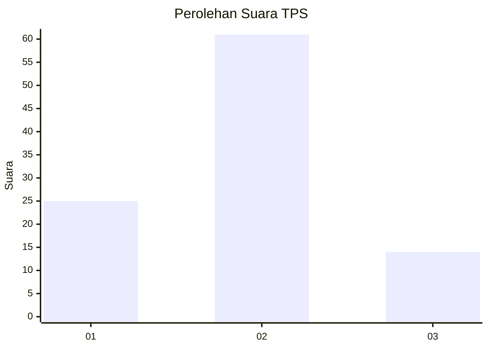
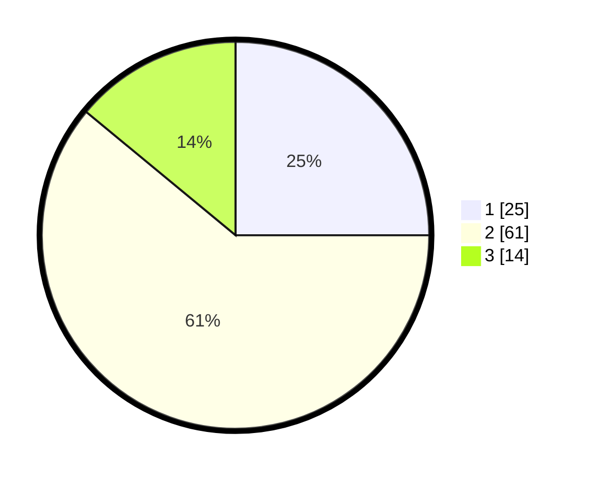

# Hasil

## Grafik

## Tabel

| No. | Nama Paslon    | Suara | Suara (raw) | Persentase |
|:--- |:-------------- | -----:| -----------:| ----------:|
| 1   | ANIES MUHAIMIN | 25    | [25][p-1]   | 25,00      |
| 2   | PRABOWO GIBRAN | 61    | [61][p-2]   | 61,00      |
| 3   | GANJAR MAHFUD  | 14    | [14][p-3]   | 14,00      |

[p-1]: https://github.com/gigit-pemilu/pemilu-2024/blob/main/pilpres/hitung-suara/sub/33-jawa-tengah/sub/29-brebes/sub/16-ketanggungan/sub/2016-pamedaran/sub/010-tps/sub/paslon-1.txt
[p-2]: https://github.com/gigit-pemilu/pemilu-2024/blob/main/pilpres/hitung-suara/sub/33-jawa-tengah/sub/29-brebes/sub/16-ketanggungan/sub/2016-pamedaran/sub/010-tps/sub/paslon-2.txt
[p-3]: https://github.com/gigit-pemilu/pemilu-2024/blob/main/pilpres/hitung-suara/sub/33-jawa-tengah/sub/29-brebes/sub/16-ketanggungan/sub/2016-pamedaran/sub/010-tps/sub/paslon-3.txt

## Foto C Plano

https://sirekap-obj-formc.kpu.go.id/18e5/pemilu/ppwp/33/29/16/20/16/3329162016010-20240215-095914--7c3c0b88-77fe-491a-8371-b65caa5e0aa2.jpg

https://sirekap-obj-formc.kpu.go.id/18e5/pemilu/ppwp/33/29/16/20/16/3329162016010-20240215-101131--d97ebe0f-813d-4775-a731-af5b79fd1766.jpg

https://sirekap-obj-formc.kpu.go.id/18e5/pemilu/ppwp/33/29/16/20/16/3329162016010-20240215-101325--37598540-d5b8-4c5f-99f4-6335c28857df.jpg

## Metadata

| Key        | Value               |
| ---------- | ------------------- |
| Time Stamp | 2024-02-15 23:29:50 |

