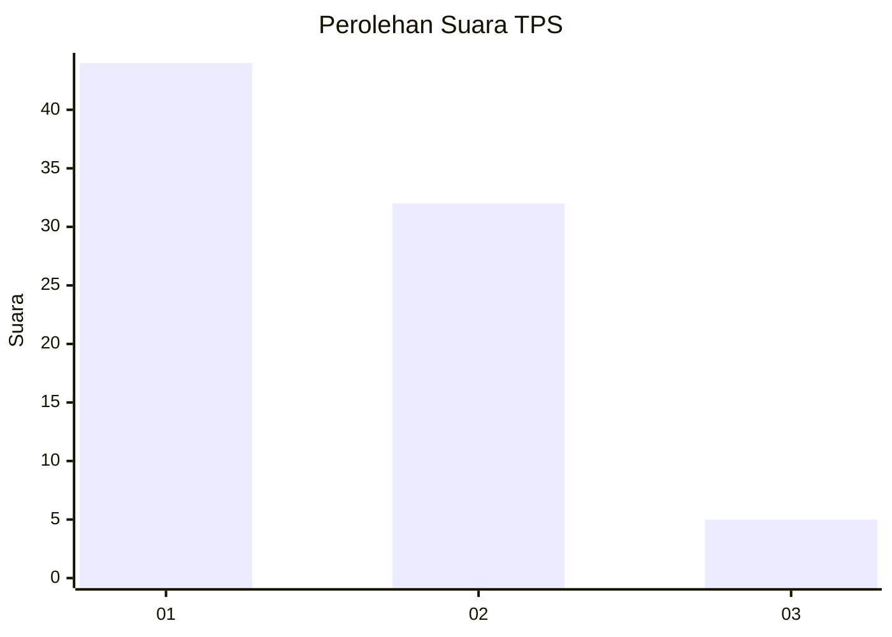
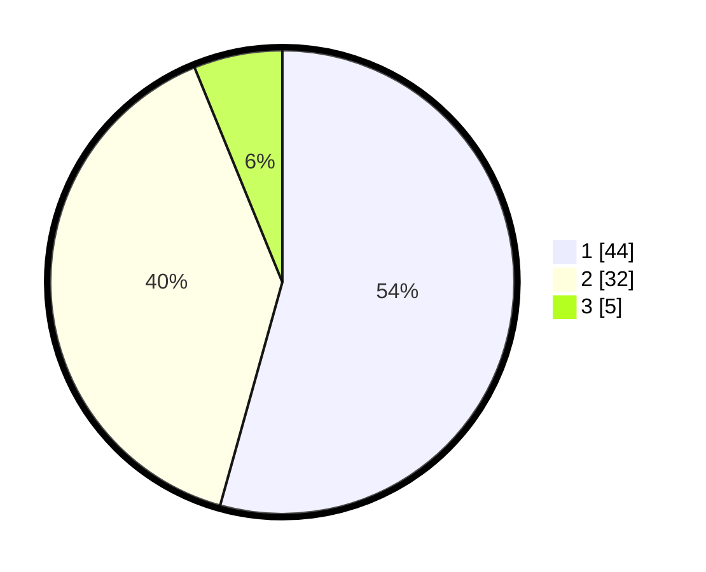

# Hasil

## Grafik

## Tabel

| No. | Nama Paslon    | Suara | Suara (raw) | Persentase |
|:--- |:-------------- | -----:| -----------:| ----------:|
| 1   | ANIES MUHAIMIN | 44    | [44][p-1]   | 54,32      |
| 2   | PRABOWO GIBRAN | 32    | [32][p-2]   | 39,51      |
| 3   | GANJAR MAHFUD  | 5     | [5][p-3]    | 6,17       |

[p-1]: https://github.com/gigit-pemilu/pemilu-2024/blob/main/pilpres/hitung-suara/sub/33-jawa-tengah/sub/29-brebes/sub/16-ketanggungan/sub/2016-pamedaran/sub/013-tps/sub/paslon-1.txt
[p-2]: https://github.com/gigit-pemilu/pemilu-2024/blob/main/pilpres/hitung-suara/sub/33-jawa-tengah/sub/29-brebes/sub/16-ketanggungan/sub/2016-pamedaran/sub/013-tps/sub/paslon-2.txt
[p-3]: https://github.com/gigit-pemilu/pemilu-2024/blob/main/pilpres/hitung-suara/sub/33-jawa-tengah/sub/29-brebes/sub/16-ketanggungan/sub/2016-pamedaran/sub/013-tps/sub/paslon-3.txt

## Foto C Plano

https://sirekap-obj-formc.kpu.go.id/d474/pemilu/ppwp/33/29/16/20/16/3329162016013-20240217-213210--e55819fd-b8ec-4cab-b381-a3ba2b1a790c.jpg

https://sirekap-obj-formc.kpu.go.id/d474/pemilu/ppwp/33/29/16/20/16/3329162016013-20240217-212356--dc397fe8-0189-4e0a-a073-fc22df101023.jpg

https://sirekap-obj-formc.kpu.go.id/d474/pemilu/ppwp/33/29/16/20/16/3329162016013-20240215-095236--7f611d51-c159-4b69-9b97-d83a460cb122.jpg

## Metadata

| Key        | Value               |
| ---------- | ------------------- |
| Time Stamp | 2024-02-24 22:31:28 |

