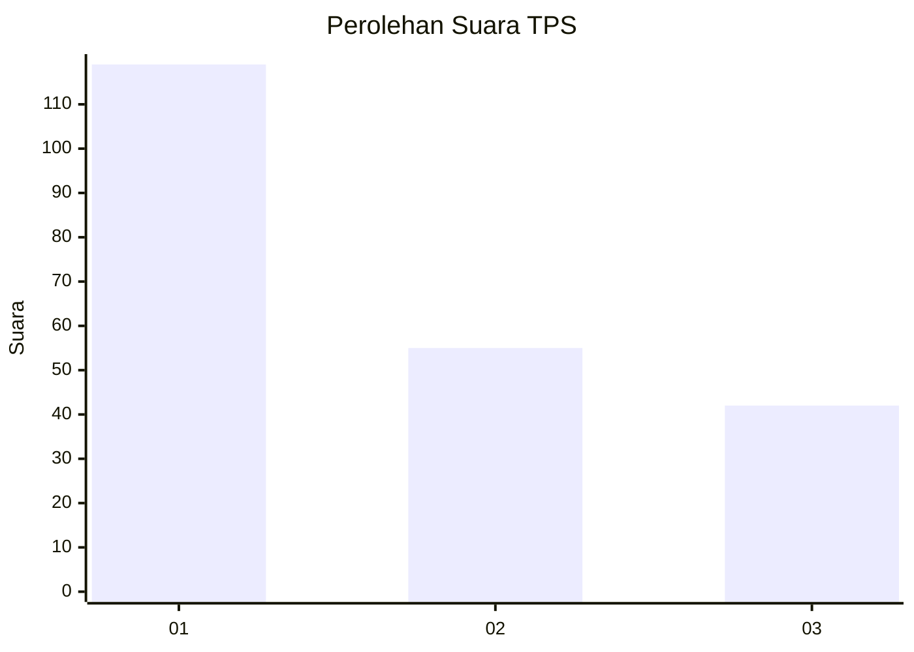
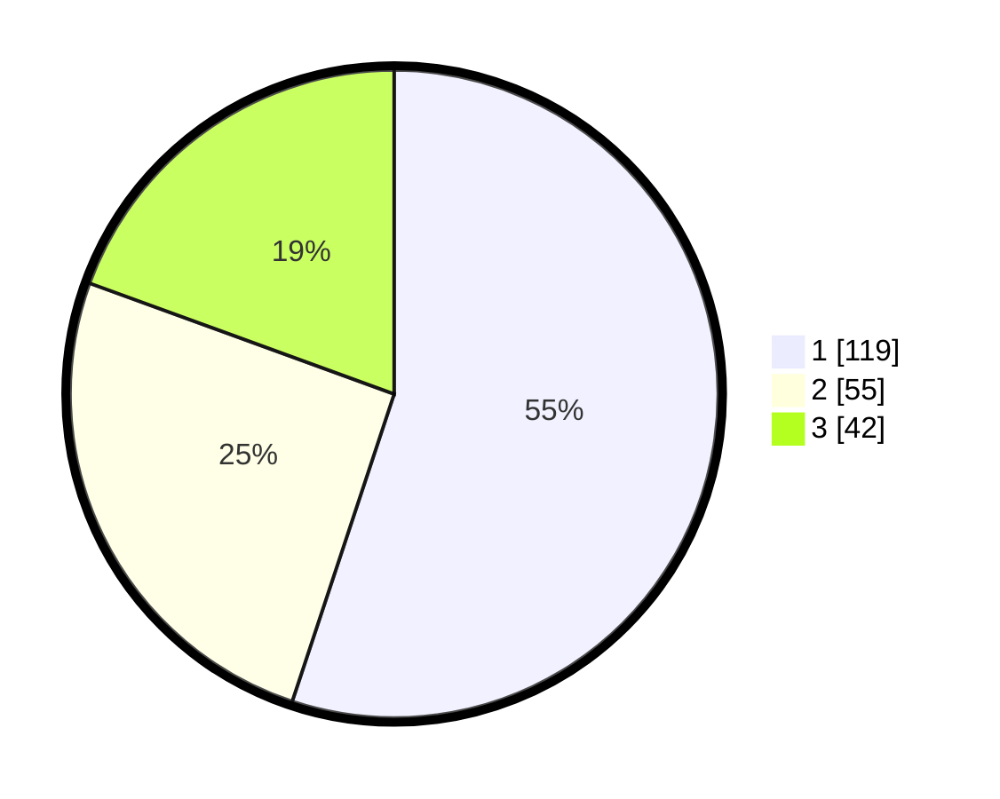

# Hasil

## Grafik

## Tabel

| No. | Nama Paslon    | Suara | Suara (raw) | Persentase |
|:--- |:-------------- | -----:| -----------:| ----------:|
| 1   | ANIES MUHAIMIN | 119   | [119][p-1]  | 55,09      |
| 2   | PRABOWO GIBRAN | 55    | [55][p-2]   | 25,46      |
| 3   | GANJAR MAHFUD  | 42    | [42][p-3]   | 19,44      |

[p-1]: https://github.com/gigit-pemilu/pemilu-2024-33-jawa-tengah/blob/main/pilpres/hitung-suara/sub/33-jawa-tengah/sub/29-brebes/sub/16-ketanggungan/sub/2016-pamedaran/sub/016-tps/sub/paslon-1.txt
[p-2]: https://github.com/gigit-pemilu/pemilu-2024-33-jawa-tengah/blob/main/pilpres/hitung-suara/sub/33-jawa-tengah/sub/29-brebes/sub/16-ketanggungan/sub/2016-pamedaran/sub/016-tps/sub/paslon-2.txt
[p-3]: https://github.com/gigit-pemilu/pemilu-2024-33-jawa-tengah/blob/main/pilpres/hitung-suara/sub/33-jawa-tengah/sub/29-brebes/sub/16-ketanggungan/sub/2016-pamedaran/sub/016-tps/sub/paslon-3.txt

## Foto C Plano

https://sirekap-obj-formc.kpu.go.id/de0d/pemilu/ppwp/33/29/16/20/16/3329162016016-20240215-093931--93979074-306e-48ea-80cd-9ce5db5a165a.jpg

https://sirekap-obj-formc.kpu.go.id/de0d/pemilu/ppwp/33/29/16/20/16/3329162016016-20240215-094139--21c1c259-d65a-4b27-a021-142edaa16216.jpg

https://sirekap-obj-formc.kpu.go.id/de0d/pemilu/ppwp/33/29/16/20/16/3329162016016-20240214-200437--0bccce62-1e1d-441f-a23f-fc26e55f69b6.jpg

## Metadata

| Key        | Value               |
| ---------- | ------------------- |
| Time Stamp | 2024-02-24 22:31:28 |

