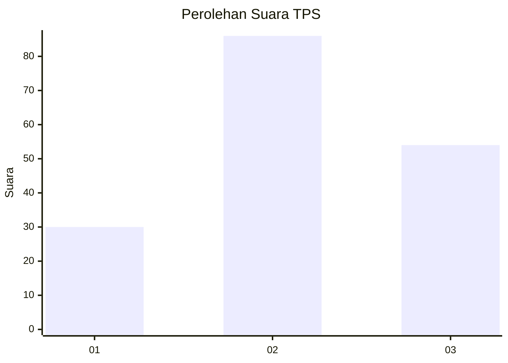
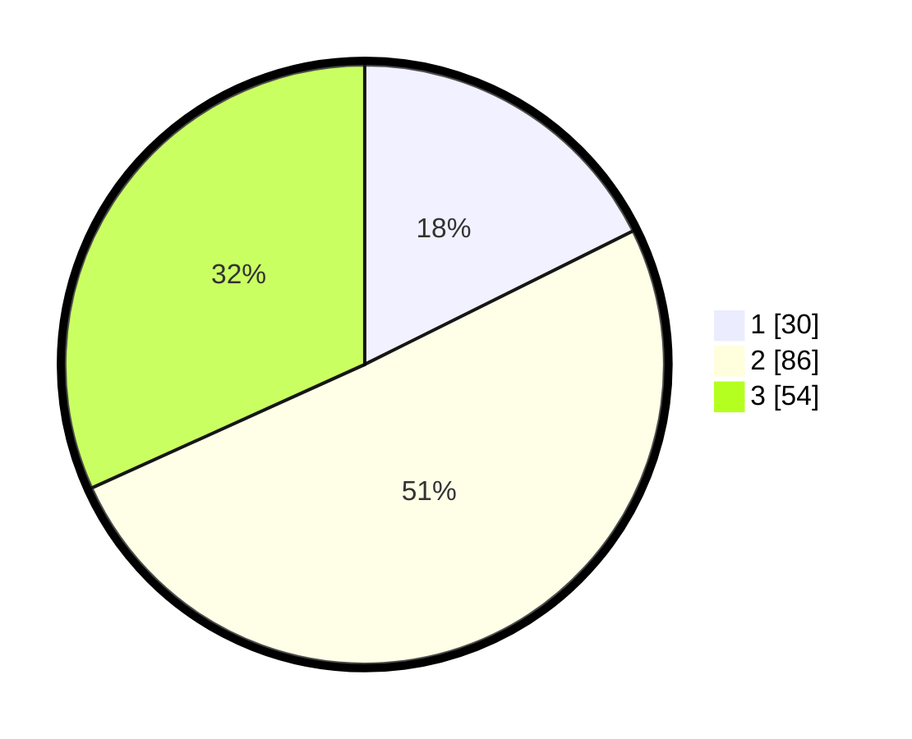

# Hasil

## Grafik

## Tabel

| No. | Nama Paslon    | Suara | Suara (raw) | Persentase |
|:--- |:-------------- | -----:| -----------:| ----------:|
| 1   | ANIES MUHAIMIN | 30    | [30][p-1]   | 17,65      |
| 2   | PRABOWO GIBRAN | 86    | [86][p-2]   | 50,59      |
| 3   | GANJAR MAHFUD  | 54    | [54][p-3]   | 31,76      |

[p-1]: https://github.com/gigit-pemilu/pemilu-2024/blob/main/pilpres/hitung-suara/sub/33-jawa-tengah/sub/29-brebes/sub/17-banjarharjo/sub/2001-bandungsari/sub/003-tps/sub/paslon-1.txt
[p-2]: https://github.com/gigit-pemilu/pemilu-2024/blob/main/pilpres/hitung-suara/sub/33-jawa-tengah/sub/29-brebes/sub/17-banjarharjo/sub/2001-bandungsari/sub/003-tps/sub/paslon-2.txt
[p-3]: https://github.com/gigit-pemilu/pemilu-2024/blob/main/pilpres/hitung-suara/sub/33-jawa-tengah/sub/29-brebes/sub/17-banjarharjo/sub/2001-bandungsari/sub/003-tps/sub/paslon-3.txt

## Foto C Plano

https://sirekap-obj-formc.kpu.go.id/7b91/pemilu/ppwp/33/29/17/20/01/3329172001003-20240215-004433--908486a1-dc4f-4f41-90db-8e96dc3d56af.jpg

https://sirekap-obj-formc.kpu.go.id/7b91/pemilu/ppwp/33/29/17/20/01/3329172001003-20240215-011457--4d6ec88e-cfd1-4094-a6e5-b4ec49ada9b7.jpg

https://sirekap-obj-formc.kpu.go.id/7b91/pemilu/ppwp/33/29/17/20/01/3329172001003-20240214-141540--dc8925cc-c0c2-4156-8bfd-a9dbc1da8d30.jpg

## Metadata

| Key        | Value               |
| ---------- | ------------------- |
| Time Stamp | 2024-02-16 11:00:29 |

