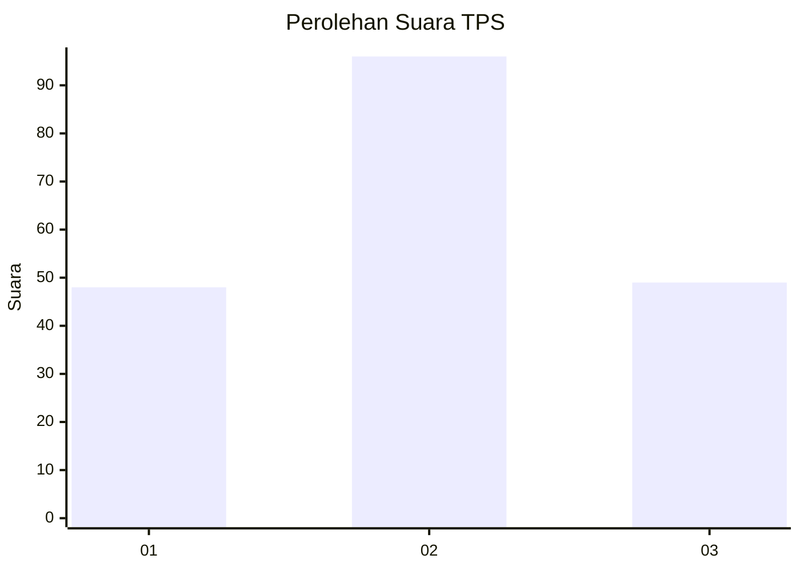
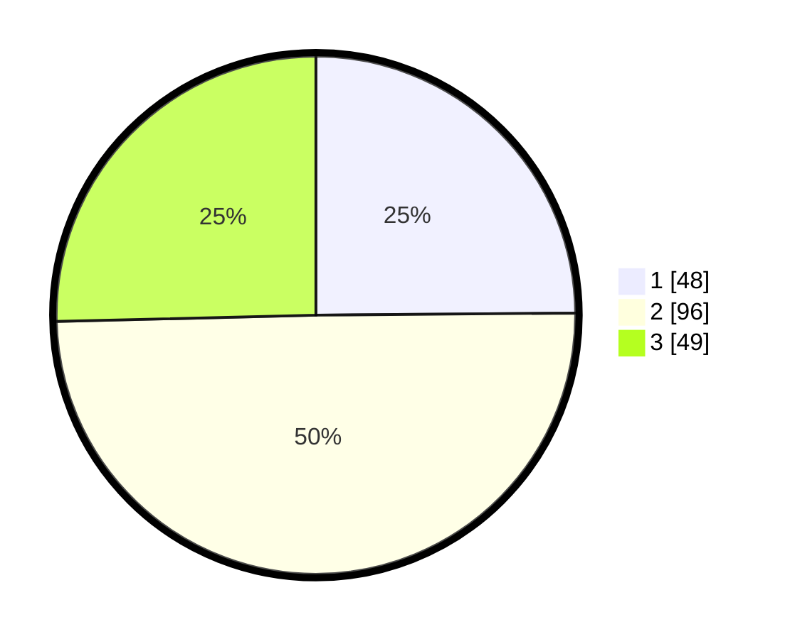

# Hasil

## Grafik

## Tabel

| No. | Nama Paslon    | Suara | Suara (raw) | Persentase |
|:--- |:-------------- | -----:| -----------:| ----------:|
| 1   | ANIES MUHAIMIN | 48    | [48][p-1]   | 24,87      |
| 2   | PRABOWO GIBRAN | 96    | [96][p-2]   | 49,74      |
| 3   | GANJAR MAHFUD  | 49    | [49][p-3]   | 25,39      |

[p-1]: https://github.com/gigit-pemilu/pemilu-2024/blob/main/pilpres/hitung-suara/sub/33-jawa-tengah/sub/29-brebes/sub/17-banjarharjo/sub/2001-bandungsari/sub/005-tps/sub/paslon-1.txt
[p-2]: https://github.com/gigit-pemilu/pemilu-2024/blob/main/pilpres/hitung-suara/sub/33-jawa-tengah/sub/29-brebes/sub/17-banjarharjo/sub/2001-bandungsari/sub/005-tps/sub/paslon-2.txt
[p-3]: https://github.com/gigit-pemilu/pemilu-2024/blob/main/pilpres/hitung-suara/sub/33-jawa-tengah/sub/29-brebes/sub/17-banjarharjo/sub/2001-bandungsari/sub/005-tps/sub/paslon-3.txt

## Foto C Plano

https://sirekap-obj-formc.kpu.go.id/22c4/pemilu/ppwp/33/29/17/20/01/3329172001005-20240215-030741--3f6ba8f9-422c-437c-bfd9-efddc522e00c.jpg

https://sirekap-obj-formc.kpu.go.id/22c4/pemilu/ppwp/33/29/17/20/01/3329172001005-20240215-030906--60a40bae-7d18-4d62-a362-24c925385258.jpg

https://sirekap-obj-formc.kpu.go.id/22c4/pemilu/ppwp/33/29/17/20/01/3329172001005-20240215-030918--2715bbce-4370-480a-b99d-4394b10c9d92.jpg

## Metadata

| Key        | Value               |
| ---------- | ------------------- |
| Time Stamp | 2024-02-16 11:00:29 |

