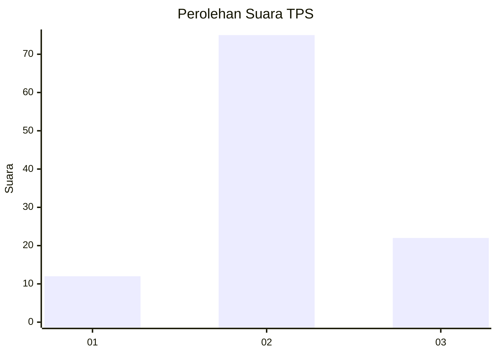
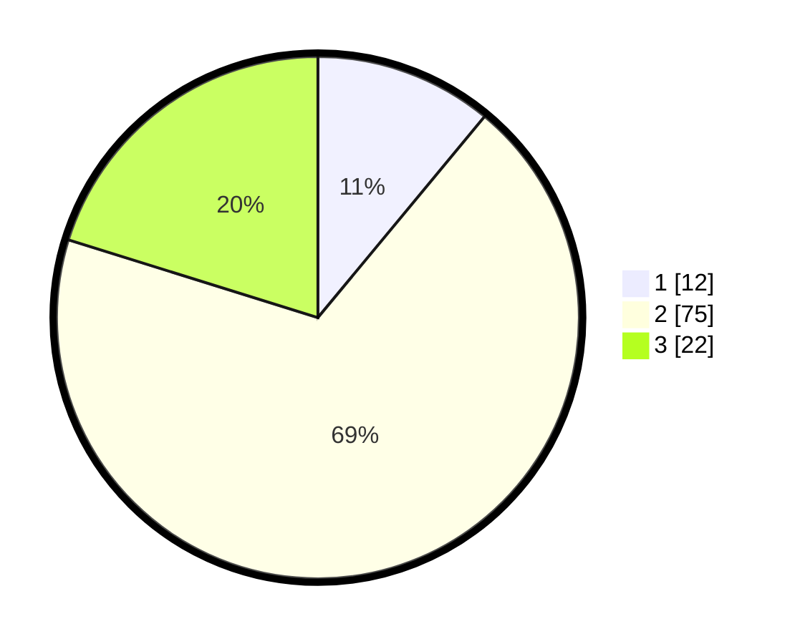

# Hasil

## Grafik

## Tabel

| No. | Nama Paslon    | Suara | Suara (raw) | Persentase |
|:--- |:-------------- | -----:| -----------:| ----------:|
| 1   | ANIES MUHAIMIN | 12    | [12][p-1]   | 11,01      |
| 2   | PRABOWO GIBRAN | 75    | [75][p-2]   | 68,81      |
| 3   | GANJAR MAHFUD  | 22    | [22][p-3]   | 20,18      |

[p-1]: https://github.com/gigit-pemilu/pemilu-2024/blob/main/pilpres/hitung-suara/sub/33-jawa-tengah/sub/29-brebes/sub/17-banjarharjo/sub/2001-bandungsari/sub/016-tps/sub/paslon-1.txt
[p-2]: https://github.com/gigit-pemilu/pemilu-2024/blob/main/pilpres/hitung-suara/sub/33-jawa-tengah/sub/29-brebes/sub/17-banjarharjo/sub/2001-bandungsari/sub/016-tps/sub/paslon-2.txt
[p-3]: https://github.com/gigit-pemilu/pemilu-2024/blob/main/pilpres/hitung-suara/sub/33-jawa-tengah/sub/29-brebes/sub/17-banjarharjo/sub/2001-bandungsari/sub/016-tps/sub/paslon-3.txt

## Foto C Plano

https://sirekap-obj-formc.kpu.go.id/0df1/pemilu/ppwp/33/29/17/20/01/3329172001016-20240215-155739--c08f93b9-efa0-4902-a7ee-eb63cf1fa396.jpg

https://sirekap-obj-formc.kpu.go.id/0df1/pemilu/ppwp/33/29/17/20/01/3329172001016-20240215-001726--ab9d31ce-357a-4d51-a2e7-55e198b52fd2.jpg

https://sirekap-obj-formc.kpu.go.id/0df1/pemilu/ppwp/33/29/17/20/01/3329172001016-20240215-001823--3b3eb31c-d923-41c5-b9b9-a5ebad07764f.jpg

## Metadata

| Key        | Value               |
| ---------- | ------------------- |
| Time Stamp | 2024-02-15 16:00:26 |

