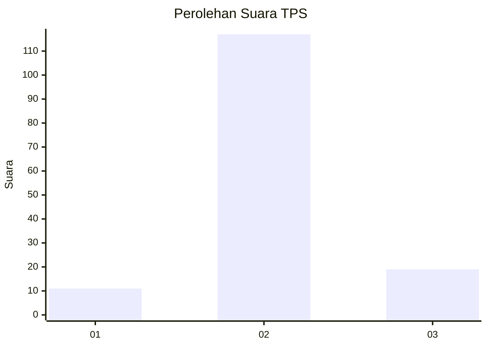
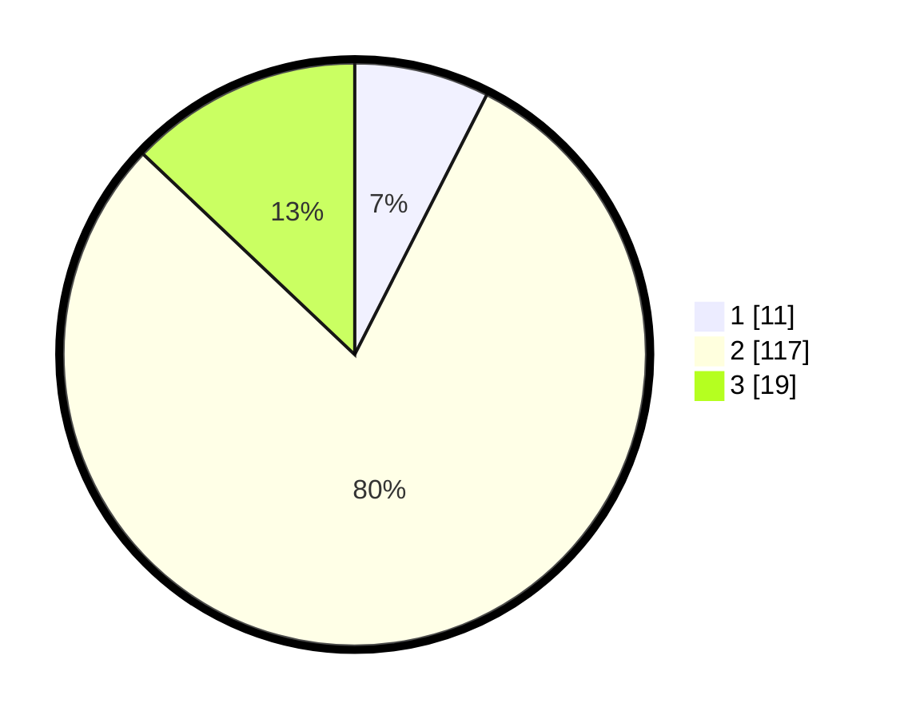

# Hasil

## Grafik

## Tabel

| No. | Nama Paslon    | Suara | Suara (raw) | Persentase |
|:--- |:-------------- | -----:| -----------:| ----------:|
| 1   | ANIES MUHAIMIN | 11    | [11][p-1]   | 7,48       |
| 2   | PRABOWO GIBRAN | 117   | [117][p-2]  | 79,59      |
| 3   | GANJAR MAHFUD  | 19    | [19][p-3]   | 12,93      |

[p-1]: https://github.com/gigit-pemilu/pemilu-2024-33-jawa-tengah/blob/main/pilpres/hitung-suara/sub/33-jawa-tengah/sub/29-brebes/sub/17-banjarharjo/sub/2004-blandongan/sub/004-tps/sub/paslon-1.txt
[p-2]: https://github.com/gigit-pemilu/pemilu-2024-33-jawa-tengah/blob/main/pilpres/hitung-suara/sub/33-jawa-tengah/sub/29-brebes/sub/17-banjarharjo/sub/2004-blandongan/sub/004-tps/sub/paslon-2.txt
[p-3]: https://github.com/gigit-pemilu/pemilu-2024-33-jawa-tengah/blob/main/pilpres/hitung-suara/sub/33-jawa-tengah/sub/29-brebes/sub/17-banjarharjo/sub/2004-blandongan/sub/004-tps/sub/paslon-3.txt

## Foto C Plano

https://sirekap-obj-formc.kpu.go.id/a02a/pemilu/ppwp/33/29/17/20/04/3329172004004-20240215-014404--422ddede-fd26-437e-ba82-33fdd3ca2658.jpg

https://sirekap-obj-formc.kpu.go.id/a02a/pemilu/ppwp/33/29/17/20/04/3329172004004-20240214-212737--ca6e8bf0-e80e-4a7d-ae51-2ed92a98ec1f.jpg

https://sirekap-obj-formc.kpu.go.id/a02a/pemilu/ppwp/33/29/17/20/04/3329172004004-20240214-212732--3ffdb465-4099-436f-a3ca-f10f2bcd1c9b.jpg

## Metadata

| Key        | Value               |
| ---------- | ------------------- |
| Time Stamp | 2024-02-15 01:47:43 |

