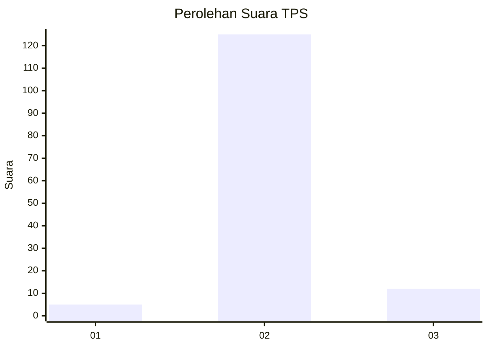
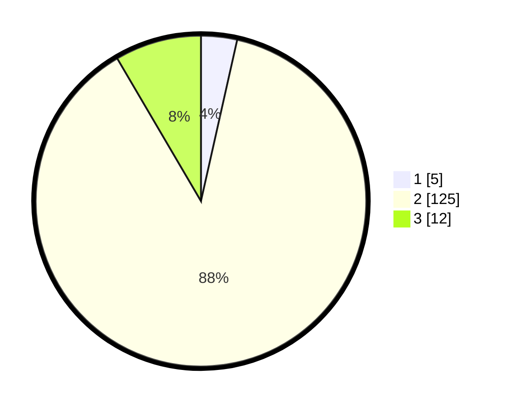

# Hasil

## Grafik

## Tabel

| No. | Nama Paslon    | Suara | Suara (raw) | Persentase |
|:--- |:-------------- | -----:| -----------:| ----------:|
| 1   | ANIES MUHAIMIN | 5     | [5][p-1]    | 3,52       |
| 2   | PRABOWO GIBRAN | 125   | [125][p-2]  | 88,03      |
| 3   | GANJAR MAHFUD  | 12    | [12][p-3]   | 8,45       |

[p-1]: https://github.com/gigit-pemilu/pemilu-2024/blob/main/pilpres/hitung-suara/sub/33-jawa-tengah/sub/29-brebes/sub/17-banjarharjo/sub/2004-blandongan/sub/005-tps/sub/paslon-1.txt
[p-2]: https://github.com/gigit-pemilu/pemilu-2024/blob/main/pilpres/hitung-suara/sub/33-jawa-tengah/sub/29-brebes/sub/17-banjarharjo/sub/2004-blandongan/sub/005-tps/sub/paslon-2.txt
[p-3]: https://github.com/gigit-pemilu/pemilu-2024/blob/main/pilpres/hitung-suara/sub/33-jawa-tengah/sub/29-brebes/sub/17-banjarharjo/sub/2004-blandongan/sub/005-tps/sub/paslon-3.txt

## Foto C Plano

https://sirekap-obj-formc.kpu.go.id/ab8c/pemilu/ppwp/33/29/17/20/04/3329172004005-20240214-221927--573fdd64-d1bb-44cc-b25f-6bcc9be7e2a3.jpg

https://sirekap-obj-formc.kpu.go.id/ab8c/pemilu/ppwp/33/29/17/20/04/3329172004005-20240214-222147--7ade5d73-817f-43d3-818f-21fa8b6258fc.jpg

https://sirekap-obj-formc.kpu.go.id/ab8c/pemilu/ppwp/33/29/17/20/04/3329172004005-20240214-222401--1f7f1b32-add8-4507-97b1-256fc464859c.jpg

## Metadata

| Key        | Value               |
| ---------- | ------------------- |
| Time Stamp | 2024-02-15 16:00:26 |

