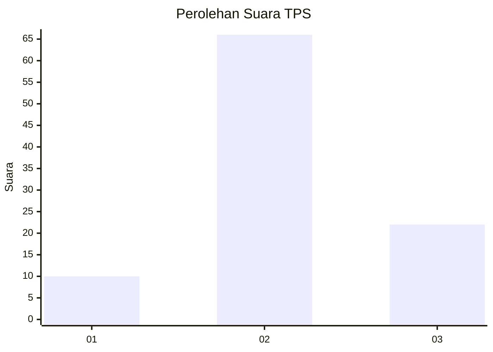
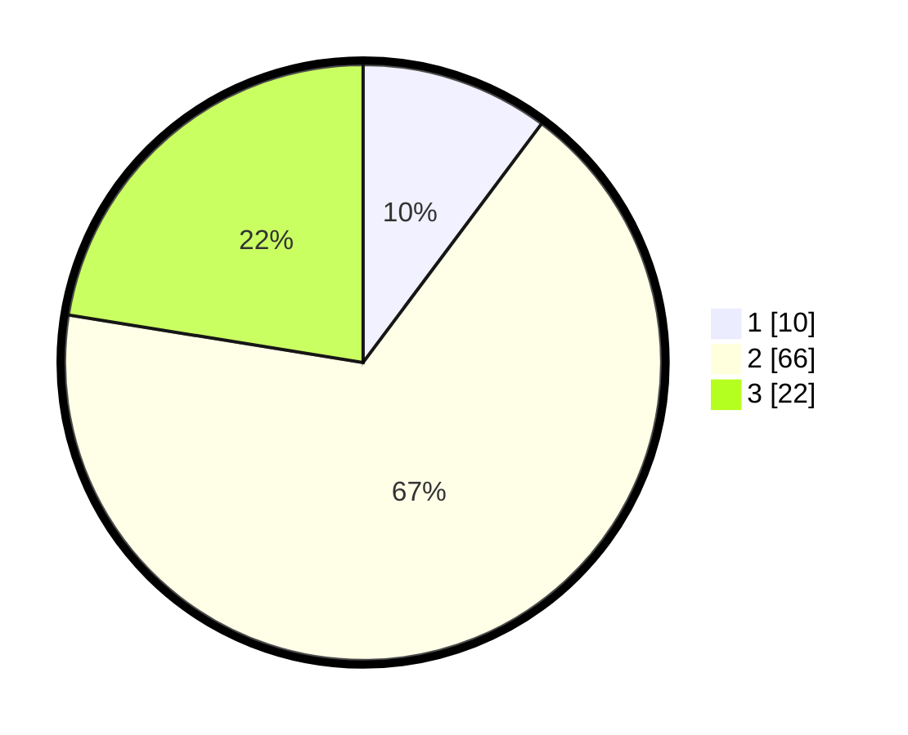

# Hasil

## Grafik

## Tabel

| No. | Nama Paslon    | Suara | Suara (raw) | Persentase |
|:--- |:-------------- | -----:| -----------:| ----------:|
| 1   | ANIES MUHAIMIN | 10    | [10][p-1]   | 10,20      |
| 2   | PRABOWO GIBRAN | 66    | [66][p-2]   | 67,35      |
| 3   | GANJAR MAHFUD  | 22    | [22][p-3]   | 22,45      |

[p-1]: https://github.com/gigit-pemilu/pemilu-2024-33-jawa-tengah/blob/main/pilpres/hitung-suara/sub/33-jawa-tengah/sub/29-brebes/sub/17-banjarharjo/sub/2007-cibuniwangi/sub/011-tps/sub/paslon-1.txt
[p-2]: https://github.com/gigit-pemilu/pemilu-2024-33-jawa-tengah/blob/main/pilpres/hitung-suara/sub/33-jawa-tengah/sub/29-brebes/sub/17-banjarharjo/sub/2007-cibuniwangi/sub/011-tps/sub/paslon-2.txt
[p-3]: https://github.com/gigit-pemilu/pemilu-2024-33-jawa-tengah/blob/main/pilpres/hitung-suara/sub/33-jawa-tengah/sub/29-brebes/sub/17-banjarharjo/sub/2007-cibuniwangi/sub/011-tps/sub/paslon-3.txt

## Foto C Plano

https://sirekap-obj-formc.kpu.go.id/4a31/pemilu/ppwp/33/29/17/20/07/3329172007011-20240215-015555--0c9af1c2-1e7c-41c8-9762-3ca744b277a2.jpg

https://sirekap-obj-formc.kpu.go.id/4a31/pemilu/ppwp/33/29/17/20/07/3329172007011-20240215-021353--8650178c-caf8-4e74-9760-7487cfd6cbfe.jpg

https://sirekap-obj-formc.kpu.go.id/4a31/pemilu/ppwp/33/29/17/20/07/3329172007011-20240215-021810--9face0a9-42fe-4ec5-9317-11b1c31c48dd.jpg

## Metadata

| Key        | Value               |
| ---------- | ------------------- |
| Time Stamp | 2024-02-16 11:00:29 |

