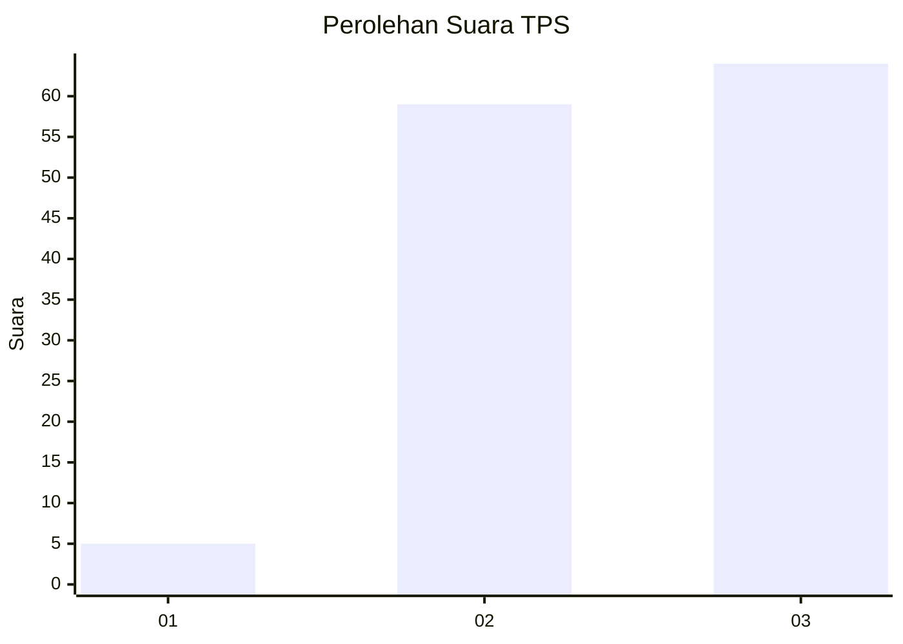
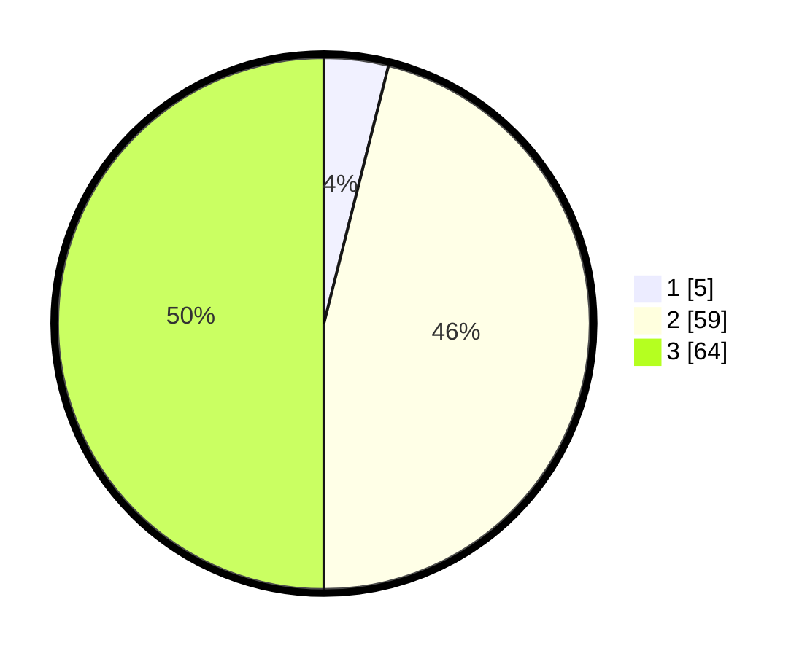

# Hasil

## Grafik

## Tabel

| No. | Nama Paslon    | Suara | Suara (raw) | Persentase |
|:--- |:-------------- | -----:| -----------:| ----------:|
| 1   | ANIES MUHAIMIN | 5     | [5][p-1]    | 3,91       |
| 2   | PRABOWO GIBRAN | 59    | [59][p-2]   | 46,09      |
| 3   | GANJAR MAHFUD  | 64    | [64][p-3]   | 50,00      |

[p-1]: https://github.com/gigit-pemilu/pemilu-2024-33-jawa-tengah/blob/main/pilpres/hitung-suara/sub/33-jawa-tengah/sub/29-brebes/sub/17-banjarharjo/sub/2007-cibuniwangi/sub/013-tps/sub/paslon-1.txt
[p-2]: https://github.com/gigit-pemilu/pemilu-2024-33-jawa-tengah/blob/main/pilpres/hitung-suara/sub/33-jawa-tengah/sub/29-brebes/sub/17-banjarharjo/sub/2007-cibuniwangi/sub/013-tps/sub/paslon-2.txt
[p-3]: https://github.com/gigit-pemilu/pemilu-2024-33-jawa-tengah/blob/main/pilpres/hitung-suara/sub/33-jawa-tengah/sub/29-brebes/sub/17-banjarharjo/sub/2007-cibuniwangi/sub/013-tps/sub/paslon-3.txt

## Foto C Plano

https://sirekap-obj-formc.kpu.go.id/8c7b/pemilu/ppwp/33/29/17/20/07/3329172007013-20240215-012007--870799c6-eeb9-4e0f-91a6-7cd67f049761.jpg

https://sirekap-obj-formc.kpu.go.id/8c7b/pemilu/ppwp/33/29/17/20/07/3329172007013-20240215-020703--c2e94c68-2410-425e-9e3f-1771bdf3530a.jpg

https://sirekap-obj-formc.kpu.go.id/8c7b/pemilu/ppwp/33/29/17/20/07/3329172007013-20240215-012425--f31a0d8f-0f4b-4ac6-8f6c-50c17e298171.jpg

## Metadata

| Key        | Value               |
| ---------- | ------------------- |
| Time Stamp | 2024-02-16 10:00:28 |

