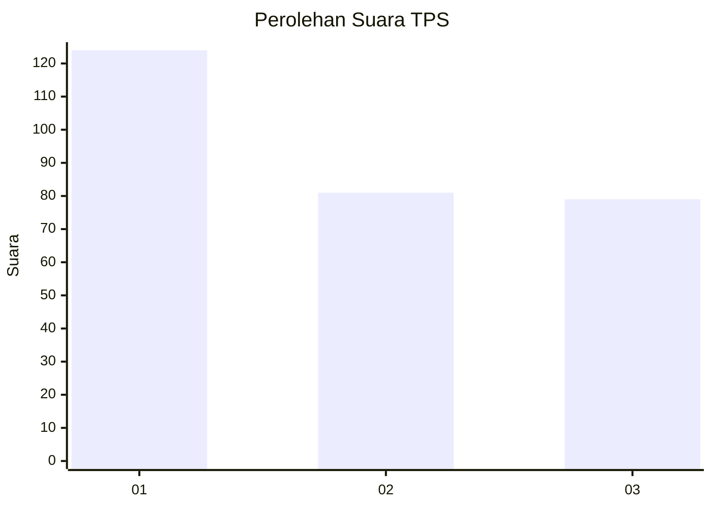
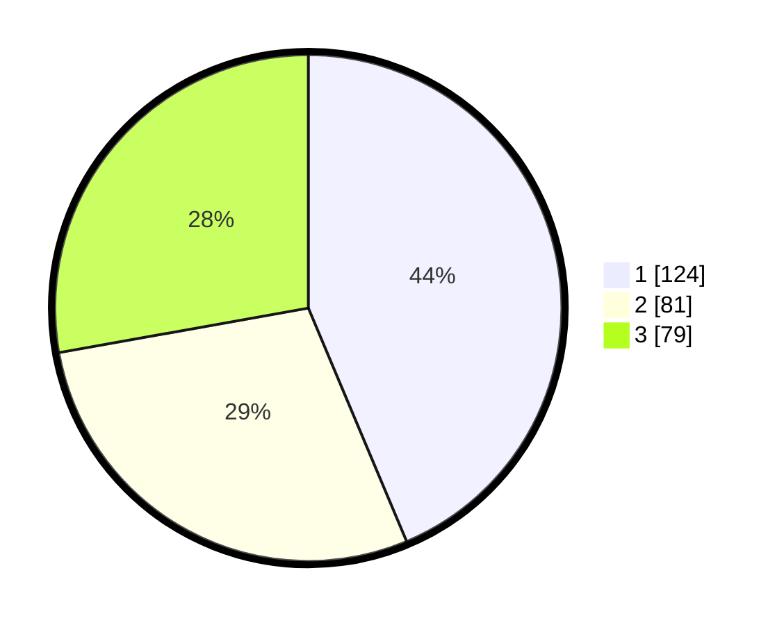

# Hasil

## Grafik

## Tabel

| No. | Nama Paslon    | Suara | Suara (raw) | Persentase |
|:--- |:-------------- | -----:| -----------:| ----------:|
| 1   | ANIES MUHAIMIN | 124   | [124][p-1]  | 43,66      |
| 2   | PRABOWO GIBRAN | 81    | [81][p-2]   | 28,52      |
| 3   | GANJAR MAHFUD  | 79    | [79][p-3]   | 27,82      |

[p-1]: https://github.com/gigit-pemilu/pemilu-2024/blob/main/pilpres/hitung-suara/sub/33-jawa-tengah/sub/29-brebes/sub/17-banjarharjo/sub/2011-cikuya/sub/017-tps/sub/paslon-1.txt
[p-2]: https://github.com/gigit-pemilu/pemilu-2024/blob/main/pilpres/hitung-suara/sub/33-jawa-tengah/sub/29-brebes/sub/17-banjarharjo/sub/2011-cikuya/sub/017-tps/sub/paslon-2.txt
[p-3]: https://github.com/gigit-pemilu/pemilu-2024/blob/main/pilpres/hitung-suara/sub/33-jawa-tengah/sub/29-brebes/sub/17-banjarharjo/sub/2011-cikuya/sub/017-tps/sub/paslon-3.txt

## Foto C Plano

https://sirekap-obj-formc.kpu.go.id/7b04/pemilu/ppwp/33/29/17/20/11/3329172011017-20240214-212731--a8ff1490-a463-4251-87ae-903a8ece9255.jpg

https://sirekap-obj-formc.kpu.go.id/7b04/pemilu/ppwp/33/29/17/20/11/3329172011017-20240214-212824--a7cd3627-6a0e-468c-9fed-668fc09b1e0c.jpg

https://sirekap-obj-formc.kpu.go.id/7b04/pemilu/ppwp/33/29/17/20/11/3329172011017-20240214-213133--5c63f5d3-30d0-4569-8bc0-a8e0355d2f9f.jpg

## Metadata

| Key        | Value               |
| ---------- | ------------------- |
| Time Stamp | 2024-02-16 12:51:22 |

