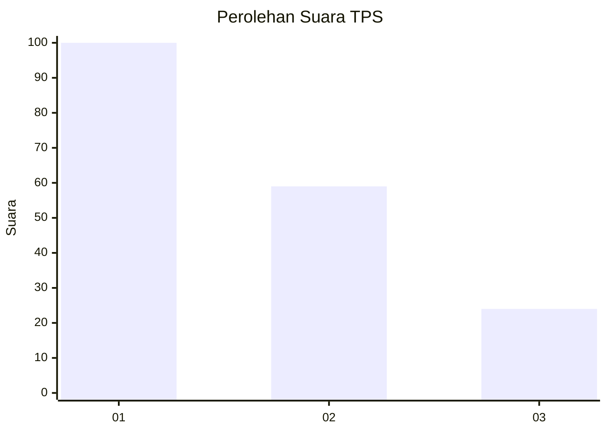
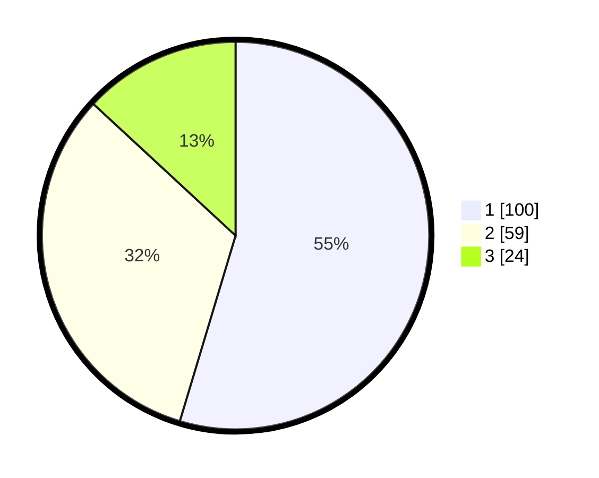

# Hasil

## Grafik

## Tabel

| No. | Nama Paslon    | Suara | Suara (raw) | Persentase |
|:--- |:-------------- | -----:| -----------:| ----------:|
| 1   | ANIES MUHAIMIN | 100   | [100][p-1]  | 54,64      |
| 2   | PRABOWO GIBRAN | 59    | [59][p-2]   | 32,24      |
| 3   | GANJAR MAHFUD  | 24    | [24][p-3]   | 13,11      |

[p-1]: https://github.com/gigit-pemilu/pemilu-2024-33-jawa-tengah/blob/main/pilpres/hitung-suara/sub/33-jawa-tengah/sub/29-brebes/sub/17-banjarharjo/sub/2011-cikuya/sub/021-tps/sub/paslon-1.txt
[p-2]: https://github.com/gigit-pemilu/pemilu-2024-33-jawa-tengah/blob/main/pilpres/hitung-suara/sub/33-jawa-tengah/sub/29-brebes/sub/17-banjarharjo/sub/2011-cikuya/sub/021-tps/sub/paslon-2.txt
[p-3]: https://github.com/gigit-pemilu/pemilu-2024-33-jawa-tengah/blob/main/pilpres/hitung-suara/sub/33-jawa-tengah/sub/29-brebes/sub/17-banjarharjo/sub/2011-cikuya/sub/021-tps/sub/paslon-3.txt

## Foto C Plano

https://sirekap-obj-formc.kpu.go.id/016c/pemilu/ppwp/33/29/17/20/11/3329172011021-20240215-030549--8cb4092e-dd1a-4d70-9b8d-acf71020139c.jpg

https://sirekap-obj-formc.kpu.go.id/016c/pemilu/ppwp/33/29/17/20/11/3329172011021-20240215-025404--4e8955b2-6b63-4b9f-8b94-f1fd6cc641e6.jpg

https://sirekap-obj-formc.kpu.go.id/016c/pemilu/ppwp/33/29/17/20/11/3329172011021-20240215-025502--186cdd83-ffef-4edd-bcad-38410d927c97.jpg

## Metadata

| Key        | Value               |
| ---------- | ------------------- |
| Time Stamp | 2024-02-16 10:00:28 |

