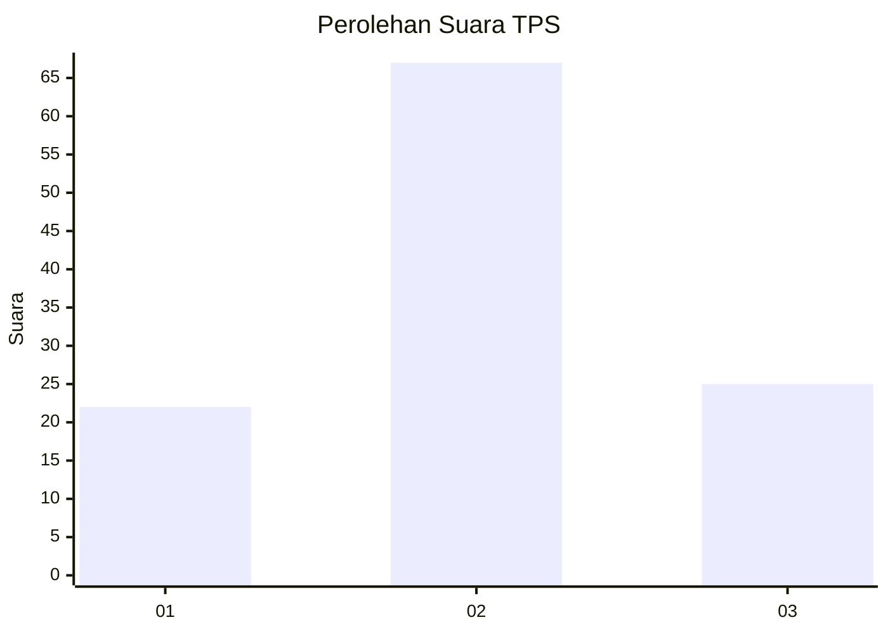
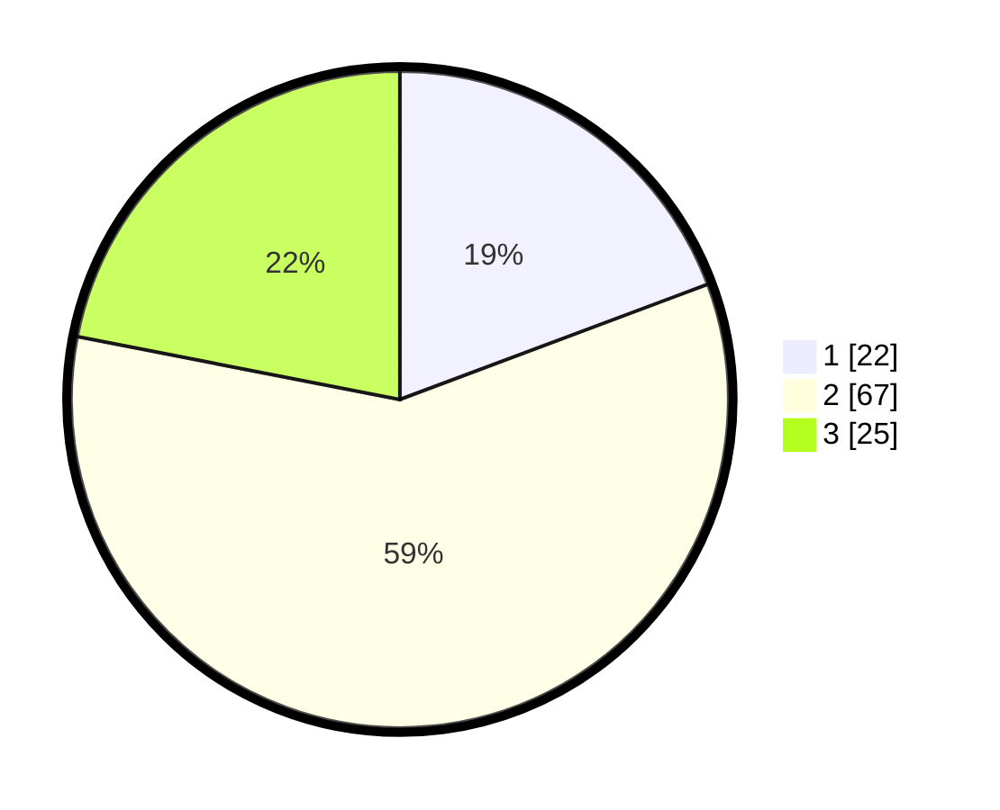

# Hasil

## Grafik

## Tabel

| No. | Nama Paslon    | Suara | Suara (raw) | Persentase |
|:--- |:-------------- | -----:| -----------:| ----------:|
| 1   | ANIES MUHAIMIN | 22    | [22][p-1]   | 19,30      |
| 2   | PRABOWO GIBRAN | 67    | [67][p-2]   | 58,77      |
| 3   | GANJAR MAHFUD  | 25    | [25][p-3]   | 21,93      |

[p-1]: https://github.com/gigit-pemilu/pemilu-2024-33-jawa-tengah/blob/main/pilpres/hitung-suara/sub/33-jawa-tengah/sub/29-brebes/sub/17-banjarharjo/sub/2012-cimunding/sub/004-tps/sub/paslon-1.txt
[p-2]: https://github.com/gigit-pemilu/pemilu-2024-33-jawa-tengah/blob/main/pilpres/hitung-suara/sub/33-jawa-tengah/sub/29-brebes/sub/17-banjarharjo/sub/2012-cimunding/sub/004-tps/sub/paslon-2.txt
[p-3]: https://github.com/gigit-pemilu/pemilu-2024-33-jawa-tengah/blob/main/pilpres/hitung-suara/sub/33-jawa-tengah/sub/29-brebes/sub/17-banjarharjo/sub/2012-cimunding/sub/004-tps/sub/paslon-3.txt

## Foto C Plano

https://sirekap-obj-formc.kpu.go.id/3c8a/pemilu/ppwp/33/29/17/20/12/3329172012004-20240215-022434--1540b206-f4ba-4804-941a-b745e09c77fc.jpg

https://sirekap-obj-formc.kpu.go.id/3c8a/pemilu/ppwp/33/29/17/20/12/3329172012004-20240215-022615--fad7656f-ebf2-49a4-8310-d82f90f759d3.jpg

https://sirekap-obj-formc.kpu.go.id/3c8a/pemilu/ppwp/33/29/17/20/12/3329172012004-20240215-022727--70fe6152-c4e7-476b-b56c-447aa6da70ea.jpg

## Metadata

| Key        | Value               |
| ---------- | ------------------- |
| Time Stamp | 2024-02-16 12:51:22 |

