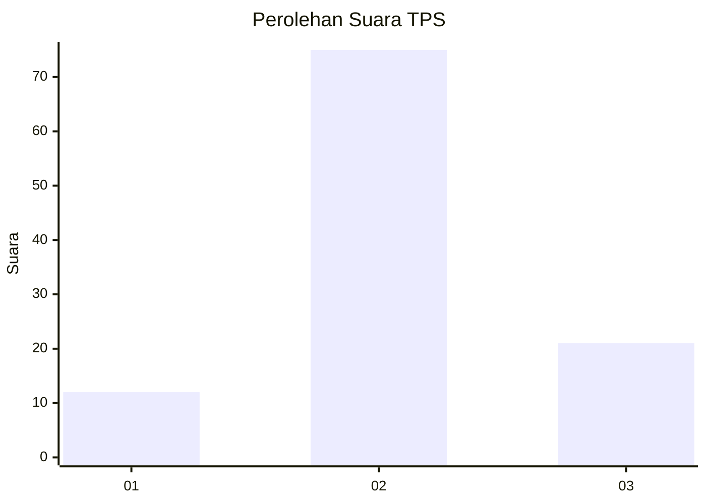
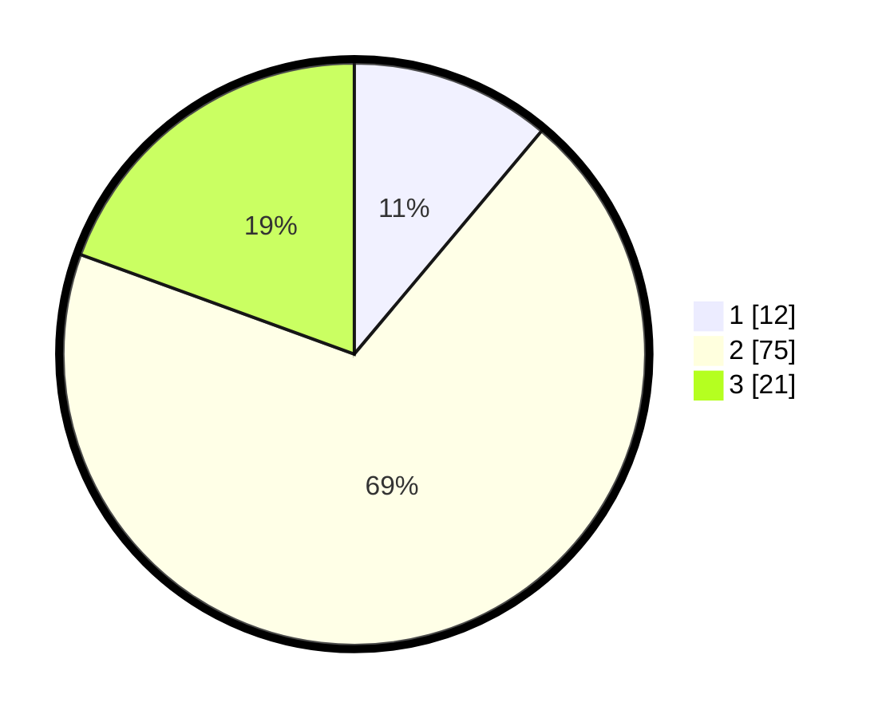

# Hasil

## Grafik

## Tabel

| No. | Nama Paslon    | Suara | Suara (raw) | Persentase |
|:--- |:-------------- | -----:| -----------:| ----------:|
| 1   | ANIES MUHAIMIN | 12    | [12][p-1]   | 11,11      |
| 2   | PRABOWO GIBRAN | 75    | [75][p-2]   | 69,44      |
| 3   | GANJAR MAHFUD  | 21    | [21][p-3]   | 19,44      |

[p-1]: https://github.com/gigit-pemilu/pemilu-2024-33-jawa-tengah/blob/main/pilpres/hitung-suara/sub/33-jawa-tengah/sub/29-brebes/sub/17-banjarharjo/sub/2012-cimunding/sub/006-tps/sub/paslon-1.txt
[p-2]: https://github.com/gigit-pemilu/pemilu-2024-33-jawa-tengah/blob/main/pilpres/hitung-suara/sub/33-jawa-tengah/sub/29-brebes/sub/17-banjarharjo/sub/2012-cimunding/sub/006-tps/sub/paslon-2.txt
[p-3]: https://github.com/gigit-pemilu/pemilu-2024-33-jawa-tengah/blob/main/pilpres/hitung-suara/sub/33-jawa-tengah/sub/29-brebes/sub/17-banjarharjo/sub/2012-cimunding/sub/006-tps/sub/paslon-3.txt

## Foto C Plano

https://sirekap-obj-formc.kpu.go.id/c4ec/pemilu/ppwp/33/29/17/20/12/3329172012006-20240214-234211--fc04e56c-16d0-4c65-83bf-52013395d540.jpg

https://sirekap-obj-formc.kpu.go.id/c4ec/pemilu/ppwp/33/29/17/20/12/3329172012006-20240214-234350--a49ab7bd-6684-42c1-a23a-dd35d72bf47c.jpg

https://sirekap-obj-formc.kpu.go.id/c4ec/pemilu/ppwp/33/29/17/20/12/3329172012006-20240214-234633--6850e0d3-9357-4aa7-be40-4f35b4fc0e34.jpg

## Metadata

| Key        | Value               |
| ---------- | ------------------- |
| Time Stamp | 2024-02-16 10:00:28 |

