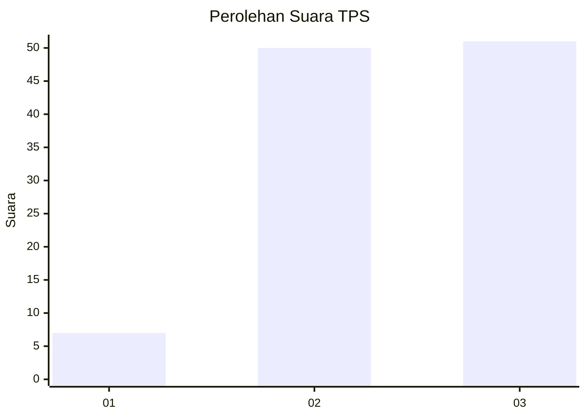
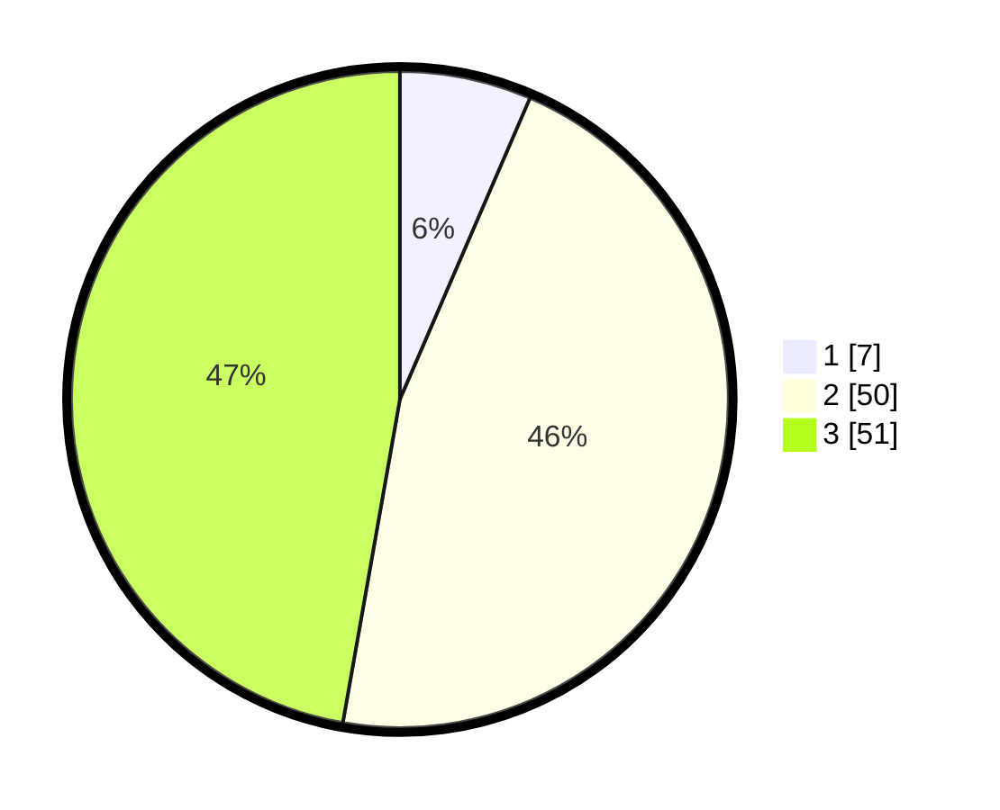

# Hasil

## Grafik

## Tabel

| No. | Nama Paslon    | Suara | Suara (raw) | Persentase |
|:--- |:-------------- | -----:| -----------:| ----------:|
| 1   | ANIES MUHAIMIN | 7     | [7][p-1]    | 6,48       |
| 2   | PRABOWO GIBRAN | 50    | [50][p-2]   | 46,30      |
| 3   | GANJAR MAHFUD  | 51    | [51][p-3]   | 47,22      |

[p-1]: https://github.com/gigit-pemilu/pemilu-2024/blob/main/pilpres/hitung-suara/sub/33-jawa-tengah/sub/29-brebes/sub/17-banjarharjo/sub/2013-cipajang/sub/013-tps/sub/paslon-1.txt
[p-2]: https://github.com/gigit-pemilu/pemilu-2024/blob/main/pilpres/hitung-suara/sub/33-jawa-tengah/sub/29-brebes/sub/17-banjarharjo/sub/2013-cipajang/sub/013-tps/sub/paslon-2.txt
[p-3]: https://github.com/gigit-pemilu/pemilu-2024/blob/main/pilpres/hitung-suara/sub/33-jawa-tengah/sub/29-brebes/sub/17-banjarharjo/sub/2013-cipajang/sub/013-tps/sub/paslon-3.txt

## Foto C Plano

https://sirekap-obj-formc.kpu.go.id/7e0e/pemilu/ppwp/33/29/17/20/13/3329172013013-20240214-211850--cb06180d-e69c-4a96-9c90-bb856674fc04.jpg

https://sirekap-obj-formc.kpu.go.id/7e0e/pemilu/ppwp/33/29/17/20/13/3329172013013-20240214-211904--ca33b0af-36e9-49b4-afb9-5c0a73532b74.jpg

https://sirekap-obj-formc.kpu.go.id/7e0e/pemilu/ppwp/33/29/17/20/13/3329172013013-20240214-211908--98b92466-a442-4129-9a63-c609ecedded8.jpg

## Metadata

| Key        | Value               |
| ---------- | ------------------- |
| Time Stamp | 2024-02-16 12:51:22 |

