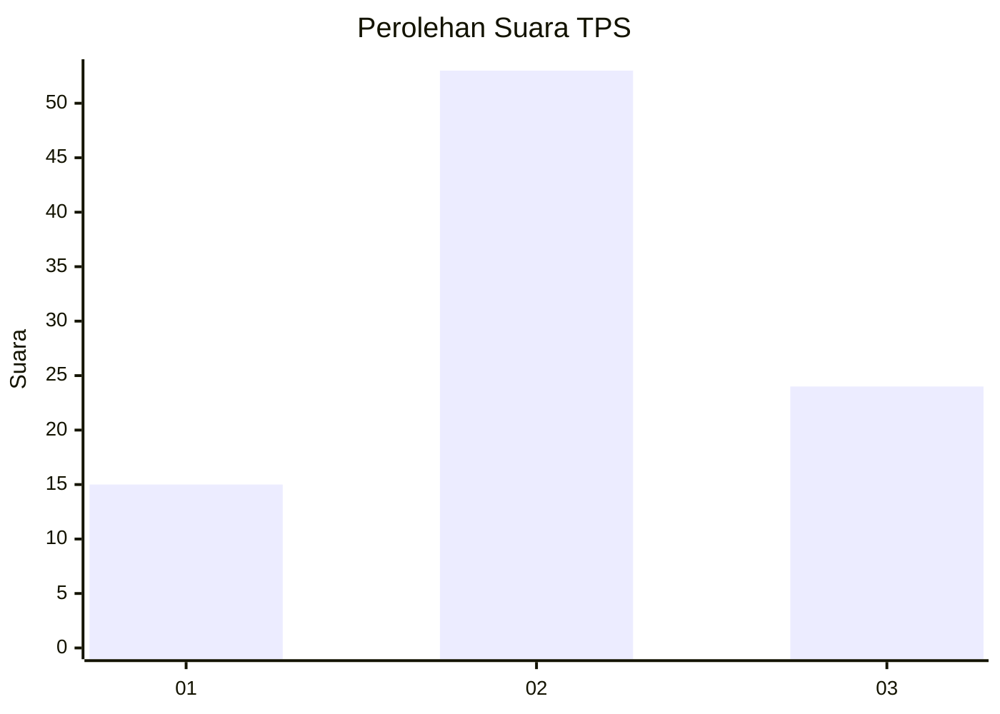
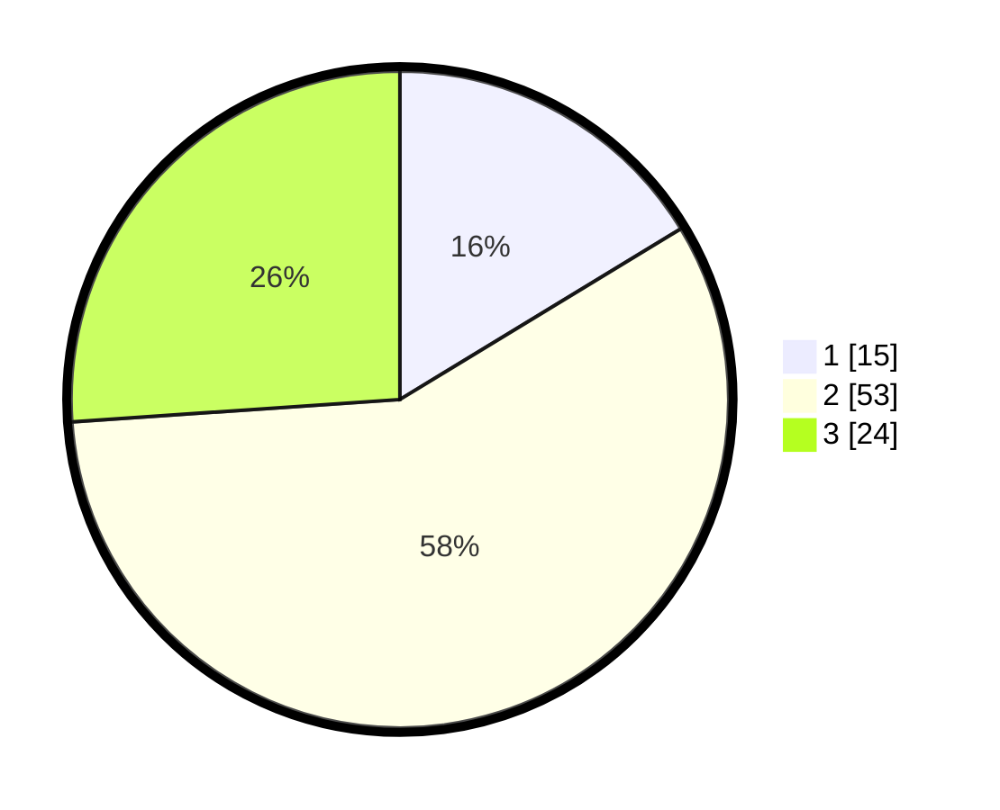

# Hasil

## Grafik

## Tabel

| No. | Nama Paslon    | Suara | Suara (raw) | Persentase |
|:--- |:-------------- | -----:| -----------:| ----------:|
| 1   | ANIES MUHAIMIN | 15    | [15][p-1]   | 16,30      |
| 2   | PRABOWO GIBRAN | 53    | [53][p-2]   | 57,61      |
| 3   | GANJAR MAHFUD  | 24    | [24][p-3]   | 26,09      |

[p-1]: https://github.com/gigit-pemilu/pemilu-2024/blob/main/pilpres/hitung-suara/sub/33-jawa-tengah/sub/29-brebes/sub/17-banjarharjo/sub/2013-cipajang/sub/015-tps/sub/paslon-1.txt
[p-2]: https://github.com/gigit-pemilu/pemilu-2024/blob/main/pilpres/hitung-suara/sub/33-jawa-tengah/sub/29-brebes/sub/17-banjarharjo/sub/2013-cipajang/sub/015-tps/sub/paslon-2.txt
[p-3]: https://github.com/gigit-pemilu/pemilu-2024/blob/main/pilpres/hitung-suara/sub/33-jawa-tengah/sub/29-brebes/sub/17-banjarharjo/sub/2013-cipajang/sub/015-tps/sub/paslon-3.txt

## Foto C Plano

https://sirekap-obj-formc.kpu.go.id/4953/pemilu/ppwp/33/29/17/20/13/3329172013015-20240215-003335--1cab4b86-7602-4983-8ddb-a72a08392b84.jpg

https://sirekap-obj-formc.kpu.go.id/4953/pemilu/ppwp/33/29/17/20/13/3329172013015-20240215-003508--83b6cec2-e516-4b79-af81-785708368e31.jpg

https://sirekap-obj-formc.kpu.go.id/4953/pemilu/ppwp/33/29/17/20/13/3329172013015-20240215-003543--70207b8c-df0d-4b6f-8a2b-d1721e77b1a8.jpg

## Metadata

| Key        | Value               |
| ---------- | ------------------- |
| Time Stamp | 2024-02-16 12:51:22 |

