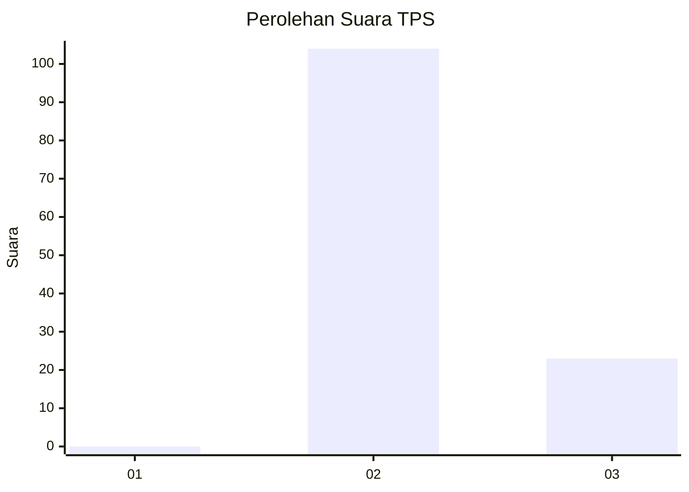
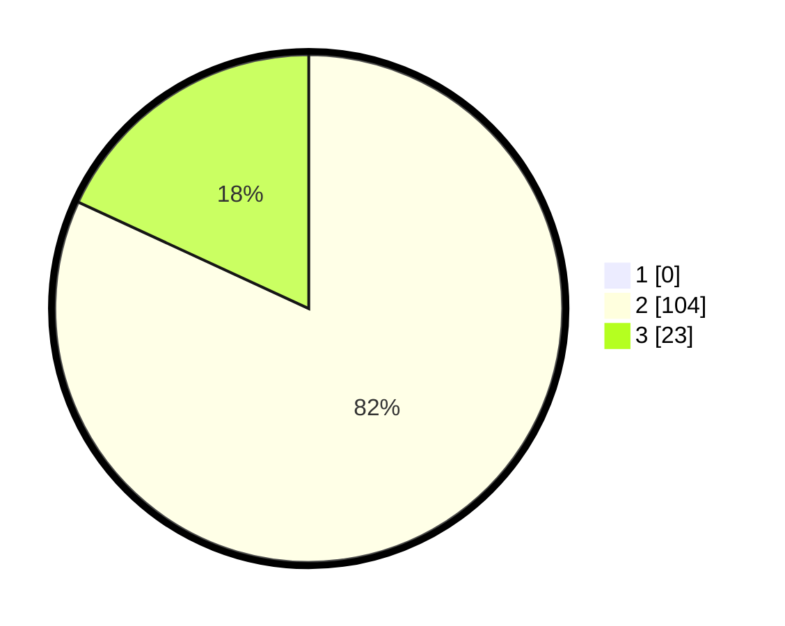

# Hasil

## Grafik

## Tabel

| No. | Nama Paslon    | Suara | Suara (raw) | Persentase |
|:--- |:-------------- | -----:| -----------:| ----------:|
| 1   | ANIES MUHAIMIN | 0     | [0][p-1]    | 0,00       |
| 2   | PRABOWO GIBRAN | 104   | [104][p-2]  | 81,89      |
| 3   | GANJAR MAHFUD  | 23    | [23][p-3]   | 18,11      |

[p-1]: https://github.com/gigit-pemilu/pemilu-2024/blob/main/pilpres/hitung-suara/sub/33-jawa-tengah/sub/29-brebes/sub/17-banjarharjo/sub/2014-dukuhjeruk/sub/007-tps/sub/paslon-1.txt
[p-2]: https://github.com/gigit-pemilu/pemilu-2024/blob/main/pilpres/hitung-suara/sub/33-jawa-tengah/sub/29-brebes/sub/17-banjarharjo/sub/2014-dukuhjeruk/sub/007-tps/sub/paslon-2.txt
[p-3]: https://github.com/gigit-pemilu/pemilu-2024/blob/main/pilpres/hitung-suara/sub/33-jawa-tengah/sub/29-brebes/sub/17-banjarharjo/sub/2014-dukuhjeruk/sub/007-tps/sub/paslon-3.txt

## Foto C Plano

https://sirekap-obj-formc.kpu.go.id/0a83/pemilu/ppwp/33/29/17/20/14/3329172014007-20240214-221350--f559cee7-a1e5-440b-8ead-4437f0e9c4db.jpg

https://sirekap-obj-formc.kpu.go.id/0a83/pemilu/ppwp/33/29/17/20/14/3329172014007-20240215-024309--f215a77c-670c-4cfc-b65c-7a11442764e9.jpg

https://sirekap-obj-formc.kpu.go.id/0a83/pemilu/ppwp/33/29/17/20/14/3329172014007-20240214-221808--ad292aa0-14f6-43e9-934e-c6fd884f6cdf.jpg

## Metadata

| Key        | Value               |
| ---------- | ------------------- |
| Time Stamp | 2024-02-15 17:00:25 |

## DATA PEMILIH TETAP

Jumlah pemilih dalam DPT: **246**.
 * L: **125**.
 * P: **121**.

## DATA PENGGUNA HAK PILIH

Jumlah pengguna hak pilih dalam DPT: **85**.
 * L: **548**.
 * P: **571**.

Jumlah pengguna hak pilih dalam DPTb: **4**.
 * L: **506**.
 * P: **0**.

Jumlah pengguna hak pilih dalam DPK: **0**.
 * L: **800**.
 * P: **0**.

Jumlah pengguna hak pilih: **153**.
 * L: **58**.
 * P: **191**.

## JUMLAH SUARA SAH DAN TIDAK SAH

JUMLAH SELURUH SUARA SAH: **557**.

JUMLAH SUARA TIDAK SAH: **503**.

JUMLAH SELURUH SUARA SAH DAN SUARA TIDAK SAH: **759**.

