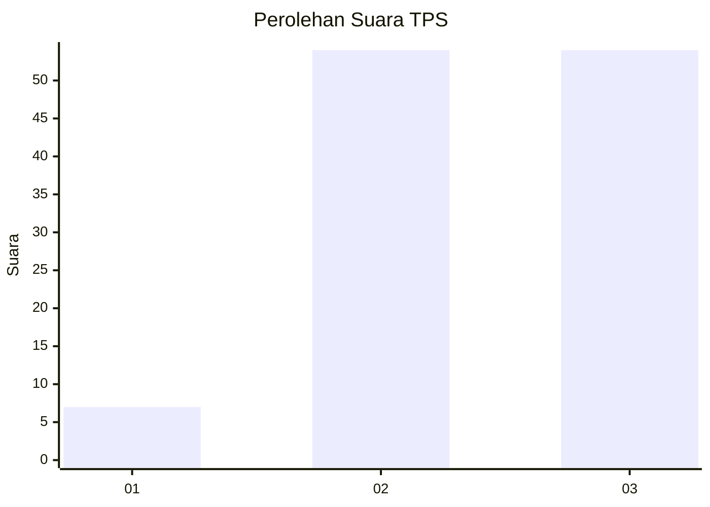
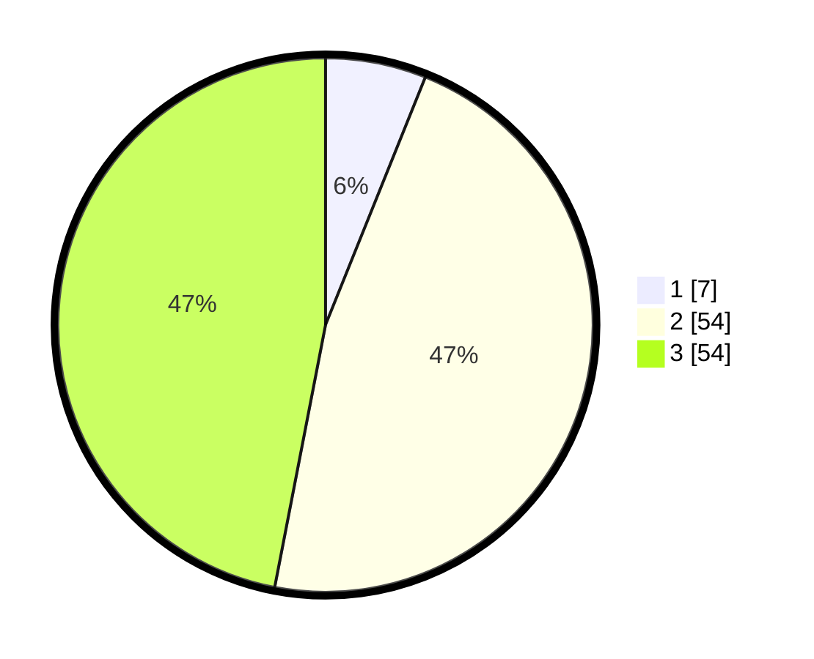

# Hasil

## Grafik

## Tabel

| No. | Nama Paslon    | Suara | Suara (raw) | Persentase |
|:--- |:-------------- | -----:| -----------:| ----------:|
| 1   | ANIES MUHAIMIN | 7     | [7][p-1]    | 6,09       |
| 2   | PRABOWO GIBRAN | 54    | [54][p-2]   | 46,96      |
| 3   | GANJAR MAHFUD  | 54    | [54][p-3]   | 46,96      |

[p-1]: https://github.com/gigit-pemilu/pemilu-2024-33-jawa-tengah/blob/main/pilpres/hitung-suara/sub/33-jawa-tengah/sub/29-brebes/sub/17-banjarharjo/sub/2016-kertasari/sub/012-tps/sub/paslon-1.txt
[p-2]: https://github.com/gigit-pemilu/pemilu-2024-33-jawa-tengah/blob/main/pilpres/hitung-suara/sub/33-jawa-tengah/sub/29-brebes/sub/17-banjarharjo/sub/2016-kertasari/sub/012-tps/sub/paslon-2.txt
[p-3]: https://github.com/gigit-pemilu/pemilu-2024-33-jawa-tengah/blob/main/pilpres/hitung-suara/sub/33-jawa-tengah/sub/29-brebes/sub/17-banjarharjo/sub/2016-kertasari/sub/012-tps/sub/paslon-3.txt

## Foto C Plano

https://sirekap-obj-formc.kpu.go.id/d235/pemilu/ppwp/33/29/17/20/16/3329172016012-20240214-232218--3d601c46-ebc1-4d55-ae19-a36e2c2b2e09.jpg

https://sirekap-obj-formc.kpu.go.id/d235/pemilu/ppwp/33/29/17/20/16/3329172016012-20240214-232401--3bab18d5-18ba-44e0-91ea-6526d6b0a28e.jpg

https://sirekap-obj-formc.kpu.go.id/d235/pemilu/ppwp/33/29/17/20/16/3329172016012-20240214-232529--e7ea3a45-70bd-4f74-b974-69a98c54c48b.jpg

## Metadata

| Key        | Value               |
| ---------- | ------------------- |
| Time Stamp | 2024-02-16 12:51:22 |

