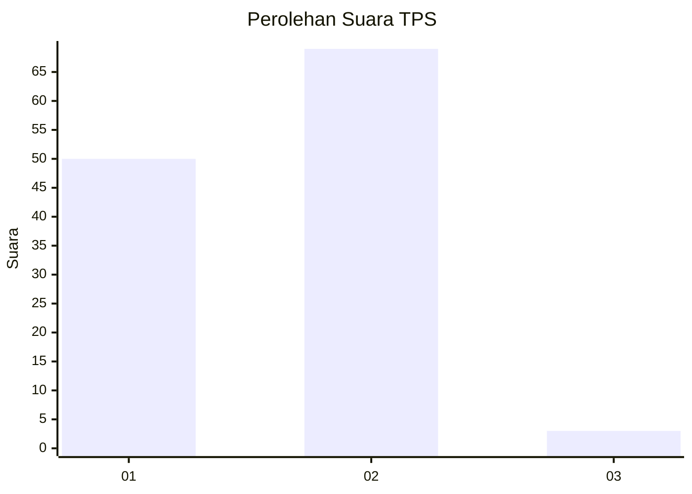
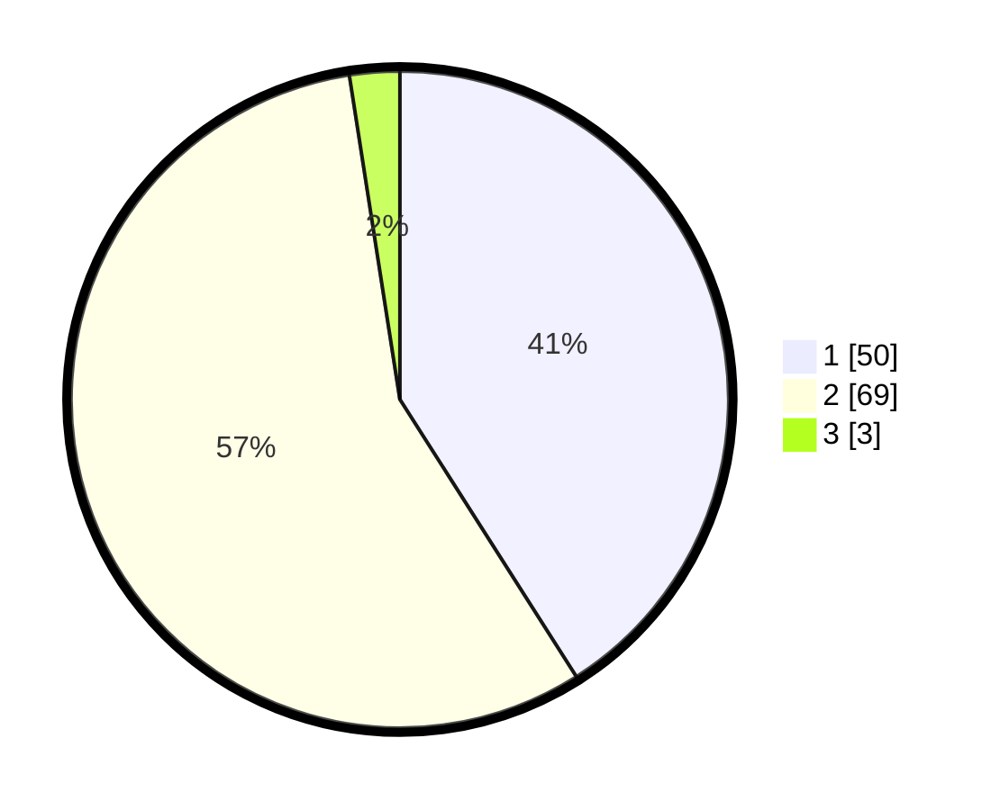

# Hasil

## Grafik

## Tabel

| No. | Nama Paslon    | Suara | Suara (raw) | Persentase |
|:--- |:-------------- | -----:| -----------:| ----------:|
| 1   | ANIES MUHAIMIN | 50    | [50][p-1]   | 40,98      |
| 2   | PRABOWO GIBRAN | 69    | [69][p-2]   | 56,56      |
| 3   | GANJAR MAHFUD  | 3     | [3][p-3]    | 2,46       |

[p-1]: https://github.com/gigit-pemilu/pemilu-2024/blob/main/pilpres/hitung-suara/sub/33-jawa-tengah/sub/29-brebes/sub/17-banjarharjo/sub/2018-malahayu/sub/002-tps/sub/paslon-1.txt
[p-2]: https://github.com/gigit-pemilu/pemilu-2024/blob/main/pilpres/hitung-suara/sub/33-jawa-tengah/sub/29-brebes/sub/17-banjarharjo/sub/2018-malahayu/sub/002-tps/sub/paslon-2.txt
[p-3]: https://github.com/gigit-pemilu/pemilu-2024/blob/main/pilpres/hitung-suara/sub/33-jawa-tengah/sub/29-brebes/sub/17-banjarharjo/sub/2018-malahayu/sub/002-tps/sub/paslon-3.txt

## Foto C Plano

https://sirekap-obj-formc.kpu.go.id/93f3/pemilu/ppwp/33/29/17/20/18/3329172018002-20240214-231354--605b55f1-75b2-4e3a-847a-d20cd52eafc0.jpg

https://sirekap-obj-formc.kpu.go.id/93f3/pemilu/ppwp/33/29/17/20/18/3329172018002-20240214-231555--762a3f08-37bc-4344-91c5-109af1aba0d0.jpg

https://sirekap-obj-formc.kpu.go.id/93f3/pemilu/ppwp/33/29/17/20/18/3329172018002-20240214-231959--0165039e-2d61-4ba1-be6f-babf44a3a5b6.jpg

## Metadata

| Key        | Value               |
| ---------- | ------------------- |
| Time Stamp | 2024-02-16 10:00:28 |

