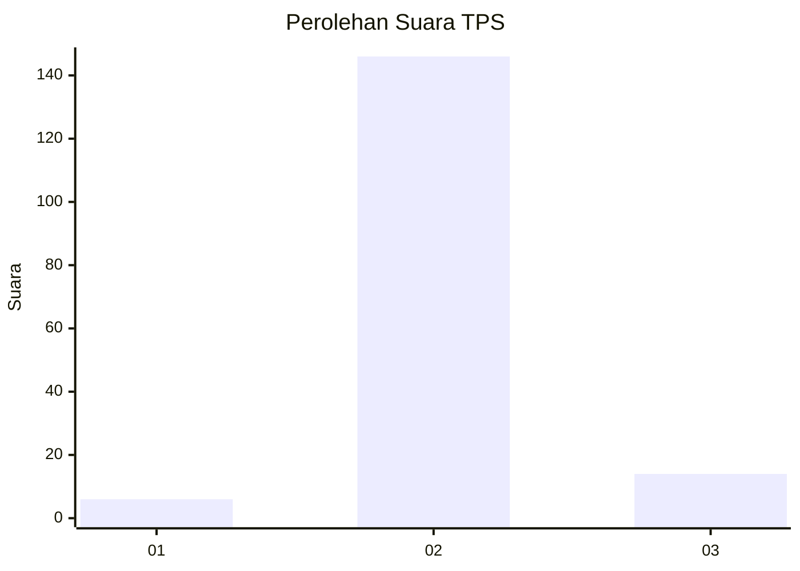
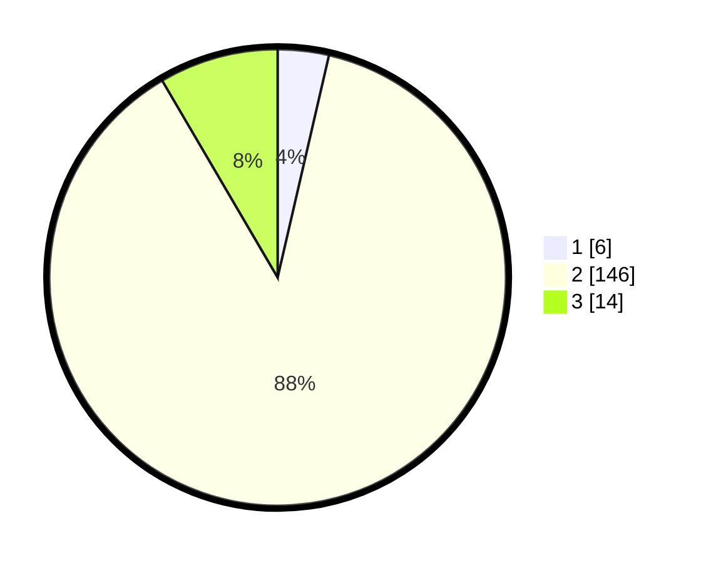

# Hasil

## Grafik

## Tabel

| No. | Nama Paslon    | Suara | Suara (raw) | Persentase |
|:--- |:-------------- | -----:| -----------:| ----------:|
| 1   | ANIES MUHAIMIN | 6     | [6][p-1]    | 3,61       |
| 2   | PRABOWO GIBRAN | 146   | [146][p-2]  | 87,95      |
| 3   | GANJAR MAHFUD  | 14    | [14][p-3]   | 8,43       |

[p-1]: https://github.com/gigit-pemilu/pemilu-2024/blob/main/pilpres/hitung-suara/sub/33-jawa-tengah/sub/29-brebes/sub/17-banjarharjo/sub/2020-penanggapan/sub/006-tps/sub/paslon-1.txt
[p-2]: https://github.com/gigit-pemilu/pemilu-2024/blob/main/pilpres/hitung-suara/sub/33-jawa-tengah/sub/29-brebes/sub/17-banjarharjo/sub/2020-penanggapan/sub/006-tps/sub/paslon-2.txt
[p-3]: https://github.com/gigit-pemilu/pemilu-2024/blob/main/pilpres/hitung-suara/sub/33-jawa-tengah/sub/29-brebes/sub/17-banjarharjo/sub/2020-penanggapan/sub/006-tps/sub/paslon-3.txt

## Foto C Plano

https://sirekap-obj-formc.kpu.go.id/2e4d/pemilu/ppwp/33/29/17/20/20/3329172020006-20240215-022855--54be3601-10aa-4db9-b8e2-43207cdc36f1.jpg

https://sirekap-obj-formc.kpu.go.id/2e4d/pemilu/ppwp/33/29/17/20/20/3329172020006-20240215-023007--f609efae-f4ab-4eff-8e11-b16838db13bd.jpg

https://sirekap-obj-formc.kpu.go.id/2e4d/pemilu/ppwp/33/29/17/20/20/3329172020006-20240215-023123--8dd03161-c179-4a3f-8247-f747fa2b1104.jpg

## Metadata

| Key        | Value               |
| ---------- | ------------------- |
| Time Stamp | 2024-02-16 11:00:29 |

