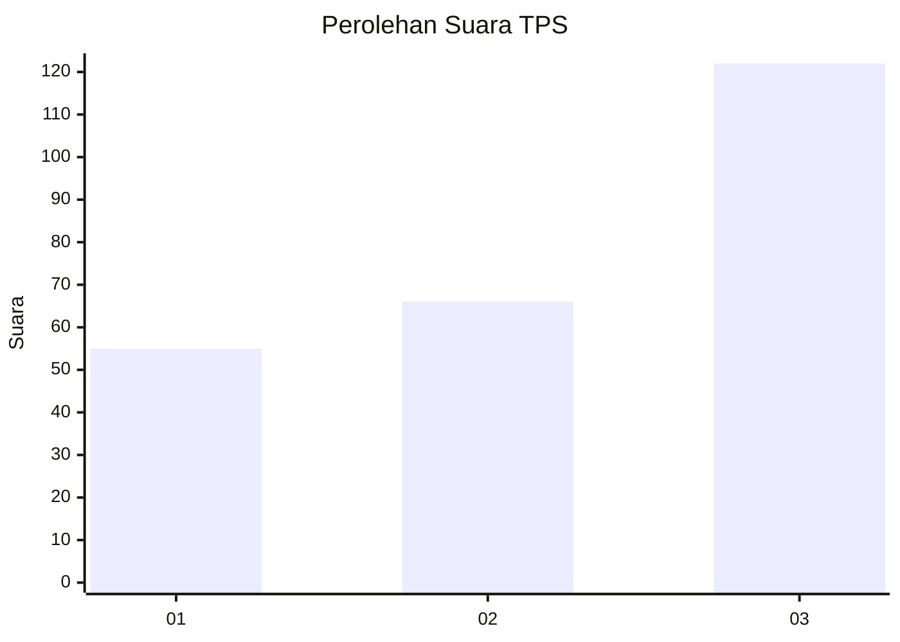
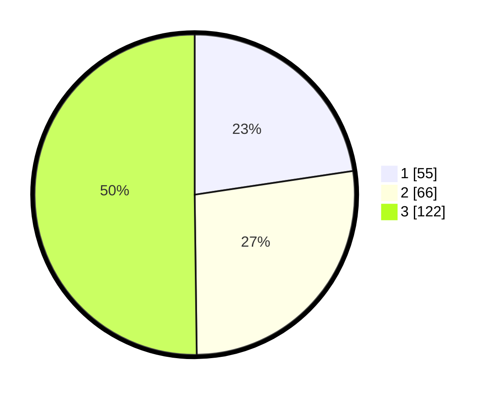

# Hasil

## Grafik

## Tabel

| No. | Nama Paslon    | Suara | Suara (raw) | Persentase |
|:--- |:-------------- | -----:| -----------:| ----------:|
| 1   | ANIES MUHAIMIN | 55    | [55][p-1]   | 22,63      |
| 2   | PRABOWO GIBRAN | 66    | [66][p-2]   | 27,16      |
| 3   | GANJAR MAHFUD  | 122   | [122][p-3]  | 50,21      |

[p-1]: https://github.com/gigit-pemilu/pemilu-2024/blob/main/pilpres/hitung-suara/sub/33-jawa-tengah/sub/29-brebes/sub/17-banjarharjo/sub/2022-sindangheula/sub/013-tps/sub/paslon-1.txt
[p-2]: https://github.com/gigit-pemilu/pemilu-2024/blob/main/pilpres/hitung-suara/sub/33-jawa-tengah/sub/29-brebes/sub/17-banjarharjo/sub/2022-sindangheula/sub/013-tps/sub/paslon-2.txt
[p-3]: https://github.com/gigit-pemilu/pemilu-2024/blob/main/pilpres/hitung-suara/sub/33-jawa-tengah/sub/29-brebes/sub/17-banjarharjo/sub/2022-sindangheula/sub/013-tps/sub/paslon-3.txt

## Foto C Plano

https://sirekap-obj-formc.kpu.go.id/d017/pemilu/ppwp/33/29/17/20/22/3329172022013-20240214-214531--c48fcd77-8c55-4979-bf41-f93d02dfa78b.jpg

https://sirekap-obj-formc.kpu.go.id/d017/pemilu/ppwp/33/29/17/20/22/3329172022013-20240215-003804--2c0e72a8-fde6-4933-bbad-3997738d21fb.jpg

https://sirekap-obj-formc.kpu.go.id/d017/pemilu/ppwp/33/29/17/20/22/3329172022013-20240215-003938--040a4559-a4d0-46c1-8192-3d6ab87bfcc5.jpg

## Metadata

| Key        | Value               |
| ---------- | ------------------- |
| Time Stamp | 2024-02-16 11:00:29 |

