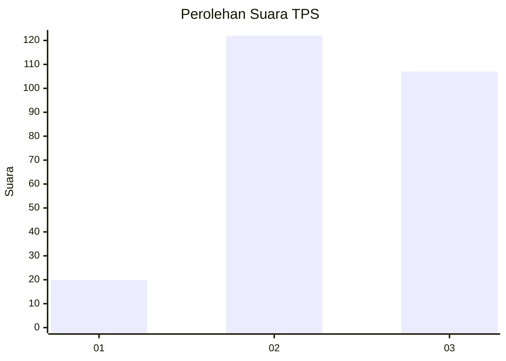
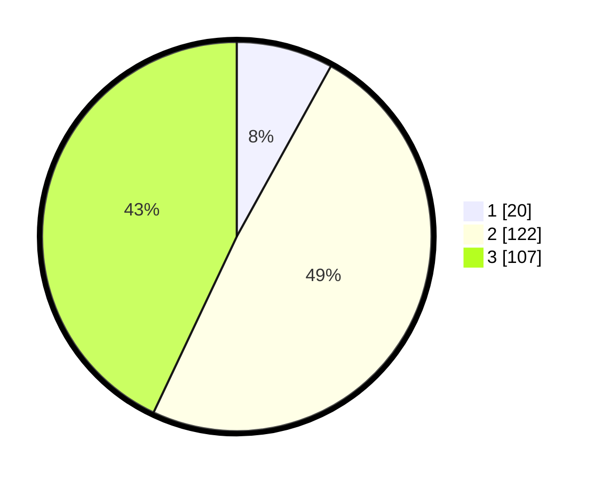

# Hasil

## Grafik

## Tabel

| No. | Nama Paslon    | Suara | Suara (raw) | Persentase |
|:--- |:-------------- | -----:| -----------:| ----------:|
| 1   | ANIES MUHAIMIN | 20    | [20][p-1]   | 8,03       |
| 2   | PRABOWO GIBRAN | 122   | [122][p-2]  | 49,00      |
| 3   | GANJAR MAHFUD  | 107   | [107][p-3]  | 42,97      |

[p-1]: https://github.com/gigit-pemilu/pemilu-2024/blob/main/pilpres/hitung-suara/sub/33-jawa-tengah/sub/71-kota-magelang/sub/01-magelang-selatan/sub/1003-rejowinangun-selatan/sub/002-tps/sub/paslon-1.txt
[p-2]: https://github.com/gigit-pemilu/pemilu-2024/blob/main/pilpres/hitung-suara/sub/33-jawa-tengah/sub/71-kota-magelang/sub/01-magelang-selatan/sub/1003-rejowinangun-selatan/sub/002-tps/sub/paslon-2.txt
[p-3]: https://github.com/gigit-pemilu/pemilu-2024/blob/main/pilpres/hitung-suara/sub/33-jawa-tengah/sub/71-kota-magelang/sub/01-magelang-selatan/sub/1003-rejowinangun-selatan/sub/002-tps/sub/paslon-3.txt

## Foto C Plano

https://sirekap-obj-formc.kpu.go.id/80de/pemilu/ppwp/33/71/01/10/03/3371011003002-20240215-031651--218e64d6-56c0-429c-95c0-7fe298df0091.jpg

https://sirekap-obj-formc.kpu.go.id/80de/pemilu/ppwp/33/71/01/10/03/3371011003002-20240214-211640--a836d391-9e67-4ad2-a962-0980d2339d7f.jpg

https://sirekap-obj-formc.kpu.go.id/80de/pemilu/ppwp/33/71/01/10/03/3371011003002-20240215-031822--686a02dd-4d56-4c0b-951b-792e9b60a324.jpg

## Metadata

| Key        | Value               |
| ---------- | ------------------- |
| Time Stamp | 2024-02-15 18:30:25 |

## DATA PEMILIH TETAP

Jumlah pemilih dalam DPT: **296**.
 * L: **136**.
 * P: **160**.

## DATA PENGGUNA HAK PILIH

Jumlah pengguna hak pilih dalam DPT: **256**.
 * L: **116**.
 * P: **140**.

Jumlah pengguna hak pilih dalam DPTb: **5**.
 * L: **3**.
 * P: **2**.

Jumlah pengguna hak pilih dalam DPK: **2**.
 * L: **2**.
 * P: **0**.

Jumlah pengguna hak pilih: **263**.
 * L: **121**.
 * P: **142**.

## JUMLAH SUARA SAH DAN TIDAK SAH

JUMLAH SELURUH SUARA SAH: **249**.

JUMLAH SUARA TIDAK SAH: **14**.

JUMLAH SELURUH SUARA SAH DAN SUARA TIDAK SAH: **263**.

