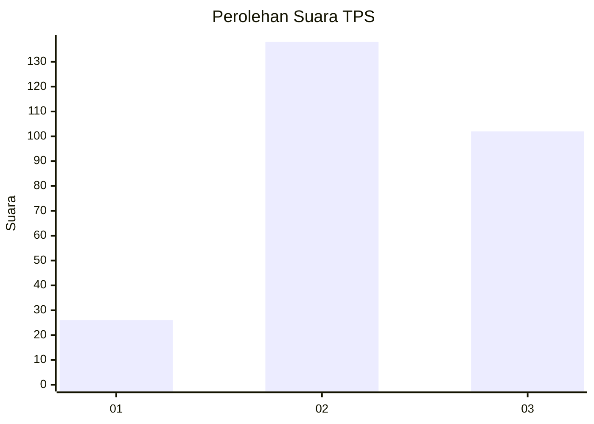
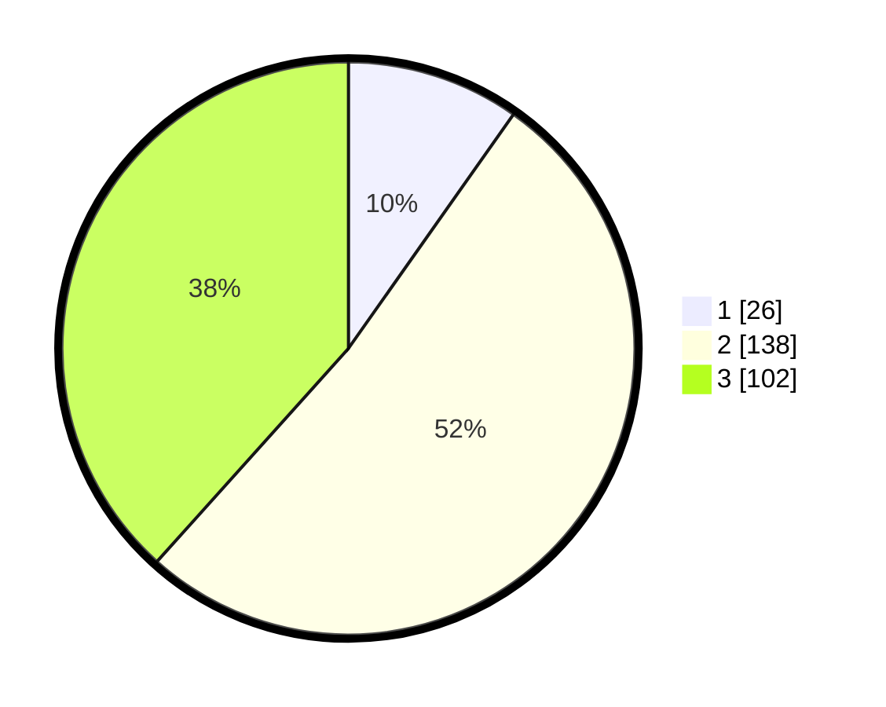

# Hasil

## Grafik

## Tabel

| No. | Nama Paslon    | Suara | Suara (raw) | Persentase |
|:--- |:-------------- | -----:| -----------:| ----------:|
| 1   | ANIES MUHAIMIN | 26    | [26][p-1]   | 9,77       |
| 2   | PRABOWO GIBRAN | 138   | [138][p-2]  | 51,88      |
| 3   | GANJAR MAHFUD  | 102   | [102][p-3]  | 38,35      |

[p-1]: https://github.com/gigit-pemilu/pemilu-2024-33-jawa-tengah/blob/main/pilpres/hitung-suara/sub/33-jawa-tengah/sub/71-kota-magelang/sub/01-magelang-selatan/sub/1003-rejowinangun-selatan/sub/005-tps/sub/paslon-1.txt
[p-2]: https://github.com/gigit-pemilu/pemilu-2024-33-jawa-tengah/blob/main/pilpres/hitung-suara/sub/33-jawa-tengah/sub/71-kota-magelang/sub/01-magelang-selatan/sub/1003-rejowinangun-selatan/sub/005-tps/sub/paslon-2.txt
[p-3]: https://github.com/gigit-pemilu/pemilu-2024-33-jawa-tengah/blob/main/pilpres/hitung-suara/sub/33-jawa-tengah/sub/71-kota-magelang/sub/01-magelang-selatan/sub/1003-rejowinangun-selatan/sub/005-tps/sub/paslon-3.txt

## Foto C Plano

https://sirekap-obj-formc.kpu.go.id/3a6f/pemilu/ppwp/33/71/01/10/03/3371011003005-20240221-184359--668342d5-622c-4fa1-bad5-99859671370a.jpg

https://sirekap-obj-formc.kpu.go.id/3a6f/pemilu/ppwp/33/71/01/10/03/3371011003005-20240221-184400--6cab4915-5747-4b9b-8290-147ed7ed12fb.jpg

https://sirekap-obj-formc.kpu.go.id/3a6f/pemilu/ppwp/33/71/01/10/03/3371011003005-20240221-184400--f652e00a-265b-4488-93d6-8135d1d05393.jpg

## Metadata

| Key        | Value               |
| ---------- | ------------------- |
| Time Stamp | 2024-02-24 22:31:28 |

## DATA PEMILIH TETAP

Jumlah pemilih dalam DPT: **297**.
 * L: **148**.
 * P: **149**.

## DATA PENGGUNA HAK PILIH

Jumlah pengguna hak pilih dalam DPT: **268**.
 * L: **134**.
 * P: **134**.

Jumlah pengguna hak pilih dalam DPTb: **9**.
 * L: **5**.
 * P: **4**.

Jumlah pengguna hak pilih dalam DPK: **0**.
 * L: **0**.
 * P: **0**.

Jumlah pengguna hak pilih: **277**.
 * L: **139**.
 * P: **138**.

## JUMLAH SUARA SAH DAN TIDAK SAH

JUMLAH SELURUH SUARA SAH: **266**.

JUMLAH SUARA TIDAK SAH: **11**.

JUMLAH SELURUH SUARA SAH DAN SUARA TIDAK SAH: **277**.

