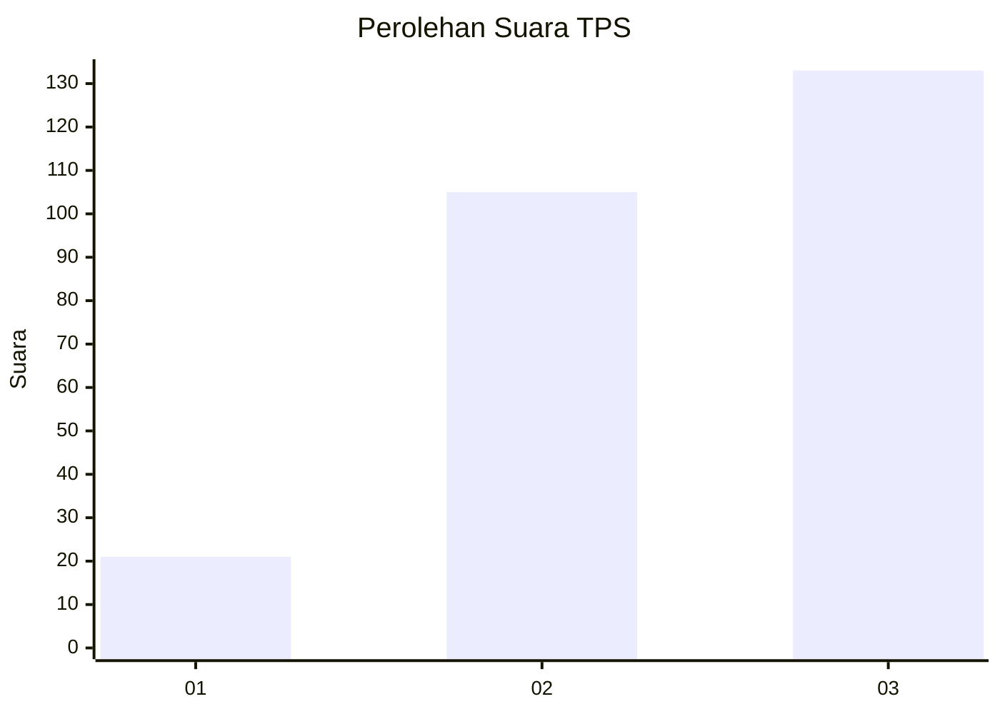
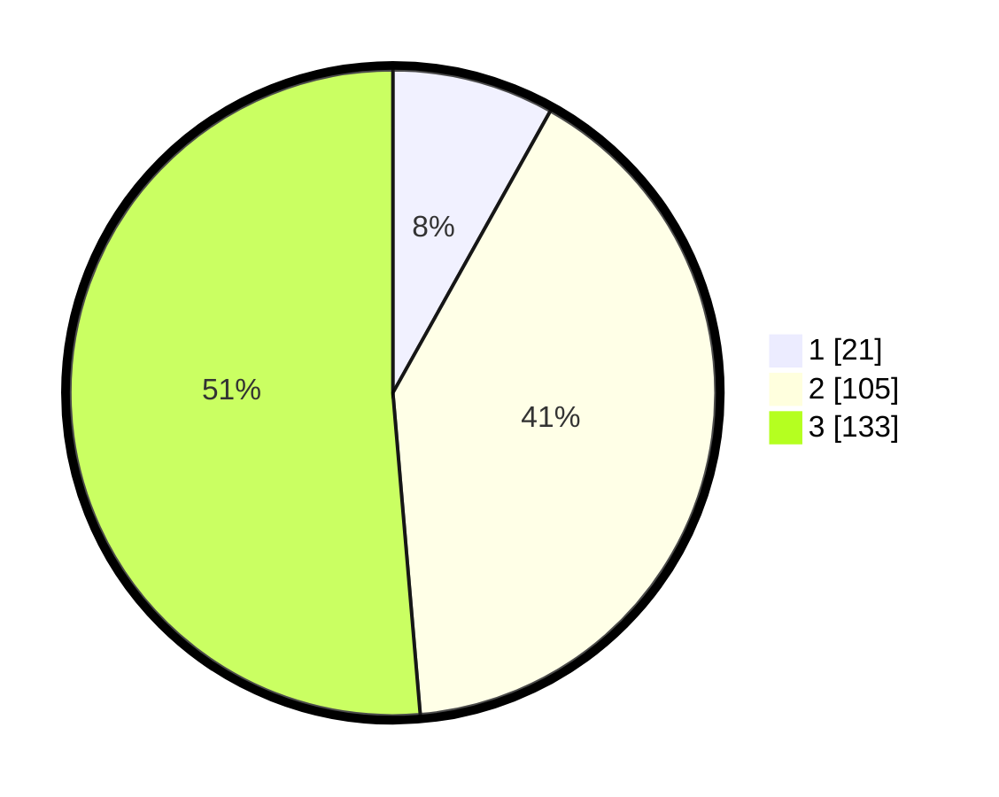

# Hasil

## Grafik

## Tabel

| No. | Nama Paslon    | Suara | Suara (raw) | Persentase |
|:--- |:-------------- | -----:| -----------:| ----------:|
| 1   | ANIES MUHAIMIN | 21    | [21][p-1]   | 8,11       |
| 2   | PRABOWO GIBRAN | 105   | [105][p-2]  | 40,54      |
| 3   | GANJAR MAHFUD  | 133   | [133][p-3]  | 51,35      |

[p-1]: https://github.com/gigit-pemilu/pemilu-2024/blob/main/pilpres/hitung-suara/sub/33-jawa-tengah/sub/71-kota-magelang/sub/01-magelang-selatan/sub/1003-rejowinangun-selatan/sub/008-tps/sub/paslon-1.txt
[p-2]: https://github.com/gigit-pemilu/pemilu-2024/blob/main/pilpres/hitung-suara/sub/33-jawa-tengah/sub/71-kota-magelang/sub/01-magelang-selatan/sub/1003-rejowinangun-selatan/sub/008-tps/sub/paslon-2.txt
[p-3]: https://github.com/gigit-pemilu/pemilu-2024/blob/main/pilpres/hitung-suara/sub/33-jawa-tengah/sub/71-kota-magelang/sub/01-magelang-selatan/sub/1003-rejowinangun-selatan/sub/008-tps/sub/paslon-3.txt

## Foto C Plano

https://sirekap-obj-formc.kpu.go.id/7ec7/pemilu/ppwp/33/71/01/10/03/3371011003008-20240215-013837--3a5a3374-37ae-4fbd-893c-c64e30ae0c50.jpg

https://sirekap-obj-formc.kpu.go.id/7ec7/pemilu/ppwp/33/71/01/10/03/3371011003008-20240214-155844--a50bfc9e-8c46-4ed0-969b-98ea5bf7434e.jpg

https://sirekap-obj-formc.kpu.go.id/7ec7/pemilu/ppwp/33/71/01/10/03/3371011003008-20240215-013830--d28c4760-b4b3-44b3-902f-55626567b55d.jpg

## Metadata

| Key        | Value               |
| ---------- | ------------------- |
| Time Stamp | 2024-02-15 12:00:28 |

