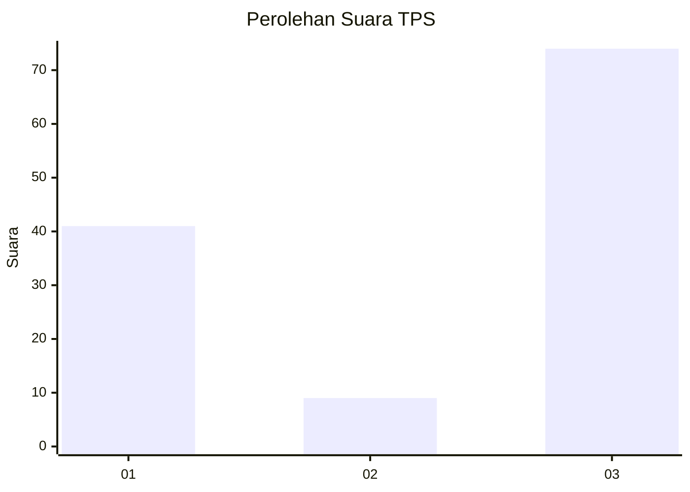
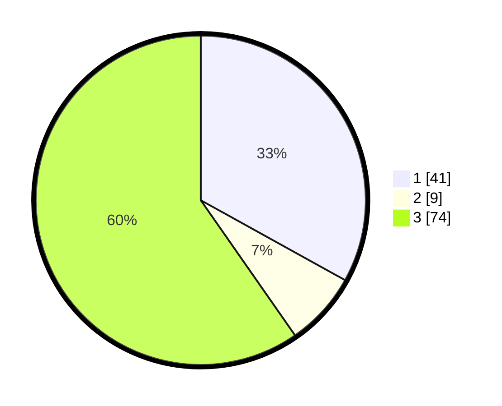

# Hasil

## Grafik

## Tabel

| No. | Nama Paslon    | Suara | Suara (raw) | Persentase |
|:--- |:-------------- | -----:| -----------:| ----------:|
| 1   | ANIES MUHAIMIN | 41    | [41][p-1]   | 33,06      |
| 2   | PRABOWO GIBRAN | 9     | [9][p-2]    | 7,26       |
| 3   | GANJAR MAHFUD  | 74    | [74][p-3]   | 59,68      |

[p-1]: https://github.com/gigit-pemilu/pemilu-2024/blob/main/pilpres/hitung-suara/sub/33-jawa-tengah/sub/71-kota-magelang/sub/01-magelang-selatan/sub/1007-magersari/sub/004-tps/sub/paslon-1.txt
[p-2]: https://github.com/gigit-pemilu/pemilu-2024/blob/main/pilpres/hitung-suara/sub/33-jawa-tengah/sub/71-kota-magelang/sub/01-magelang-selatan/sub/1007-magersari/sub/004-tps/sub/paslon-2.txt
[p-3]: https://github.com/gigit-pemilu/pemilu-2024/blob/main/pilpres/hitung-suara/sub/33-jawa-tengah/sub/71-kota-magelang/sub/01-magelang-selatan/sub/1007-magersari/sub/004-tps/sub/paslon-3.txt

## Foto C Plano

https://sirekap-obj-formc.kpu.go.id/2217/pemilu/ppwp/33/71/01/10/07/3371011007004-20240220-122149--efe5ce28-8eb7-4a82-b0e8-fef239a365ac.jpg

https://sirekap-obj-formc.kpu.go.id/2217/pemilu/ppwp/33/71/01/10/07/3371011007004-20240220-122206--96c8b5aa-5a15-41b9-8663-39acd94cfd12.jpg

https://sirekap-obj-formc.kpu.go.id/2217/pemilu/ppwp/33/71/01/10/07/3371011007004-20240214-155340--58af4ad5-1055-469a-8e15-8859ce98758a.jpg

## Metadata

| Key        | Value               |
| ---------- | ------------------- |
| Time Stamp | 2024-02-24 22:31:28 |

