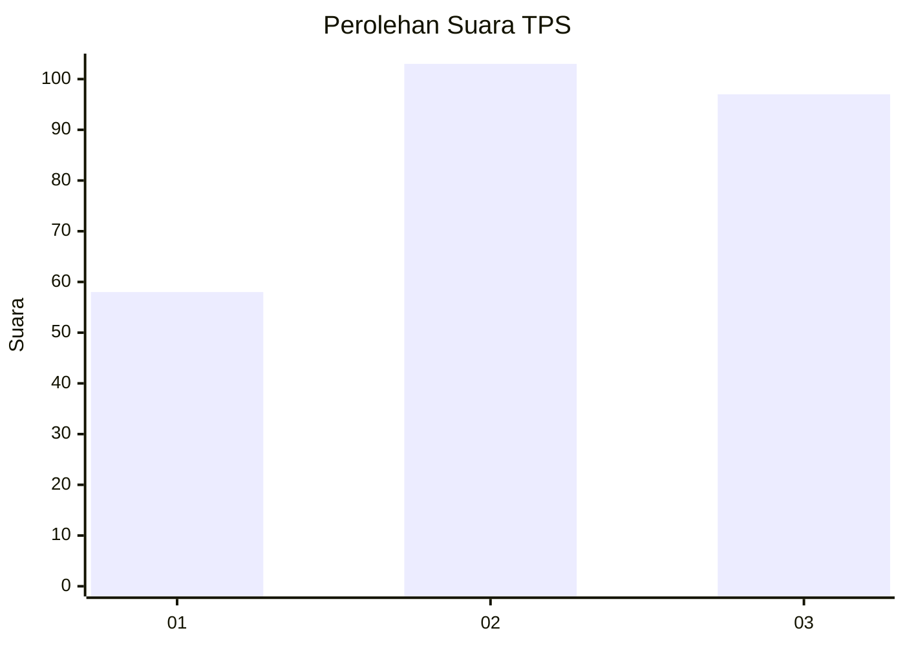
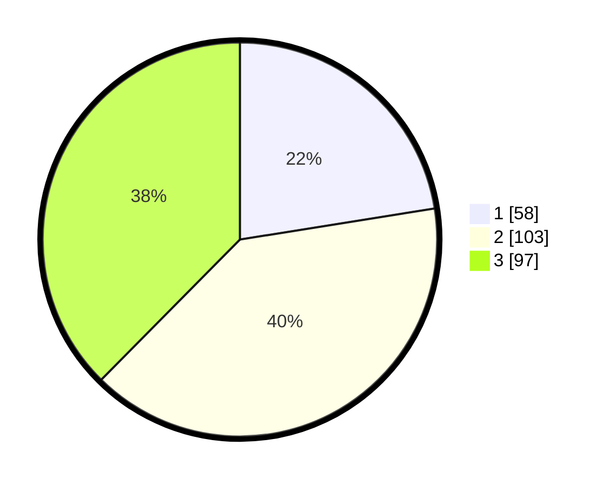

# Hasil

## Grafik

## Tabel

| No. | Nama Paslon    | Suara | Suara (raw) | Persentase |
|:--- |:-------------- | -----:| -----------:| ----------:|
| 1   | ANIES MUHAIMIN | 58    | [58][p-1]   | 22,48      |
| 2   | PRABOWO GIBRAN | 103   | [103][p-2]  | 39,92      |
| 3   | GANJAR MAHFUD  | 97    | [97][p-3]   | 37,60      |

[p-1]: https://github.com/gigit-pemilu/pemilu-2024/blob/main/pilpres/hitung-suara/sub/33-jawa-tengah/sub/71-kota-magelang/sub/01-magelang-selatan/sub/1009-jurangombo-selatan/sub/004-tps/sub/paslon-1.txt
[p-2]: https://github.com/gigit-pemilu/pemilu-2024/blob/main/pilpres/hitung-suara/sub/33-jawa-tengah/sub/71-kota-magelang/sub/01-magelang-selatan/sub/1009-jurangombo-selatan/sub/004-tps/sub/paslon-2.txt
[p-3]: https://github.com/gigit-pemilu/pemilu-2024/blob/main/pilpres/hitung-suara/sub/33-jawa-tengah/sub/71-kota-magelang/sub/01-magelang-selatan/sub/1009-jurangombo-selatan/sub/004-tps/sub/paslon-3.txt

## Foto C Plano

https://sirekap-obj-formc.kpu.go.id/1b2d/pemilu/ppwp/33/71/01/10/09/3371011009004-20240215-032614--e4fa8888-2461-4554-9fec-771b5b0ecaf4.jpg

https://sirekap-obj-formc.kpu.go.id/1b2d/pemilu/ppwp/33/71/01/10/09/3371011009004-20240215-032707--a198e240-4f73-4fad-905b-11a85eeb1121.jpg

https://sirekap-obj-formc.kpu.go.id/1b2d/pemilu/ppwp/33/71/01/10/09/3371011009004-20240215-032805--e153a9f7-cd42-49f8-a16e-99e0bde5d708.jpg

## Metadata

| Key        | Value               |
| ---------- | ------------------- |
| Time Stamp | 2024-02-15 15:00:29 |

