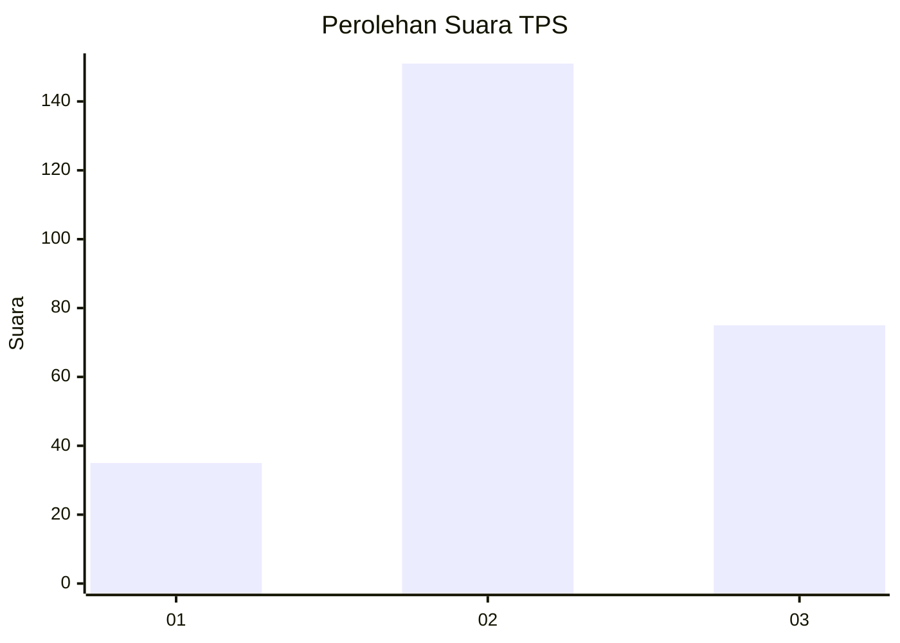
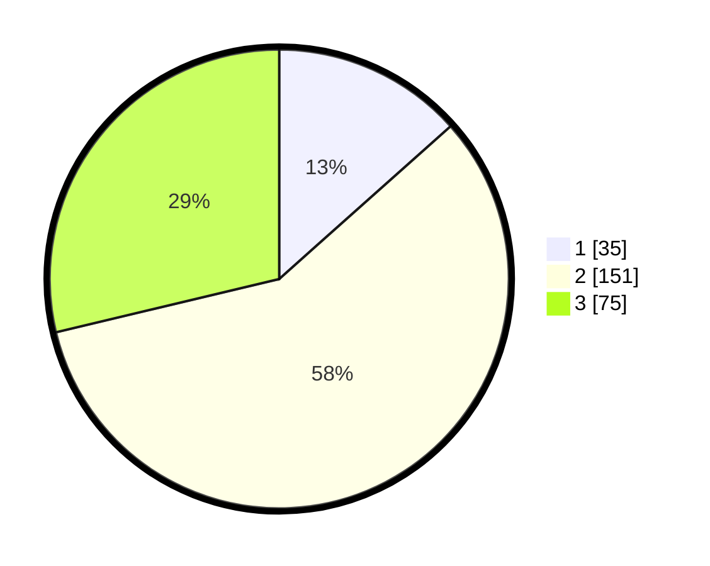

# Hasil

## Grafik

## Tabel

| No. | Nama Paslon    | Suara | Suara (raw) | Persentase |
|:--- |:-------------- | -----:| -----------:| ----------:|
| 1   | ANIES MUHAIMIN | 35    | [35][p-1]   | 13,41      |
| 2   | PRABOWO GIBRAN | 151   | [151][p-2]  | 57,85      |
| 3   | GANJAR MAHFUD  | 75    | [75][p-3]   | 28,74      |

[p-1]: https://github.com/gigit-pemilu/pemilu-2024/blob/main/pilpres/hitung-suara/sub/33-jawa-tengah/sub/71-kota-magelang/sub/01-magelang-selatan/sub/1010-tidar-utara/sub/022-tps/sub/paslon-1.txt
[p-2]: https://github.com/gigit-pemilu/pemilu-2024/blob/main/pilpres/hitung-suara/sub/33-jawa-tengah/sub/71-kota-magelang/sub/01-magelang-selatan/sub/1010-tidar-utara/sub/022-tps/sub/paslon-2.txt
[p-3]: https://github.com/gigit-pemilu/pemilu-2024/blob/main/pilpres/hitung-suara/sub/33-jawa-tengah/sub/71-kota-magelang/sub/01-magelang-selatan/sub/1010-tidar-utara/sub/022-tps/sub/paslon-3.txt

## Foto C Plano

https://sirekap-obj-formc.kpu.go.id/4308/pemilu/ppwp/33/71/01/10/10/3371011010022-20240215-021236--6388c372-489e-426c-868f-6d61b9459b83.jpg

https://sirekap-obj-formc.kpu.go.id/4308/pemilu/ppwp/33/71/01/10/10/3371011010022-20240215-050946--9bc26426-25bf-4742-b965-4185103e7345.jpg

https://sirekap-obj-formc.kpu.go.id/4308/pemilu/ppwp/33/71/01/10/10/3371011010022-20240214-230403--cc94165c-d4aa-46ed-b909-8ae67faaad56.jpg

## Metadata

| Key        | Value               |
| ---------- | ------------------- |
| Time Stamp | 2024-02-15 17:30:25 |

