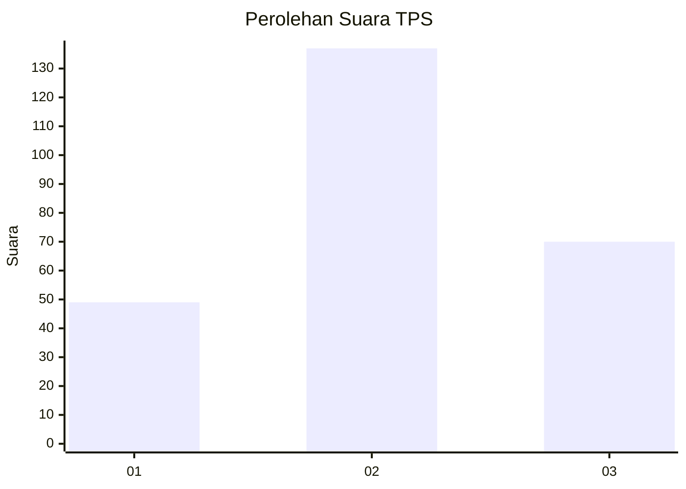
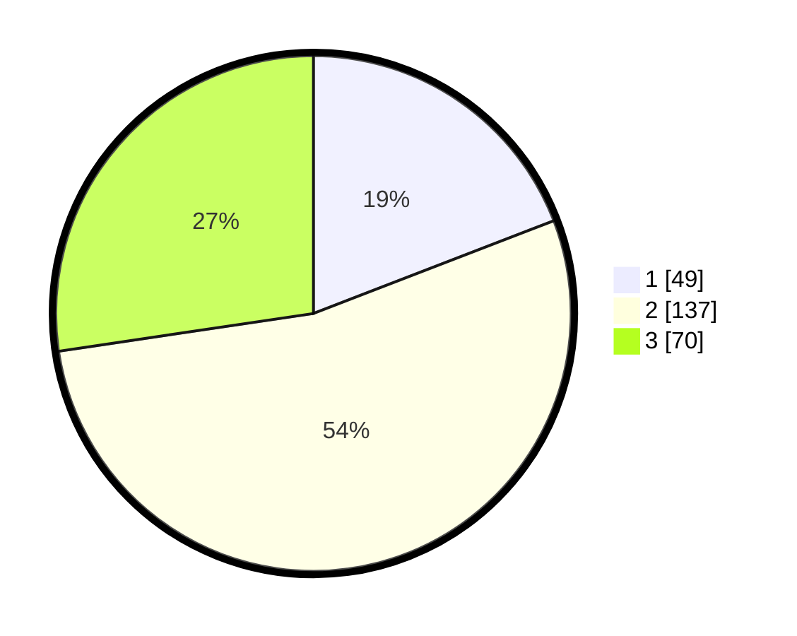

# Hasil

## Grafik

## Tabel

| No. | Nama Paslon    | Suara | Suara (raw) | Persentase |
|:--- |:-------------- | -----:| -----------:| ----------:|
| 1   | ANIES MUHAIMIN | 49    | [49][p-1]   | 19,14      |
| 2   | PRABOWO GIBRAN | 137   | [137][p-2]  | 53,52      |
| 3   | GANJAR MAHFUD  | 70    | [70][p-3]   | 27,34      |

[p-1]: https://github.com/gigit-pemilu/pemilu-2024/blob/main/pilpres/hitung-suara/sub/33-jawa-tengah/sub/71-kota-magelang/sub/02-magelang-utara/sub/1003-wates/sub/006-tps/sub/paslon-1.txt
[p-2]: https://github.com/gigit-pemilu/pemilu-2024/blob/main/pilpres/hitung-suara/sub/33-jawa-tengah/sub/71-kota-magelang/sub/02-magelang-utara/sub/1003-wates/sub/006-tps/sub/paslon-2.txt
[p-3]: https://github.com/gigit-pemilu/pemilu-2024/blob/main/pilpres/hitung-suara/sub/33-jawa-tengah/sub/71-kota-magelang/sub/02-magelang-utara/sub/1003-wates/sub/006-tps/sub/paslon-3.txt

## Foto C Plano

https://sirekap-obj-formc.kpu.go.id/159d/pemilu/ppwp/33/71/02/10/03/3371021003006-20240214-215151--2a46e697-123b-4017-a7e9-b2368df2aa75.jpg

https://sirekap-obj-formc.kpu.go.id/159d/pemilu/ppwp/33/71/02/10/03/3371021003006-20240214-215245--765898b7-c887-4c01-977a-91d3b8732f81.jpg

https://sirekap-obj-formc.kpu.go.id/159d/pemilu/ppwp/33/71/02/10/03/3371021003006-20240214-215332--a025e1ab-9de6-4340-af3b-13f6f33ac515.jpg

## Metadata

| Key        | Value               |
| ---------- | ------------------- |
| Time Stamp | 2024-02-15 12:00:28 |

