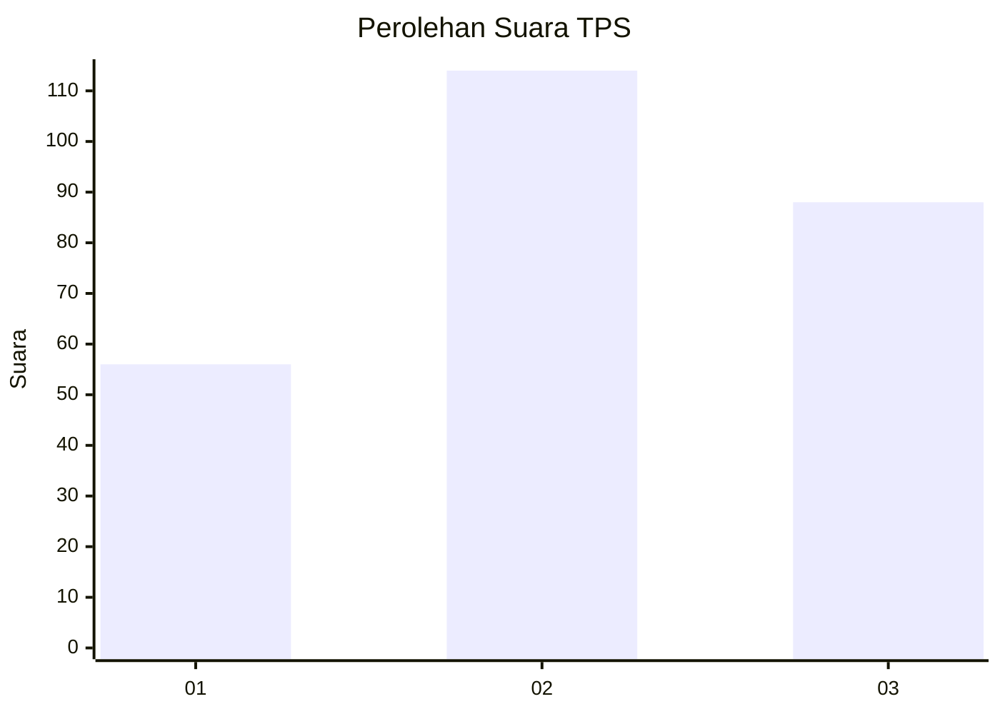
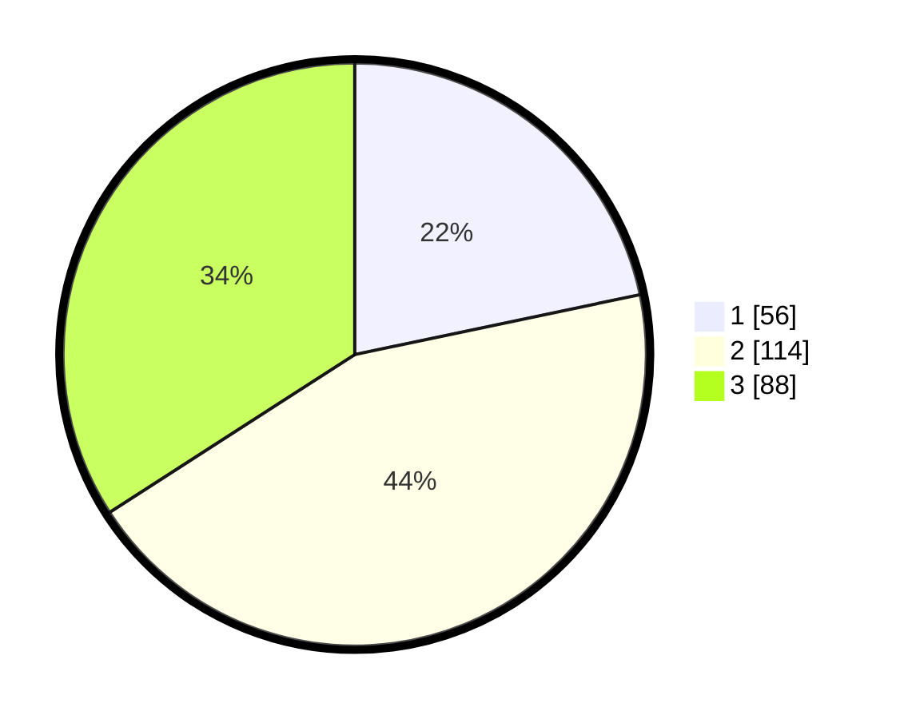

# Hasil

## Grafik

## Tabel

| No. | Nama Paslon    | Suara | Suara (raw) | Persentase |
|:--- |:-------------- | -----:| -----------:| ----------:|
| 1   | ANIES MUHAIMIN | 56    | [56][p-1]   | 21,71      |
| 2   | PRABOWO GIBRAN | 114   | [114][p-2]  | 44,19      |
| 3   | GANJAR MAHFUD  | 88    | [88][p-3]   | 34,11      |

[p-1]: https://github.com/gigit-pemilu/pemilu-2024-33-jawa-tengah/blob/main/pilpres/hitung-suara/sub/33-jawa-tengah/sub/71-kota-magelang/sub/02-magelang-utara/sub/1004-potrobangsan/sub/018-tps/sub/paslon-1.txt
[p-2]: https://github.com/gigit-pemilu/pemilu-2024-33-jawa-tengah/blob/main/pilpres/hitung-suara/sub/33-jawa-tengah/sub/71-kota-magelang/sub/02-magelang-utara/sub/1004-potrobangsan/sub/018-tps/sub/paslon-2.txt
[p-3]: https://github.com/gigit-pemilu/pemilu-2024-33-jawa-tengah/blob/main/pilpres/hitung-suara/sub/33-jawa-tengah/sub/71-kota-magelang/sub/02-magelang-utara/sub/1004-potrobangsan/sub/018-tps/sub/paslon-3.txt

## Foto C Plano

https://sirekap-obj-formc.kpu.go.id/bd7c/pemilu/ppwp/33/71/02/10/04/3371021004018-20240215-031817--1ecb437e-0e95-4aae-8d57-358e07898982.jpg

https://sirekap-obj-formc.kpu.go.id/bd7c/pemilu/ppwp/33/71/02/10/04/3371021004018-20240215-032241--3ad233d6-04bc-4e45-8a15-38786ce3ac72.jpg

https://sirekap-obj-formc.kpu.go.id/bd7c/pemilu/ppwp/33/71/02/10/04/3371021004018-20240215-034927--b7180d7e-3ee6-4d31-aef2-1a7120a1b1b8.jpg

## Metadata

| Key        | Value               |
| ---------- | ------------------- |
| Time Stamp | 2024-02-15 16:00:26 |

