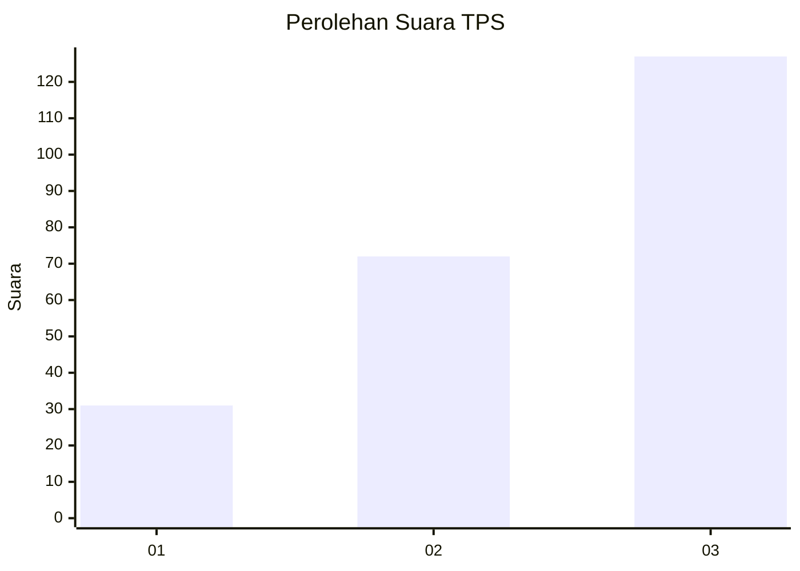
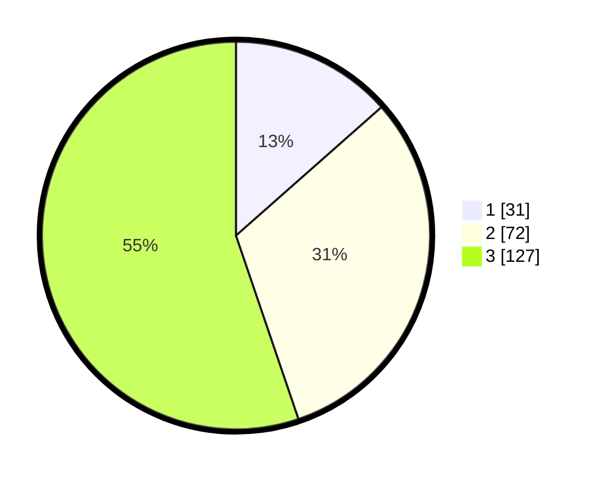

# Hasil

## Grafik

## Tabel

| No. | Nama Paslon    | Suara | Suara (raw) | Persentase |
|:--- |:-------------- | -----:| -----------:| ----------:|
| 1   | ANIES MUHAIMIN | 31    | [31][p-1]   | 13,48      |
| 2   | PRABOWO GIBRAN | 72    | [72][p-2]   | 31,30      |
| 3   | GANJAR MAHFUD  | 127   | [127][p-3]  | 55,22      |

[p-1]: https://github.com/gigit-pemilu/pemilu-2024/blob/main/pilpres/hitung-suara/sub/33-jawa-tengah/sub/71-kota-magelang/sub/03-magelang-tengah/sub/1001-kemirirejo/sub/003-tps/sub/paslon-1.txt
[p-2]: https://github.com/gigit-pemilu/pemilu-2024/blob/main/pilpres/hitung-suara/sub/33-jawa-tengah/sub/71-kota-magelang/sub/03-magelang-tengah/sub/1001-kemirirejo/sub/003-tps/sub/paslon-2.txt
[p-3]: https://github.com/gigit-pemilu/pemilu-2024/blob/main/pilpres/hitung-suara/sub/33-jawa-tengah/sub/71-kota-magelang/sub/03-magelang-tengah/sub/1001-kemirirejo/sub/003-tps/sub/paslon-3.txt

## Foto C Plano

https://sirekap-obj-formc.kpu.go.id/ee2a/pemilu/ppwp/33/71/03/10/01/3371031001003-20240214-155720--5d554536-a3ca-4315-b330-08dc11e6ecfa.jpg

https://sirekap-obj-formc.kpu.go.id/ee2a/pemilu/ppwp/33/71/03/10/01/3371031001003-20240214-205559--e5abc2c8-5bd7-483d-a023-8d945a3ab328.jpg

https://sirekap-obj-formc.kpu.go.id/ee2a/pemilu/ppwp/33/71/03/10/01/3371031001003-20240214-205730--a983653b-8121-4068-a531-308b12e85ebf.jpg

## Metadata

| Key        | Value               |
| ---------- | ------------------- |
| Time Stamp | 2024-02-15 00:41:44 |

