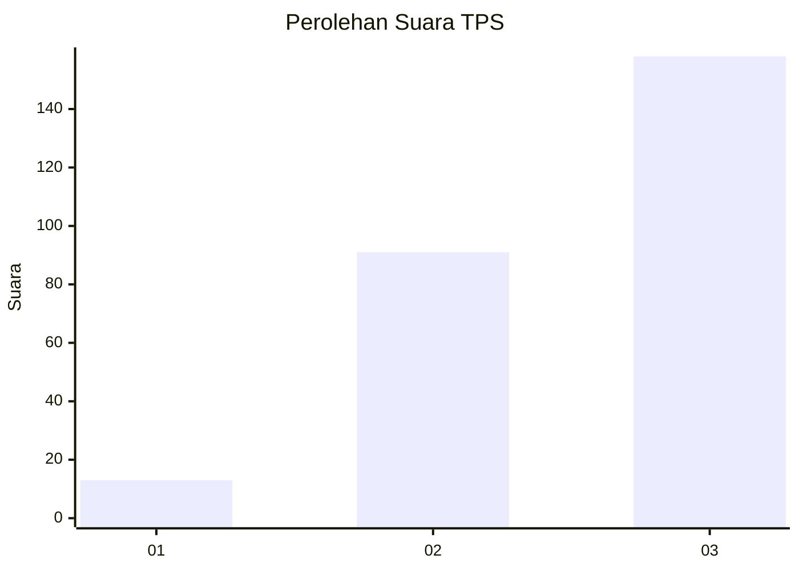
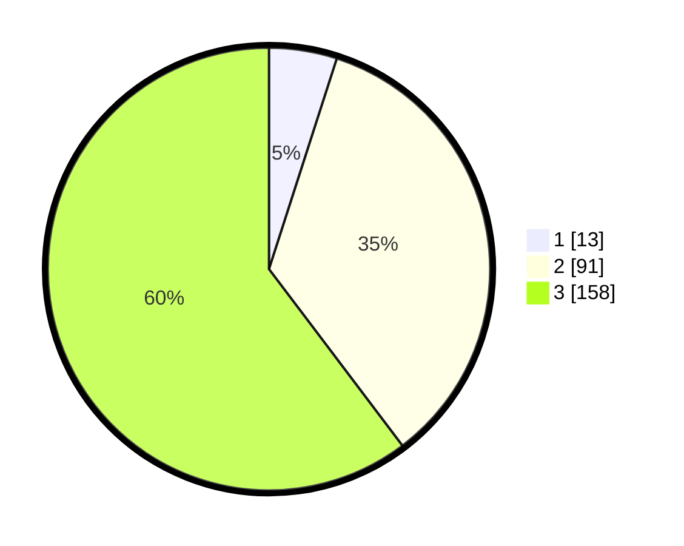

# Hasil

## Grafik

## Tabel

| No. | Nama Paslon    | Suara | Suara (raw) | Persentase |
|:--- |:-------------- | -----:| -----------:| ----------:|
| 1   | ANIES MUHAIMIN | 13    | [13][p-1]   | 4,96       |
| 2   | PRABOWO GIBRAN | 91    | [91][p-2]   | 34,73      |
| 3   | GANJAR MAHFUD  | 158   | [158][p-3]  | 60,31      |

[p-1]: https://github.com/gigit-pemilu/pemilu-2024/blob/main/pilpres/hitung-suara/sub/33-jawa-tengah/sub/71-kota-magelang/sub/03-magelang-tengah/sub/1005-panjang/sub/004-tps/sub/paslon-1.txt
[p-2]: https://github.com/gigit-pemilu/pemilu-2024/blob/main/pilpres/hitung-suara/sub/33-jawa-tengah/sub/71-kota-magelang/sub/03-magelang-tengah/sub/1005-panjang/sub/004-tps/sub/paslon-2.txt
[p-3]: https://github.com/gigit-pemilu/pemilu-2024/blob/main/pilpres/hitung-suara/sub/33-jawa-tengah/sub/71-kota-magelang/sub/03-magelang-tengah/sub/1005-panjang/sub/004-tps/sub/paslon-3.txt

## Foto C Plano

https://sirekap-obj-formc.kpu.go.id/d267/pemilu/ppwp/33/71/03/10/05/3371031005004-20240214-193624--873b7e1e-a99f-423a-88a3-85ccc3f662cf.jpg

https://sirekap-obj-formc.kpu.go.id/d267/pemilu/ppwp/33/71/03/10/05/3371031005004-20240214-204539--a731d931-09e4-4b87-b3a7-97d2a3de9f14.jpg

https://sirekap-obj-formc.kpu.go.id/d267/pemilu/ppwp/33/71/03/10/05/3371031005004-20240214-194213--4ba12095-2db8-4dcb-9d21-28ba4f26bd1b.jpg

## Metadata

| Key        | Value               |
| ---------- | ------------------- |
| Time Stamp | 2024-02-15 12:00:28 |

