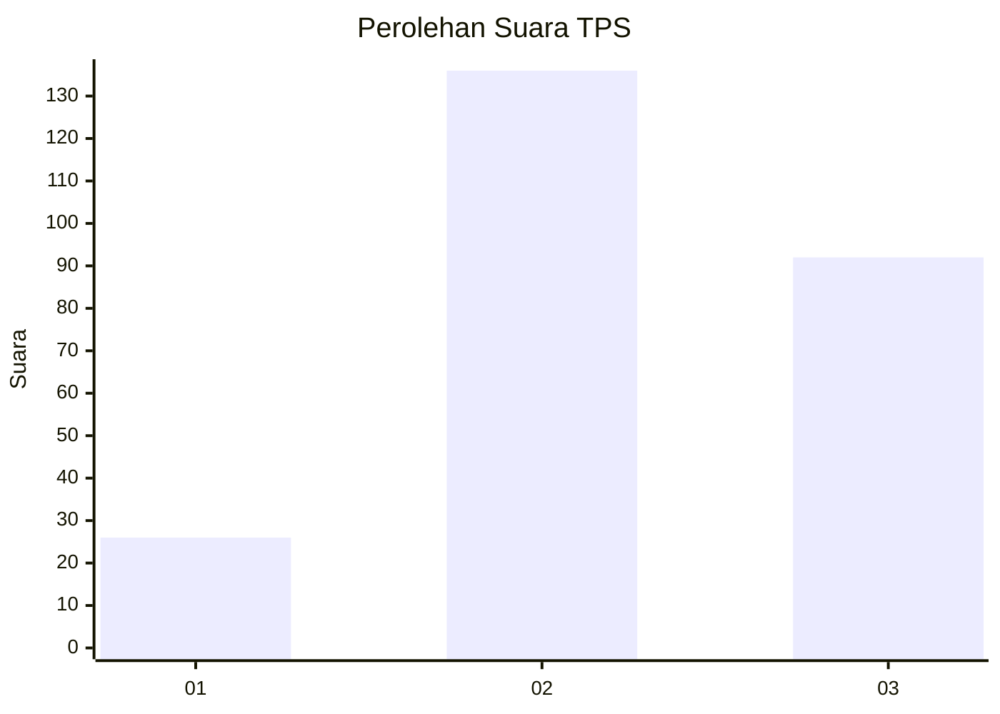
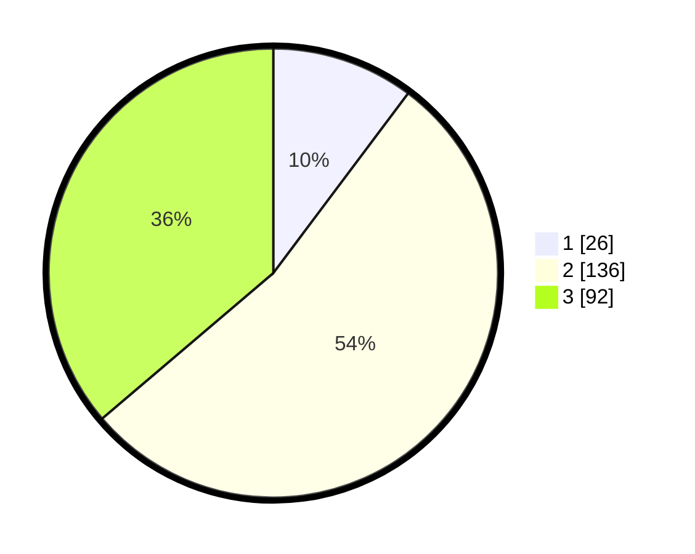

# Hasil

## Grafik

## Tabel

| No. | Nama Paslon    | Suara | Suara (raw) | Persentase |
|:--- |:-------------- | -----:| -----------:| ----------:|
| 1   | ANIES MUHAIMIN | 26    | [26][p-1]   | 10,24      |
| 2   | PRABOWO GIBRAN | 136   | [136][p-2]  | 53,54      |
| 3   | GANJAR MAHFUD  | 92    | [92][p-3]   | 36,22      |

[p-1]: https://github.com/gigit-pemilu/pemilu-2024/blob/main/pilpres/hitung-suara/sub/33-jawa-tengah/sub/72-kota-surakarta/sub/01-laweyan/sub/1007-purwosari/sub/014-tps/sub/paslon-1.txt
[p-2]: https://github.com/gigit-pemilu/pemilu-2024/blob/main/pilpres/hitung-suara/sub/33-jawa-tengah/sub/72-kota-surakarta/sub/01-laweyan/sub/1007-purwosari/sub/014-tps/sub/paslon-2.txt
[p-3]: https://github.com/gigit-pemilu/pemilu-2024/blob/main/pilpres/hitung-suara/sub/33-jawa-tengah/sub/72-kota-surakarta/sub/01-laweyan/sub/1007-purwosari/sub/014-tps/sub/paslon-3.txt

## Foto C Plano

https://sirekap-obj-formc.kpu.go.id/b2ca/pemilu/ppwp/33/72/01/10/07/3372011007014-20240214-201531--ab03b5b8-49fa-4213-82ba-fc6c01d97b1c.jpg

https://sirekap-obj-formc.kpu.go.id/b2ca/pemilu/ppwp/33/72/01/10/07/3372011007014-20240214-201607--f3ad170c-833c-4fa9-9172-266dad488064.jpg

https://sirekap-obj-formc.kpu.go.id/b2ca/pemilu/ppwp/33/72/01/10/07/3372011007014-20240214-201639--1fc02f09-b2a8-4087-b092-f57ee9424f75.jpg

## Metadata

| Key        | Value               |
| ---------- | ------------------- |
| Time Stamp | 2024-02-15 00:41:44 |

