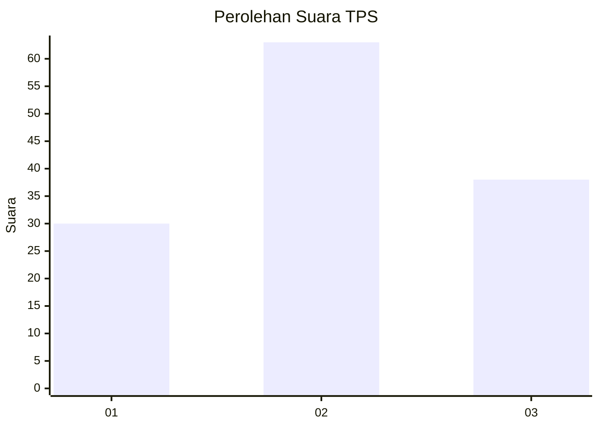
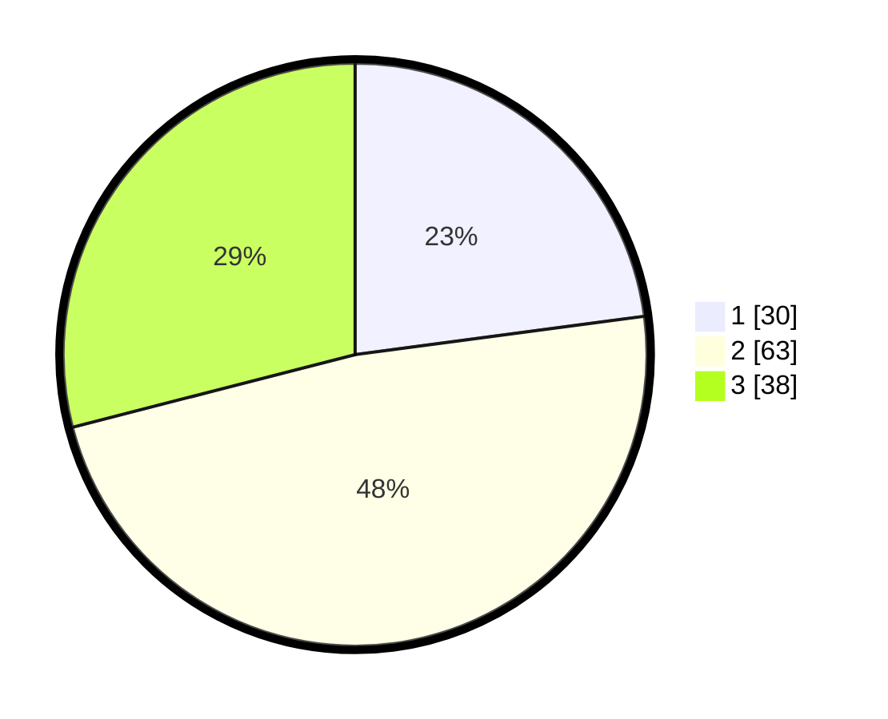

# Hasil

## Grafik

## Tabel

| No. | Nama Paslon    | Suara | Suara (raw) | Persentase |
|:--- |:-------------- | -----:| -----------:| ----------:|
| 1   | ANIES MUHAIMIN | 30    | [30][p-1]   | 22,90      |
| 2   | PRABOWO GIBRAN | 63    | [63][p-2]   | 48,09      |
| 3   | GANJAR MAHFUD  | 38    | [38][p-3]   | 29,01      |

[p-1]: https://github.com/gigit-pemilu/pemilu-2024/blob/main/pilpres/hitung-suara/sub/33-jawa-tengah/sub/72-kota-surakarta/sub/01-laweyan/sub/1007-purwosari/sub/018-tps/sub/paslon-1.txt
[p-2]: https://github.com/gigit-pemilu/pemilu-2024/blob/main/pilpres/hitung-suara/sub/33-jawa-tengah/sub/72-kota-surakarta/sub/01-laweyan/sub/1007-purwosari/sub/018-tps/sub/paslon-2.txt
[p-3]: https://github.com/gigit-pemilu/pemilu-2024/blob/main/pilpres/hitung-suara/sub/33-jawa-tengah/sub/72-kota-surakarta/sub/01-laweyan/sub/1007-purwosari/sub/018-tps/sub/paslon-3.txt

## Foto C Plano

https://sirekap-obj-formc.kpu.go.id/97da/pemilu/ppwp/33/72/01/10/07/3372011007018-20240214-215009--9abba1e8-6d65-423e-b830-6683778da0d0.jpg

https://sirekap-obj-formc.kpu.go.id/97da/pemilu/ppwp/33/72/01/10/07/3372011007018-20240214-215247--548b201b-7861-4360-9348-1e9d49c06682.jpg

https://sirekap-obj-formc.kpu.go.id/97da/pemilu/ppwp/33/72/01/10/07/3372011007018-20240214-214759--00a8d533-aef8-47da-bec2-6610bf0a75bf.jpg

## Metadata

| Key        | Value               |
| ---------- | ------------------- |
| Time Stamp | 2024-02-16 22:01:00 |

