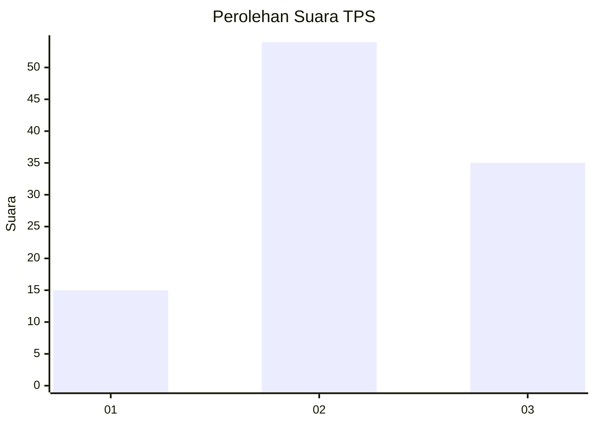
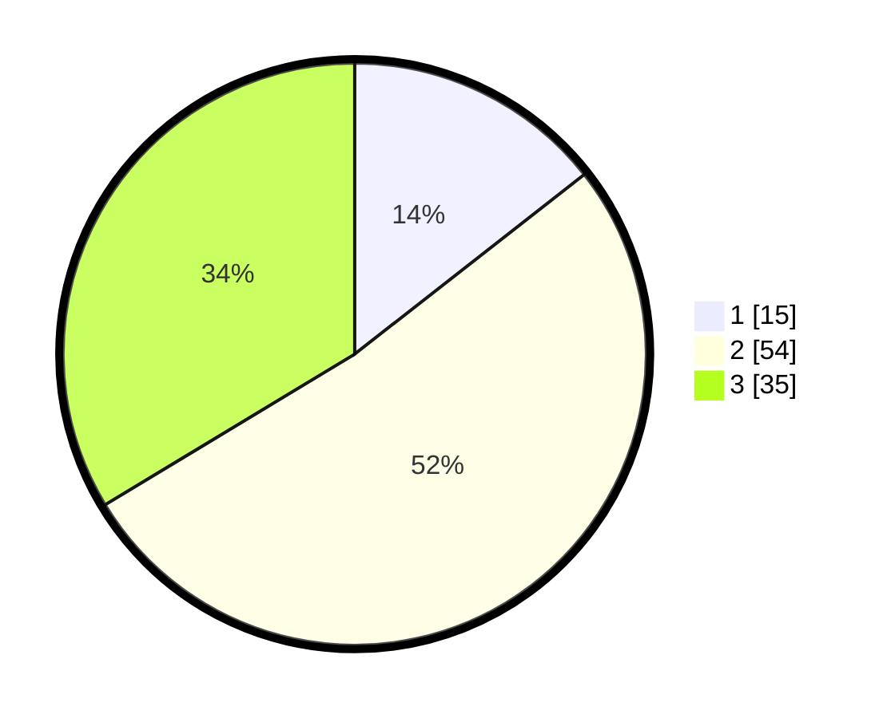

# Hasil

## Grafik

## Tabel

| No. | Nama Paslon    | Suara | Suara (raw) | Persentase |
|:--- |:-------------- | -----:| -----------:| ----------:|
| 1   | ANIES MUHAIMIN | 15    | [15][p-1]   | 14,42      |
| 2   | PRABOWO GIBRAN | 54    | [54][p-2]   | 51,92      |
| 3   | GANJAR MAHFUD  | 35    | [35][p-3]   | 33,65      |

[p-1]: https://github.com/gigit-pemilu/pemilu-2024/blob/main/pilpres/hitung-suara/sub/33-jawa-tengah/sub/72-kota-surakarta/sub/01-laweyan/sub/1007-purwosari/sub/027-tps/sub/paslon-1.txt
[p-2]: https://github.com/gigit-pemilu/pemilu-2024/blob/main/pilpres/hitung-suara/sub/33-jawa-tengah/sub/72-kota-surakarta/sub/01-laweyan/sub/1007-purwosari/sub/027-tps/sub/paslon-2.txt
[p-3]: https://github.com/gigit-pemilu/pemilu-2024/blob/main/pilpres/hitung-suara/sub/33-jawa-tengah/sub/72-kota-surakarta/sub/01-laweyan/sub/1007-purwosari/sub/027-tps/sub/paslon-3.txt

## Foto C Plano

https://sirekap-obj-formc.kpu.go.id/0502/pemilu/ppwp/33/72/01/10/07/3372011007027-20240214-192958--ab0a2ca6-a90b-43db-b657-ab9ed9472ec4.jpg

https://sirekap-obj-formc.kpu.go.id/0502/pemilu/ppwp/33/72/01/10/07/3372011007027-20240214-193126--f85ccb9a-9ec2-444f-a0f0-fc5f2b102daf.jpg

https://sirekap-obj-formc.kpu.go.id/0502/pemilu/ppwp/33/72/01/10/07/3372011007027-20240214-193142--e98f2b16-6943-4191-a2e9-500fc4b2c27b.jpg

## Metadata

| Key        | Value               |
| ---------- | ------------------- |
| Time Stamp | 2024-02-15 15:00:29 |

