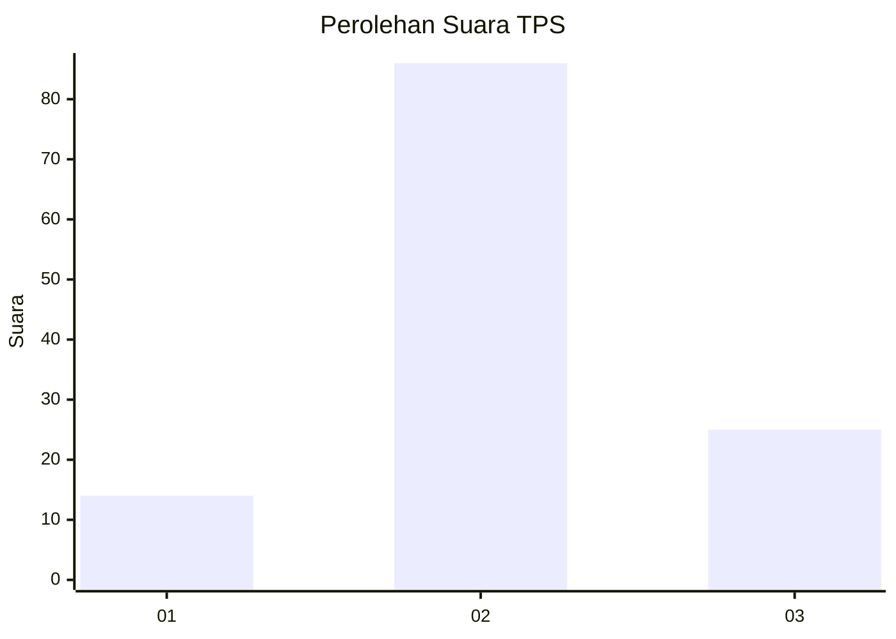
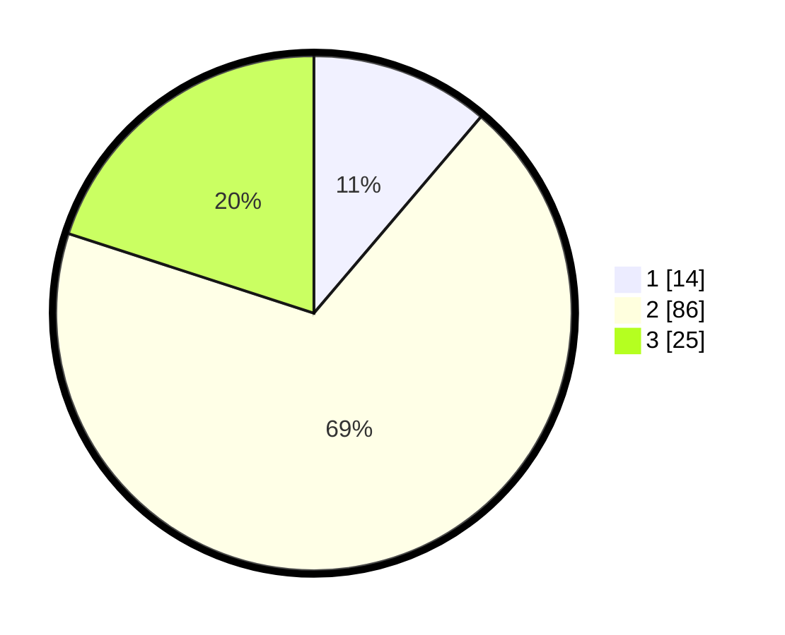

# Hasil

## Grafik

## Tabel

| No. | Nama Paslon    | Suara | Suara (raw) | Persentase |
|:--- |:-------------- | -----:| -----------:| ----------:|
| 1   | ANIES MUHAIMIN | 14    | [14][p-1]   | 11,20      |
| 2   | PRABOWO GIBRAN | 86    | [86][p-2]   | 68,80      |
| 3   | GANJAR MAHFUD  | 25    | [25][p-3]   | 20,00      |

[p-1]: https://github.com/gigit-pemilu/pemilu-2024/blob/main/pilpres/hitung-suara/sub/33-jawa-tengah/sub/72-kota-surakarta/sub/01-laweyan/sub/1009-kerten/sub/022-tps/sub/paslon-1.txt
[p-2]: https://github.com/gigit-pemilu/pemilu-2024/blob/main/pilpres/hitung-suara/sub/33-jawa-tengah/sub/72-kota-surakarta/sub/01-laweyan/sub/1009-kerten/sub/022-tps/sub/paslon-2.txt
[p-3]: https://github.com/gigit-pemilu/pemilu-2024/blob/main/pilpres/hitung-suara/sub/33-jawa-tengah/sub/72-kota-surakarta/sub/01-laweyan/sub/1009-kerten/sub/022-tps/sub/paslon-3.txt

## Foto C Plano

https://sirekap-obj-formc.kpu.go.id/dae5/pemilu/ppwp/33/72/01/10/09/3372011009022-20240214-220818--7cdf2c86-51e5-480a-8d0f-6d56c9be5868.jpg

https://sirekap-obj-formc.kpu.go.id/dae5/pemilu/ppwp/33/72/01/10/09/3372011009022-20240214-210816--a1d699a2-f48d-419c-8f7a-e633df38b5ca.jpg

https://sirekap-obj-formc.kpu.go.id/dae5/pemilu/ppwp/33/72/01/10/09/3372011009022-20240214-210959--fb169d60-d83a-4251-8a8b-c3f0fb3c634d.jpg

## Metadata

| Key        | Value               |
| ---------- | ------------------- |
| Time Stamp | 2024-02-15 15:00:29 |

