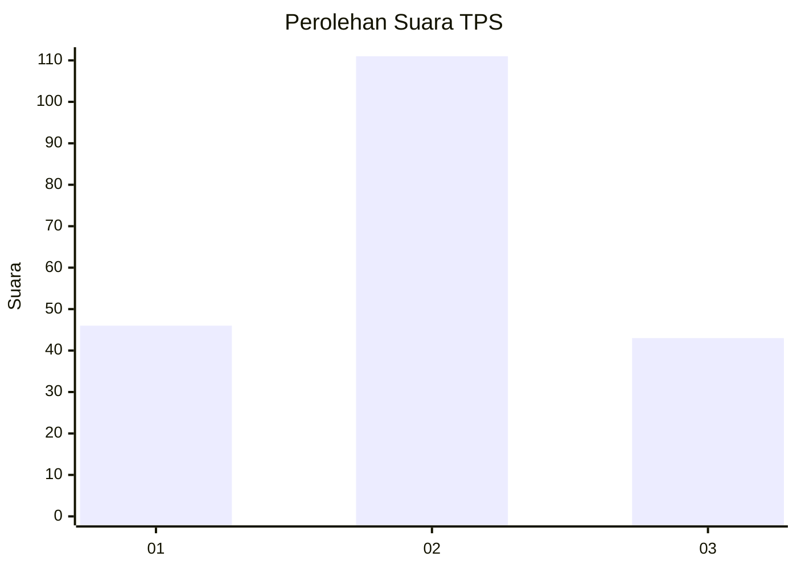
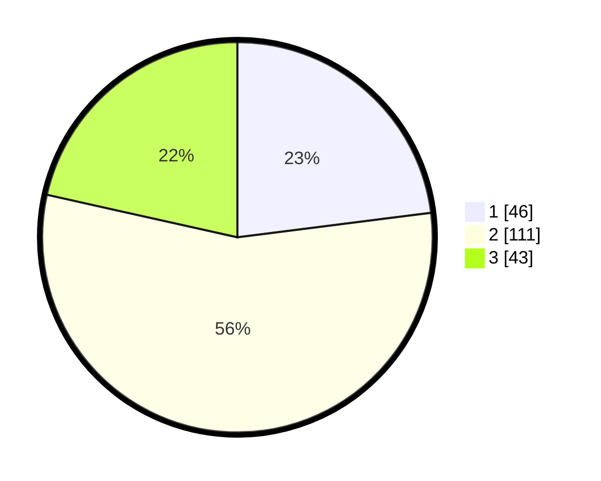

# Hasil

## Grafik

## Tabel

| No. | Nama Paslon    | Suara | Suara (raw) | Persentase |
|:--- |:-------------- | -----:| -----------:| ----------:|
| 1   | ANIES MUHAIMIN | 46    | [46][p-1]   | 23,00      |
| 2   | PRABOWO GIBRAN | 111   | [111][p-2]  | 55,50      |
| 3   | GANJAR MAHFUD  | 43    | [43][p-3]   | 21,50      |

[p-1]: https://github.com/gigit-pemilu/pemilu-2024/blob/main/pilpres/hitung-suara/sub/33-jawa-tengah/sub/72-kota-surakarta/sub/02-serengan/sub/1001-joyotakan/sub/009-tps/sub/paslon-1.txt
[p-2]: https://github.com/gigit-pemilu/pemilu-2024/blob/main/pilpres/hitung-suara/sub/33-jawa-tengah/sub/72-kota-surakarta/sub/02-serengan/sub/1001-joyotakan/sub/009-tps/sub/paslon-2.txt
[p-3]: https://github.com/gigit-pemilu/pemilu-2024/blob/main/pilpres/hitung-suara/sub/33-jawa-tengah/sub/72-kota-surakarta/sub/02-serengan/sub/1001-joyotakan/sub/009-tps/sub/paslon-3.txt

## Foto C Plano

https://sirekap-obj-formc.kpu.go.id/f02d/pemilu/ppwp/33/72/02/10/01/3372021001009-20240214-225004--9aff355b-c19c-422e-adf7-0703f2620fef.jpg

https://sirekap-obj-formc.kpu.go.id/f02d/pemilu/ppwp/33/72/02/10/01/3372021001009-20240214-225031--4a42d995-1b9a-49b1-b635-6f2fd1b19e0c.jpg

https://sirekap-obj-formc.kpu.go.id/f02d/pemilu/ppwp/33/72/02/10/01/3372021001009-20240214-225035--6f51a9be-b9dc-421a-b853-97c1fb9acdc4.jpg

## Metadata

| Key        | Value               |
| ---------- | ------------------- |
| Time Stamp | 2024-02-15 12:00:28 |

