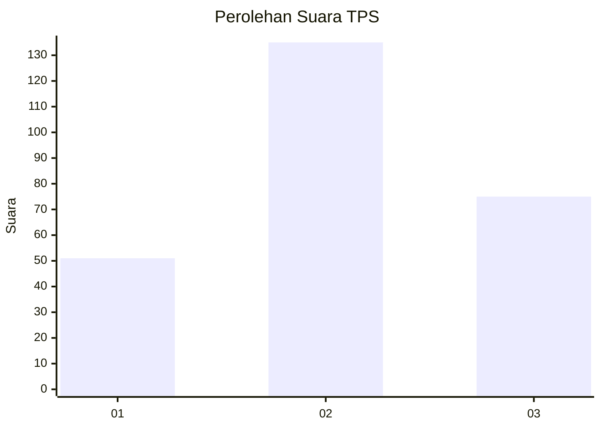
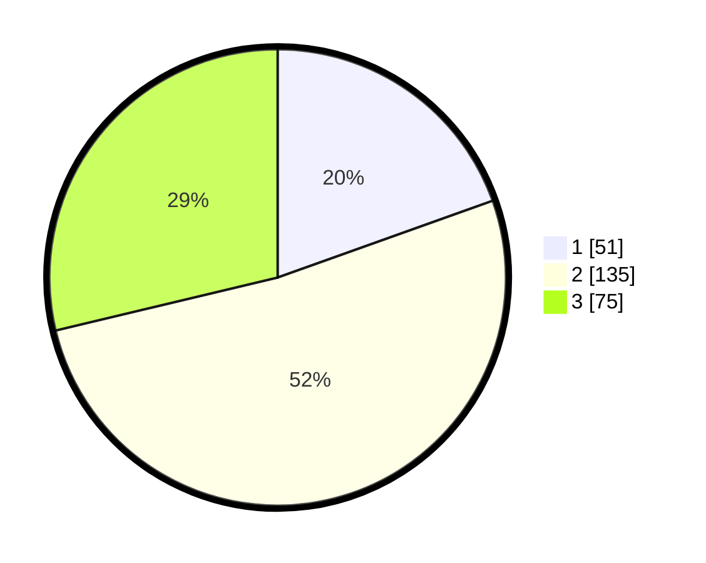

# Hasil

## Grafik

## Tabel

| No. | Nama Paslon    | Suara | Suara (raw) | Persentase |
|:--- |:-------------- | -----:| -----------:| ----------:|
| 1   | ANIES MUHAIMIN | 51    | [51][p-1]   | 19,54      |
| 2   | PRABOWO GIBRAN | 135   | [135][p-2]  | 51,72      |
| 3   | GANJAR MAHFUD  | 75    | [75][p-3]   | 28,74      |

[p-1]: https://github.com/gigit-pemilu/pemilu-2024-33-jawa-tengah/blob/main/pilpres/hitung-suara/sub/33-jawa-tengah/sub/72-kota-surakarta/sub/02-serengan/sub/1006-jayengan/sub/003-tps/sub/paslon-1.txt
[p-2]: https://github.com/gigit-pemilu/pemilu-2024-33-jawa-tengah/blob/main/pilpres/hitung-suara/sub/33-jawa-tengah/sub/72-kota-surakarta/sub/02-serengan/sub/1006-jayengan/sub/003-tps/sub/paslon-2.txt
[p-3]: https://github.com/gigit-pemilu/pemilu-2024-33-jawa-tengah/blob/main/pilpres/hitung-suara/sub/33-jawa-tengah/sub/72-kota-surakarta/sub/02-serengan/sub/1006-jayengan/sub/003-tps/sub/paslon-3.txt

## Foto C Plano

https://sirekap-obj-formc.kpu.go.id/b0a8/pemilu/ppwp/33/72/02/10/06/3372021006003-20240220-142517--8d85a2bb-9f53-4b64-9062-10d3616b5d9b.jpg

https://sirekap-obj-formc.kpu.go.id/b0a8/pemilu/ppwp/33/72/02/10/06/3372021006003-20240220-142630--6a68bf55-a506-45fd-b897-d00b852ff6c8.jpg

https://sirekap-obj-formc.kpu.go.id/b0a8/pemilu/ppwp/33/72/02/10/06/3372021006003-20240220-142724--c896a716-4765-408d-8afa-33fdd7243e98.jpg

## Metadata

| Key        | Value               |
| ---------- | ------------------- |
| Time Stamp | 2024-02-20 18:00:00 |

