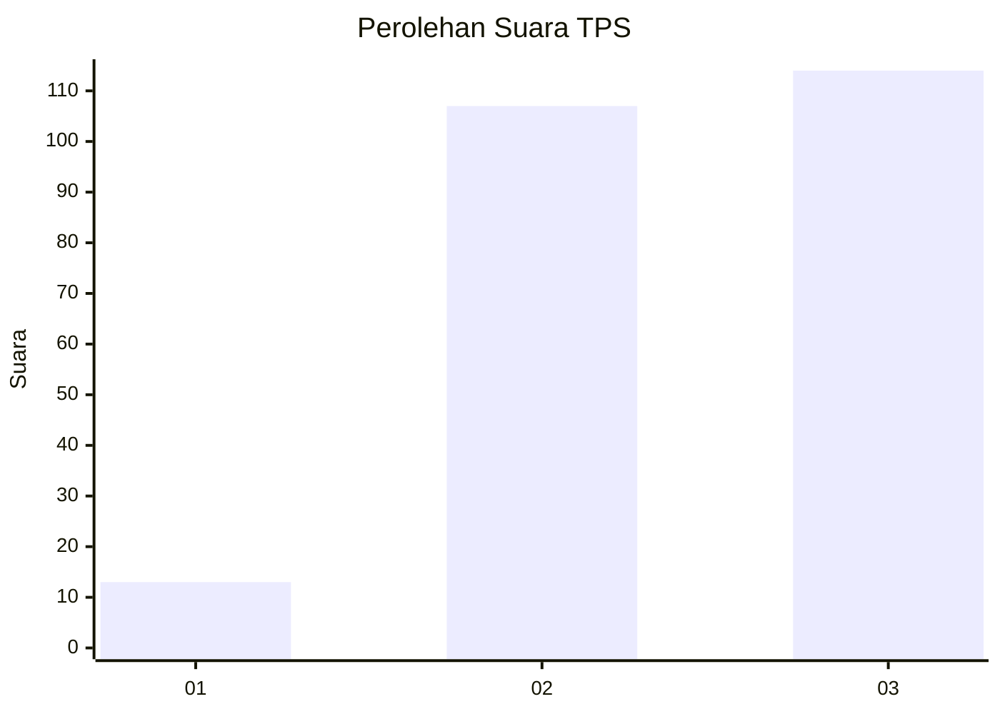
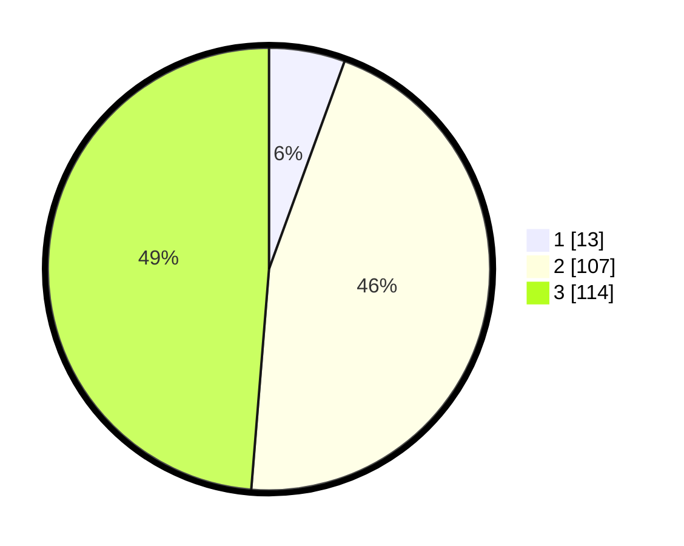

# Hasil

## Grafik

## Tabel

| No. | Nama Paslon    | Suara | Suara (raw) | Persentase |
|:--- |:-------------- | -----:| -----------:| ----------:|
| 1   | ANIES MUHAIMIN | 13    | [13][p-1]   | 5,56       |
| 2   | PRABOWO GIBRAN | 107   | [107][p-2]  | 45,73      |
| 3   | GANJAR MAHFUD  | 114   | [114][p-3]  | 48,72      |

[p-1]: https://github.com/gigit-pemilu/pemilu-2024-33-jawa-tengah/blob/main/pilpres/hitung-suara/sub/33-jawa-tengah/sub/72-kota-surakarta/sub/03-pasar-kliwon/sub/1007-kedunglumbu/sub/003-tps/sub/paslon-1.txt
[p-2]: https://github.com/gigit-pemilu/pemilu-2024-33-jawa-tengah/blob/main/pilpres/hitung-suara/sub/33-jawa-tengah/sub/72-kota-surakarta/sub/03-pasar-kliwon/sub/1007-kedunglumbu/sub/003-tps/sub/paslon-2.txt
[p-3]: https://github.com/gigit-pemilu/pemilu-2024-33-jawa-tengah/blob/main/pilpres/hitung-suara/sub/33-jawa-tengah/sub/72-kota-surakarta/sub/03-pasar-kliwon/sub/1007-kedunglumbu/sub/003-tps/sub/paslon-3.txt

## Foto C Plano

https://sirekap-obj-formc.kpu.go.id/06c5/pemilu/ppwp/33/72/03/10/07/3372031007003-20240216-211504--64c8543f-562b-44e2-b9fd-9abd6a5c1f8b.jpg

https://sirekap-obj-formc.kpu.go.id/06c5/pemilu/ppwp/33/72/03/10/07/3372031007003-20240215-031359--4d71f6dd-5d27-4fd8-a988-85aa1d3e0e97.jpg

https://sirekap-obj-formc.kpu.go.id/06c5/pemilu/ppwp/33/72/03/10/07/3372031007003-20240215-031619--5981cc9f-0f09-4363-8eb0-543d91c1c6bd.jpg

## Metadata

| Key        | Value               |
| ---------- | ------------------- |
| Time Stamp | 2024-02-16 22:01:00 |

