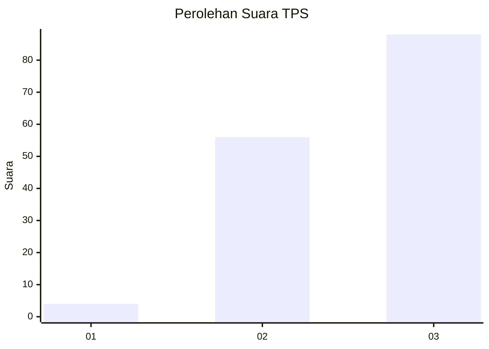
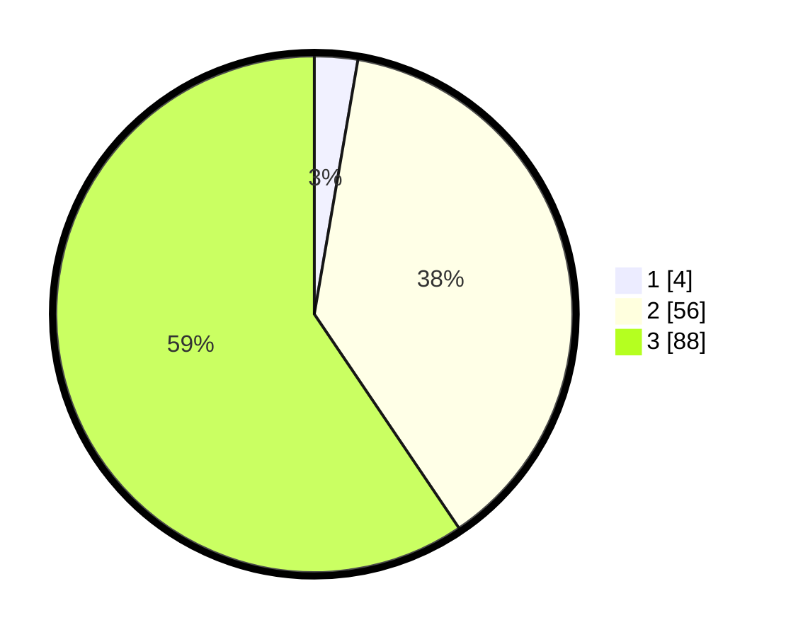

# Hasil

## Grafik

## Tabel

| No. | Nama Paslon    | Suara | Suara (raw) | Persentase |
|:--- |:-------------- | -----:| -----------:| ----------:|
| 1   | ANIES MUHAIMIN | 4     | [4][p-1]    | 2,70       |
| 2   | PRABOWO GIBRAN | 56    | [56][p-2]   | 37,84      |
| 3   | GANJAR MAHFUD  | 88    | [88][p-3]   | 59,46      |

[p-1]: https://github.com/gigit-pemilu/pemilu-2024-33-jawa-tengah/blob/main/pilpres/hitung-suara/sub/33-jawa-tengah/sub/72-kota-surakarta/sub/04-jebres/sub/1008-purwodiningratan/sub/001-tps/sub/paslon-1.txt
[p-2]: https://github.com/gigit-pemilu/pemilu-2024-33-jawa-tengah/blob/main/pilpres/hitung-suara/sub/33-jawa-tengah/sub/72-kota-surakarta/sub/04-jebres/sub/1008-purwodiningratan/sub/001-tps/sub/paslon-2.txt
[p-3]: https://github.com/gigit-pemilu/pemilu-2024-33-jawa-tengah/blob/main/pilpres/hitung-suara/sub/33-jawa-tengah/sub/72-kota-surakarta/sub/04-jebres/sub/1008-purwodiningratan/sub/001-tps/sub/paslon-3.txt

## Foto C Plano

https://sirekap-obj-formc.kpu.go.id/0d6c/pemilu/ppwp/33/72/04/10/08/3372041008001-20240214-230356--39dff229-7995-4b2a-b552-ce4a0b4042ee.jpg

https://sirekap-obj-formc.kpu.go.id/0d6c/pemilu/ppwp/33/72/04/10/08/3372041008001-20240214-235331--a9ee45ff-0890-4f84-b521-7b4d495e0097.jpg

https://sirekap-obj-formc.kpu.go.id/0d6c/pemilu/ppwp/33/72/04/10/08/3372041008001-20240214-235503--e1621055-81db-42fd-957f-3f355af6923a.jpg

## Metadata

| Key        | Value               |
| ---------- | ------------------- |
| Time Stamp | 2024-02-15 21:30:27 |

