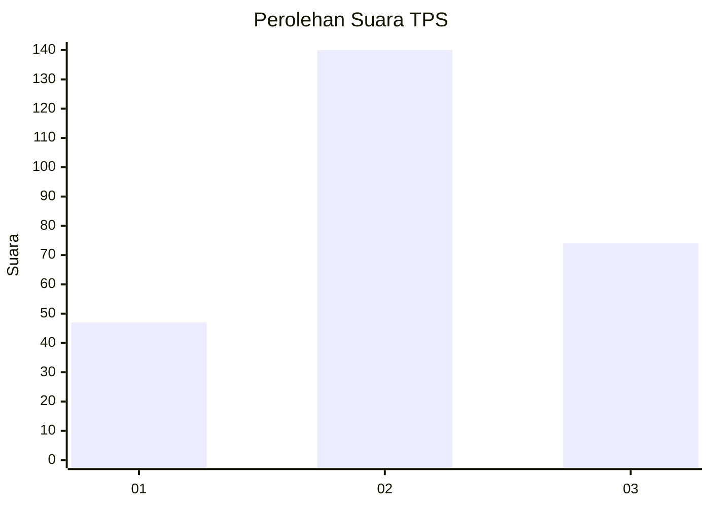
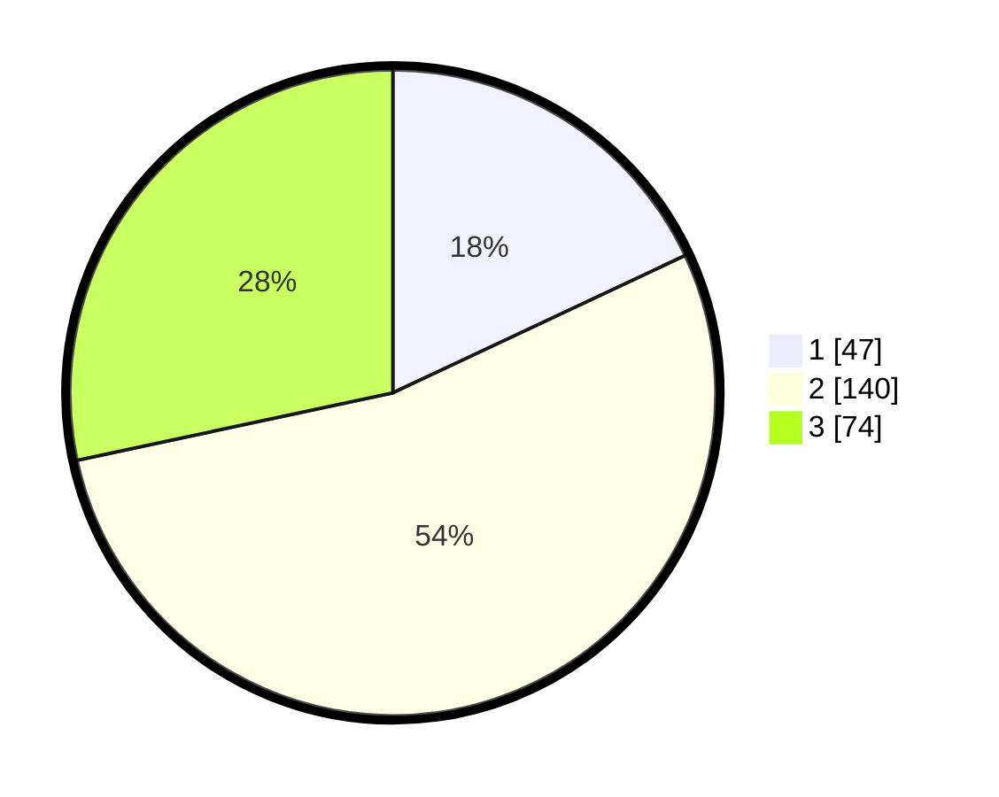

# Hasil

## Grafik

## Tabel

| No. | Nama Paslon    | Suara | Suara (raw) | Persentase |
|:--- |:-------------- | -----:| -----------:| ----------:|
| 1   | ANIES MUHAIMIN | 47    | [47][p-1]   | 18,01      |
| 2   | PRABOWO GIBRAN | 140   | [140][p-2]  | 53,64      |
| 3   | GANJAR MAHFUD  | 74    | [74][p-3]   | 28,35      |

[p-1]: https://github.com/gigit-pemilu/pemilu-2024/blob/main/pilpres/hitung-suara/sub/33-jawa-tengah/sub/72-kota-surakarta/sub/04-jebres/sub/1010-jebres/sub/019-tps/sub/paslon-1.txt
[p-2]: https://github.com/gigit-pemilu/pemilu-2024/blob/main/pilpres/hitung-suara/sub/33-jawa-tengah/sub/72-kota-surakarta/sub/04-jebres/sub/1010-jebres/sub/019-tps/sub/paslon-2.txt
[p-3]: https://github.com/gigit-pemilu/pemilu-2024/blob/main/pilpres/hitung-suara/sub/33-jawa-tengah/sub/72-kota-surakarta/sub/04-jebres/sub/1010-jebres/sub/019-tps/sub/paslon-3.txt

## Foto C Plano

https://sirekap-obj-formc.kpu.go.id/b45d/pemilu/ppwp/33/72/04/10/10/3372041010019-20240216-205433--7280d8cb-a21d-4f8d-bade-6775f5882b4d.jpg

https://sirekap-obj-formc.kpu.go.id/b45d/pemilu/ppwp/33/72/04/10/10/3372041010019-20240216-210132--8bf8358b-03dc-4f32-bc6e-c01a9b3763d1.jpg

https://sirekap-obj-formc.kpu.go.id/b45d/pemilu/ppwp/33/72/04/10/10/3372041010019-20240216-210327--15f4b448-148a-48d6-8204-2f60fddb1ea2.jpg

## Metadata

| Key        | Value               |
| ---------- | ------------------- |
| Time Stamp | 2024-02-25 11:00:00 |

