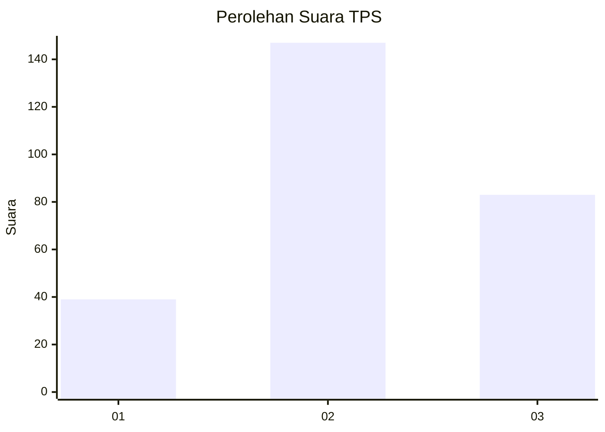
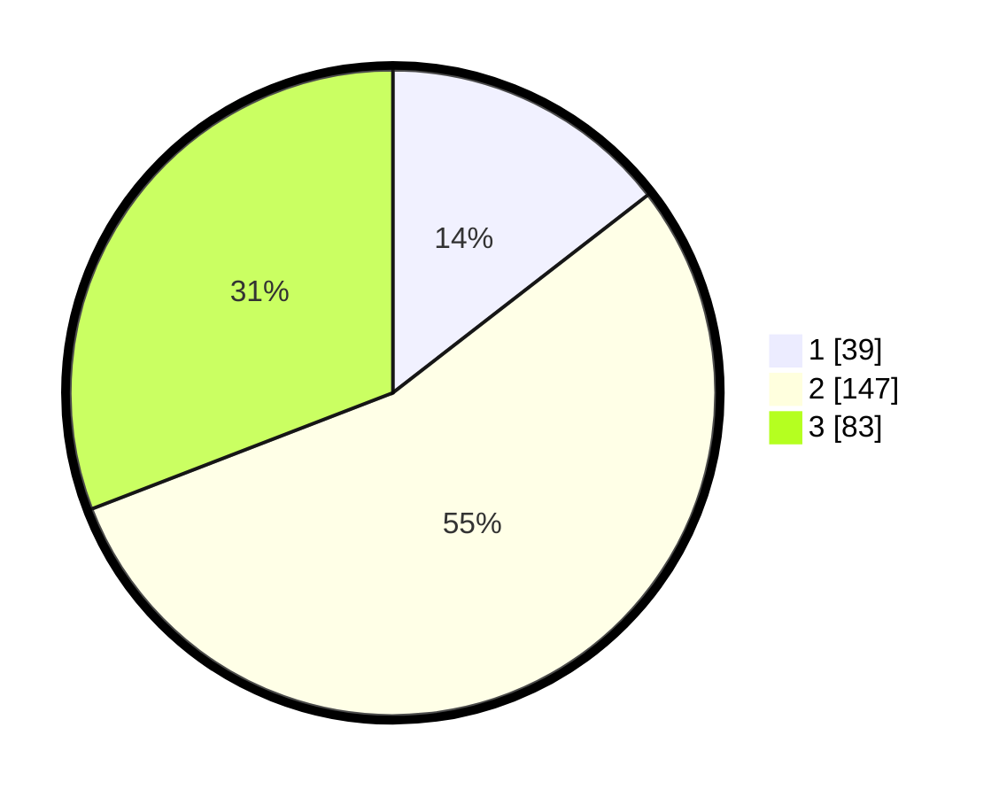

# Hasil

## Grafik

## Tabel

| No. | Nama Paslon    | Suara | Suara (raw) | Persentase |
|:--- |:-------------- | -----:| -----------:| ----------:|
| 1   | ANIES MUHAIMIN | 39    | [39][p-1]   | 14,50      |
| 2   | PRABOWO GIBRAN | 147   | [147][p-2]  | 54,65      |
| 3   | GANJAR MAHFUD  | 83    | [83][p-3]   | 30,86      |

[p-1]: https://github.com/gigit-pemilu/pemilu-2024-33-jawa-tengah/blob/main/pilpres/hitung-suara/sub/33-jawa-tengah/sub/72-kota-surakarta/sub/04-jebres/sub/1011-mojosongo/sub/017-tps/sub/paslon-1.txt
[p-2]: https://github.com/gigit-pemilu/pemilu-2024-33-jawa-tengah/blob/main/pilpres/hitung-suara/sub/33-jawa-tengah/sub/72-kota-surakarta/sub/04-jebres/sub/1011-mojosongo/sub/017-tps/sub/paslon-2.txt
[p-3]: https://github.com/gigit-pemilu/pemilu-2024-33-jawa-tengah/blob/main/pilpres/hitung-suara/sub/33-jawa-tengah/sub/72-kota-surakarta/sub/04-jebres/sub/1011-mojosongo/sub/017-tps/sub/paslon-3.txt

## Foto C Plano

https://sirekap-obj-formc.kpu.go.id/ee88/pemilu/ppwp/33/72/04/10/11/3372041011017-20240215-034248--f7196f52-71d1-4cd6-ba45-6c3c17078cb4.jpg

https://sirekap-obj-formc.kpu.go.id/ee88/pemilu/ppwp/33/72/04/10/11/3372041011017-20240215-034512--b04b532f-8a03-4f47-9723-2751f23638ea.jpg

https://sirekap-obj-formc.kpu.go.id/ee88/pemilu/ppwp/33/72/04/10/11/3372041011017-20240215-034853--f290f974-acfc-4103-83cc-ac5a2411d30e.jpg

## Metadata

| Key        | Value               |
| ---------- | ------------------- |
| Time Stamp | 2024-02-15 17:00:25 |

