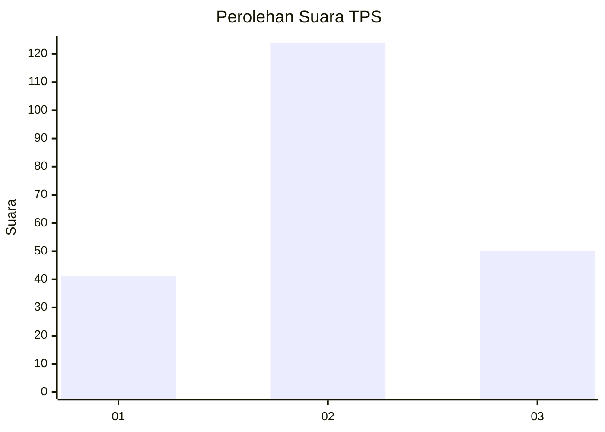
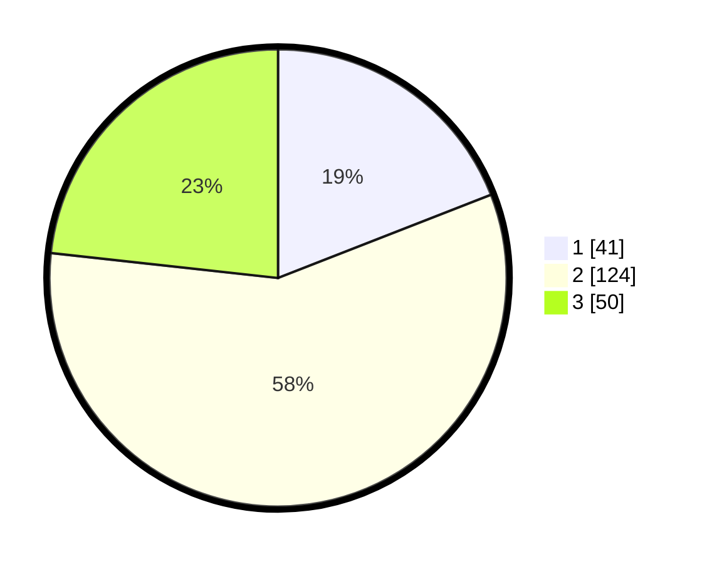

# Hasil

## Grafik

## Tabel

| No. | Nama Paslon    | Suara | Suara (raw) | Persentase |
|:--- |:-------------- | -----:| -----------:| ----------:|
| 1   | ANIES MUHAIMIN | 41    | [41][p-1]   | 19,07      |
| 2   | PRABOWO GIBRAN | 124   | [124][p-2]  | 57,67      |
| 3   | GANJAR MAHFUD  | 50    | [50][p-3]   | 23,26      |

[p-1]: https://github.com/gigit-pemilu/pemilu-2024-33-jawa-tengah/blob/main/pilpres/hitung-suara/sub/33-jawa-tengah/sub/72-kota-surakarta/sub/05-banjarsari/sub/1001-kadipiro/sub/006-tps/sub/paslon-1.txt
[p-2]: https://github.com/gigit-pemilu/pemilu-2024-33-jawa-tengah/blob/main/pilpres/hitung-suara/sub/33-jawa-tengah/sub/72-kota-surakarta/sub/05-banjarsari/sub/1001-kadipiro/sub/006-tps/sub/paslon-2.txt
[p-3]: https://github.com/gigit-pemilu/pemilu-2024-33-jawa-tengah/blob/main/pilpres/hitung-suara/sub/33-jawa-tengah/sub/72-kota-surakarta/sub/05-banjarsari/sub/1001-kadipiro/sub/006-tps/sub/paslon-3.txt

## Foto C Plano

https://sirekap-obj-formc.kpu.go.id/da61/pemilu/ppwp/33/72/05/10/01/3372051001006-20240215-020328--6fc25770-d24b-4821-974a-ac5f44ccc4ad.jpg

https://sirekap-obj-formc.kpu.go.id/da61/pemilu/ppwp/33/72/05/10/01/3372051001006-20240215-020532--48daf8f3-2f7a-438d-8b7c-0c4f7f2dc82c.jpg

https://sirekap-obj-formc.kpu.go.id/da61/pemilu/ppwp/33/72/05/10/01/3372051001006-20240215-020711--22dcb03e-ac45-4b1c-9f29-de0e1044903d.jpg

## Metadata

| Key        | Value               |
| ---------- | ------------------- |
| Time Stamp | 2024-02-21 16:00:00 |

