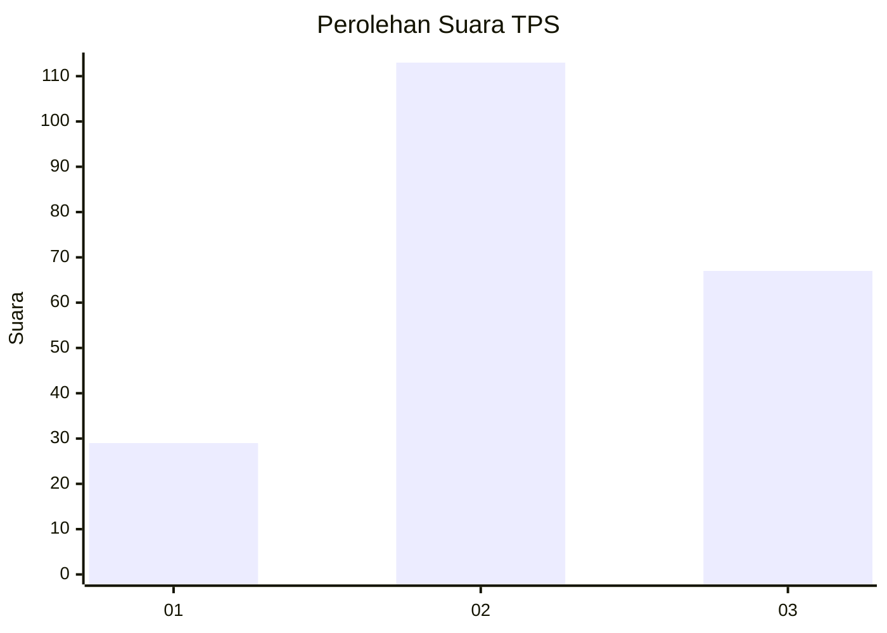
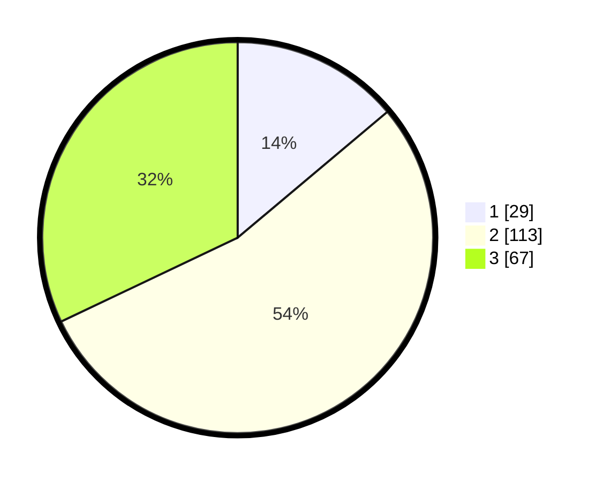

# Hasil

## Grafik

## Tabel

| No. | Nama Paslon    | Suara | Suara (raw) | Persentase |
|:--- |:-------------- | -----:| -----------:| ----------:|
| 1   | ANIES MUHAIMIN | 29    | [29][p-1]   | 13,88      |
| 2   | PRABOWO GIBRAN | 113   | [113][p-2]  | 54,07      |
| 3   | GANJAR MAHFUD  | 67    | [67][p-3]   | 32,06      |

[p-1]: https://github.com/gigit-pemilu/pemilu-2024/blob/main/pilpres/hitung-suara/sub/33-jawa-tengah/sub/72-kota-surakarta/sub/05-banjarsari/sub/1001-kadipiro/sub/009-tps/sub/paslon-1.txt
[p-2]: https://github.com/gigit-pemilu/pemilu-2024/blob/main/pilpres/hitung-suara/sub/33-jawa-tengah/sub/72-kota-surakarta/sub/05-banjarsari/sub/1001-kadipiro/sub/009-tps/sub/paslon-2.txt
[p-3]: https://github.com/gigit-pemilu/pemilu-2024/blob/main/pilpres/hitung-suara/sub/33-jawa-tengah/sub/72-kota-surakarta/sub/05-banjarsari/sub/1001-kadipiro/sub/009-tps/sub/paslon-3.txt

## Foto C Plano

https://sirekap-obj-formc.kpu.go.id/adfc/pemilu/ppwp/33/72/05/10/01/3372051001009-20240214-141336--ff0625a2-f64a-4b87-8c48-323bc06b6712.jpg

https://sirekap-obj-formc.kpu.go.id/adfc/pemilu/ppwp/33/72/05/10/01/3372051001009-20240214-141626--b8c76ffd-510c-4a55-ad51-d957e54b4dfd.jpg

https://sirekap-obj-formc.kpu.go.id/adfc/pemilu/ppwp/33/72/05/10/01/3372051001009-20240214-141837--613a83dc-633a-4ef1-bb7a-d7092dfb3a68.jpg

## Metadata

| Key        | Value               |
| ---------- | ------------------- |
| Time Stamp | 2024-02-14 21:46:01 |

