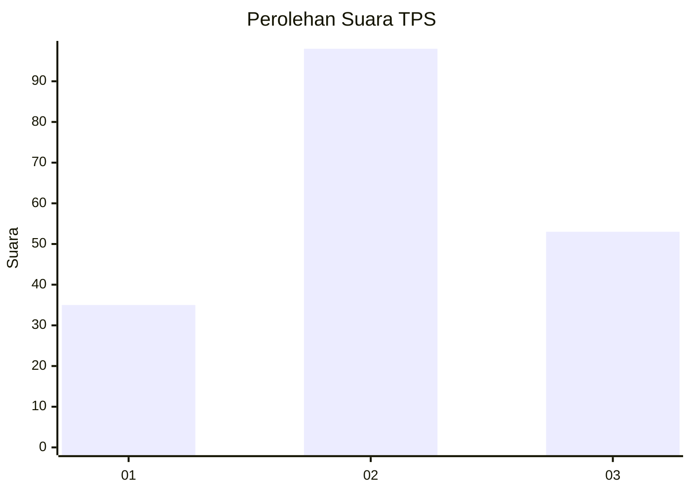
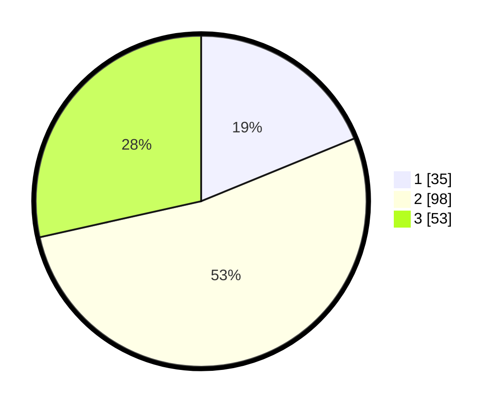

# Hasil

## Grafik

## Tabel

| No. | Nama Paslon    | Suara | Suara (raw) | Persentase |
|:--- |:-------------- | -----:| -----------:| ----------:|
| 1   | ANIES MUHAIMIN | 35    | [35][p-1]   | 18,82      |
| 2   | PRABOWO GIBRAN | 98    | [98][p-2]   | 52,69      |
| 3   | GANJAR MAHFUD  | 53    | [53][p-3]   | 28,49      |

[p-1]: https://github.com/gigit-pemilu/pemilu-2024-33-jawa-tengah/blob/main/pilpres/hitung-suara/sub/33-jawa-tengah/sub/72-kota-surakarta/sub/05-banjarsari/sub/1001-kadipiro/sub/012-tps/sub/paslon-1.txt
[p-2]: https://github.com/gigit-pemilu/pemilu-2024-33-jawa-tengah/blob/main/pilpres/hitung-suara/sub/33-jawa-tengah/sub/72-kota-surakarta/sub/05-banjarsari/sub/1001-kadipiro/sub/012-tps/sub/paslon-2.txt
[p-3]: https://github.com/gigit-pemilu/pemilu-2024-33-jawa-tengah/blob/main/pilpres/hitung-suara/sub/33-jawa-tengah/sub/72-kota-surakarta/sub/05-banjarsari/sub/1001-kadipiro/sub/012-tps/sub/paslon-3.txt

## Foto C Plano

https://sirekap-obj-formc.kpu.go.id/3408/pemilu/ppwp/33/72/05/10/01/3372051001012-20240215-113607--85bc9851-f8b9-4ae2-bd42-db5c28b0f05c.jpg

https://sirekap-obj-formc.kpu.go.id/3408/pemilu/ppwp/33/72/05/10/01/3372051001012-20240215-152346--d3a0edc5-0187-4104-a71b-a8e3d8017118.jpg

https://sirekap-obj-formc.kpu.go.id/3408/pemilu/ppwp/33/72/05/10/01/3372051001012-20240215-091421--6b2be5b7-4252-4ce0-be7a-a1eaebb93b9f.jpg

## Metadata

| Key        | Value               |
| ---------- | ------------------- |
| Time Stamp | 2024-02-15 19:30:26 |

