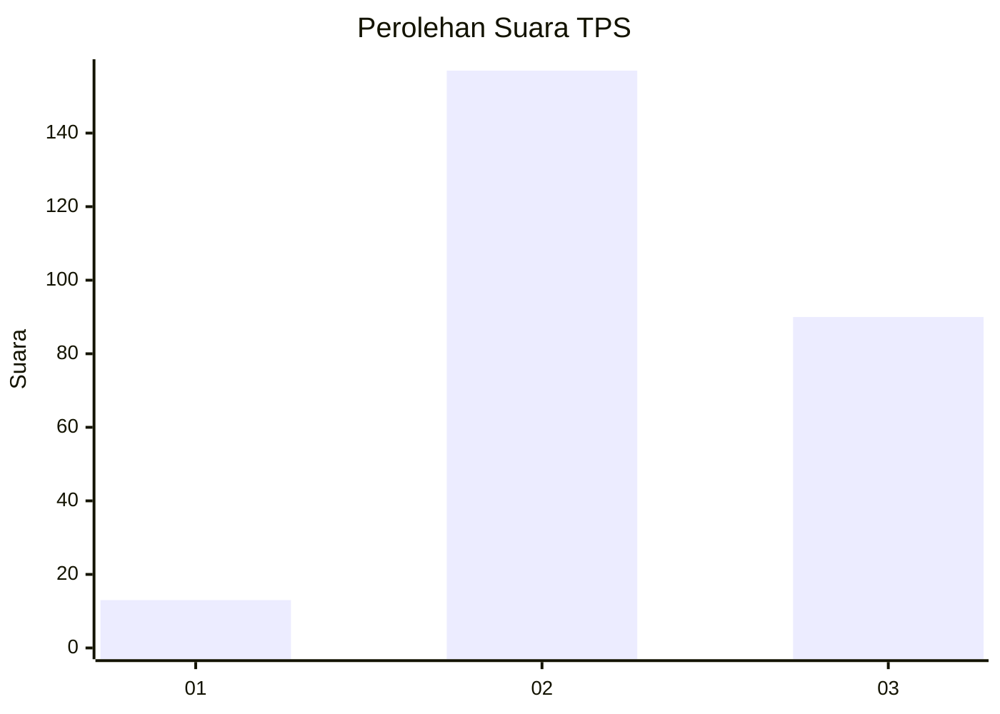
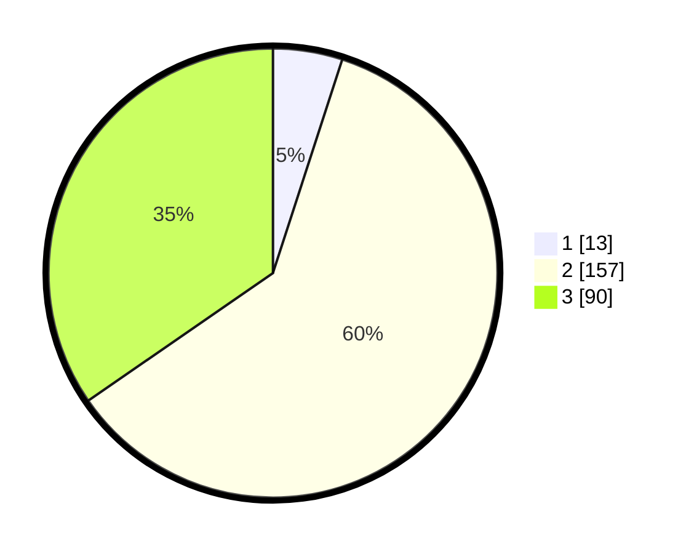

# Hasil

## Grafik

## Tabel

| No. | Nama Paslon    | Suara | Suara (raw) | Persentase |
|:--- |:-------------- | -----:| -----------:| ----------:|
| 1   | ANIES MUHAIMIN | 13    | [13][p-1]   | 5,00       |
| 2   | PRABOWO GIBRAN | 157   | [157][p-2]  | 60,38      |
| 3   | GANJAR MAHFUD  | 90    | [90][p-3]   | 34,62      |

[p-1]: https://github.com/gigit-pemilu/pemilu-2024-33-jawa-tengah/blob/main/pilpres/hitung-suara/sub/33-jawa-tengah/sub/72-kota-surakarta/sub/05-banjarsari/sub/1002-nusukan/sub/089-tps/sub/paslon-1.txt
[p-2]: https://github.com/gigit-pemilu/pemilu-2024-33-jawa-tengah/blob/main/pilpres/hitung-suara/sub/33-jawa-tengah/sub/72-kota-surakarta/sub/05-banjarsari/sub/1002-nusukan/sub/089-tps/sub/paslon-2.txt
[p-3]: https://github.com/gigit-pemilu/pemilu-2024-33-jawa-tengah/blob/main/pilpres/hitung-suara/sub/33-jawa-tengah/sub/72-kota-surakarta/sub/05-banjarsari/sub/1002-nusukan/sub/089-tps/sub/paslon-3.txt

## Foto C Plano

https://sirekap-obj-formc.kpu.go.id/4c3a/pemilu/ppwp/33/72/05/10/02/3372051002089-20240214-231842--bad790ed-bc5a-423e-8bbb-b189ae961c88.jpg

https://sirekap-obj-formc.kpu.go.id/4c3a/pemilu/ppwp/33/72/05/10/02/3372051002089-20240214-203452--956b5977-f071-4706-a6ca-bcfc7d10c6fa.jpg

https://sirekap-obj-formc.kpu.go.id/4c3a/pemilu/ppwp/33/72/05/10/02/3372051002089-20240214-203604--f2dbf032-1e59-47e3-85d7-ecfbd4784e09.jpg

## Metadata

| Key        | Value               |
| ---------- | ------------------- |
| Time Stamp | 2024-02-15 12:00:28 |

