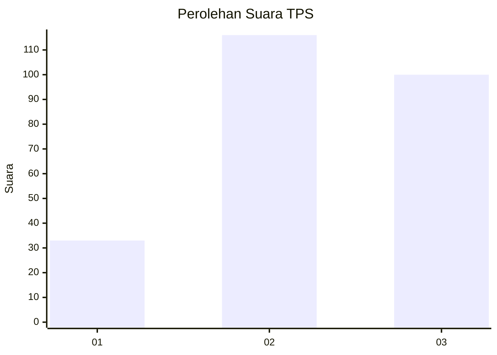
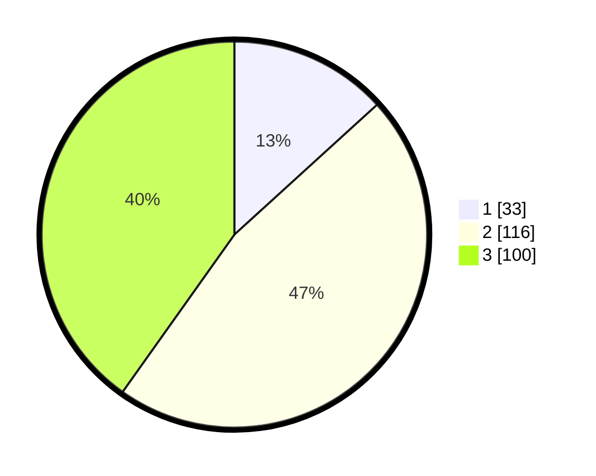

# Hasil

## Grafik

## Tabel

| No. | Nama Paslon    | Suara | Suara (raw) | Persentase |
|:--- |:-------------- | -----:| -----------:| ----------:|
| 1   | ANIES MUHAIMIN | 33    | [33][p-1]   | 13,25      |
| 2   | PRABOWO GIBRAN | 116   | [116][p-2]  | 46,59      |
| 3   | GANJAR MAHFUD  | 100   | [100][p-3]  | 40,16      |

[p-1]: https://github.com/gigit-pemilu/pemilu-2024/blob/main/pilpres/hitung-suara/sub/33-jawa-tengah/sub/72-kota-surakarta/sub/05-banjarsari/sub/1014-banjarsari/sub/021-tps/sub/paslon-1.txt
[p-2]: https://github.com/gigit-pemilu/pemilu-2024/blob/main/pilpres/hitung-suara/sub/33-jawa-tengah/sub/72-kota-surakarta/sub/05-banjarsari/sub/1014-banjarsari/sub/021-tps/sub/paslon-2.txt
[p-3]: https://github.com/gigit-pemilu/pemilu-2024/blob/main/pilpres/hitung-suara/sub/33-jawa-tengah/sub/72-kota-surakarta/sub/05-banjarsari/sub/1014-banjarsari/sub/021-tps/sub/paslon-3.txt

## Foto C Plano

https://sirekap-obj-formc.kpu.go.id/c90d/pemilu/ppwp/33/72/05/10/14/3372051014021-20240219-062350--da89bde1-ead5-47d7-b816-4566f6cac0c5.jpg

https://sirekap-obj-formc.kpu.go.id/c90d/pemilu/ppwp/33/72/05/10/14/3372051014021-20240219-062357--f642fd9f-dd18-4388-bbd5-620ff5af2850.jpg

https://sirekap-obj-formc.kpu.go.id/c90d/pemilu/ppwp/33/72/05/10/14/3372051014021-20240219-062402--20fffb2b-2061-4caf-bc2d-d1105b4d6bda.jpg

## Metadata

| Key        | Value               |
| ---------- | ------------------- |
| Time Stamp | 2024-02-20 18:00:00 |

