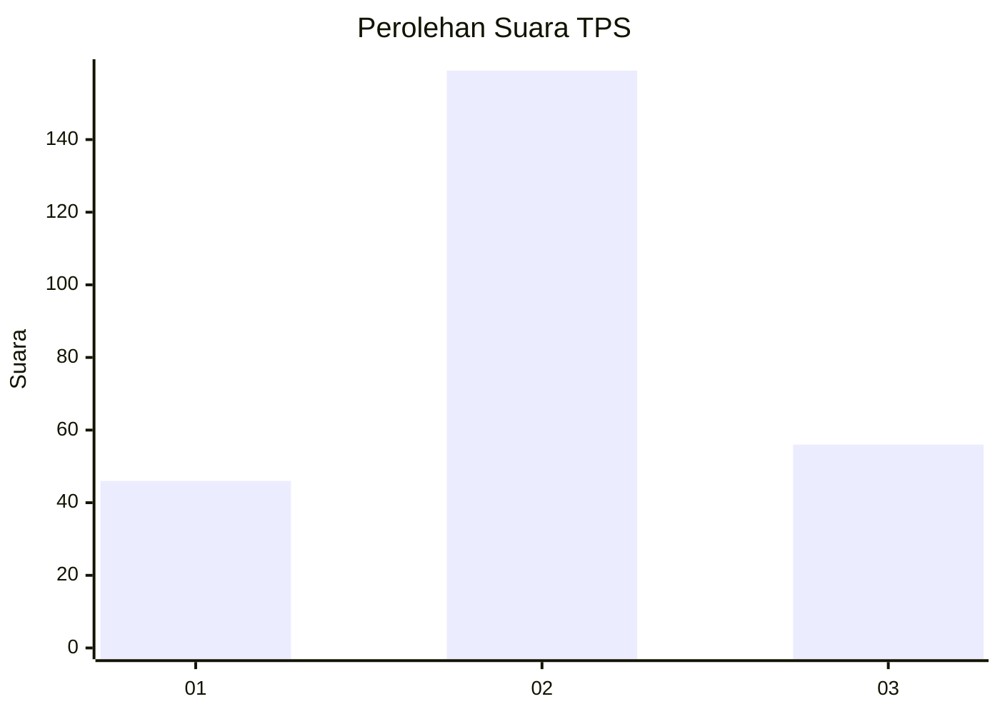
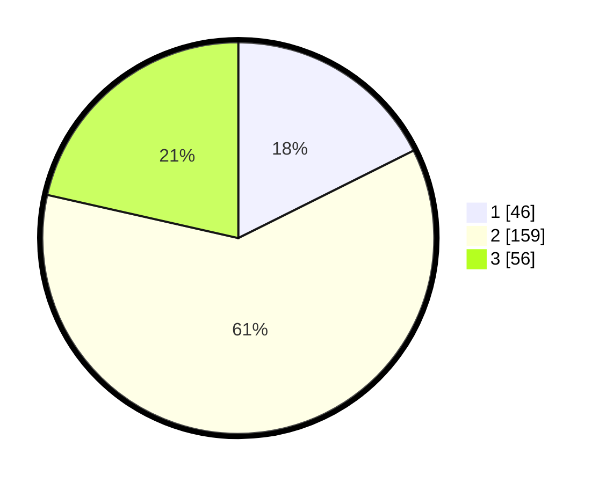

# Hasil

## Grafik

## Tabel

| No. | Nama Paslon    | Suara | Suara (raw) | Persentase |
|:--- |:-------------- | -----:| -----------:| ----------:|
| 1   | ANIES MUHAIMIN | 46    | [46][p-1]   | 17,62      |
| 2   | PRABOWO GIBRAN | 159   | [159][p-2]  | 60,92      |
| 3   | GANJAR MAHFUD  | 56    | [56][p-3]   | 21,46      |

[p-1]: https://github.com/gigit-pemilu/pemilu-2024-33-jawa-tengah/blob/main/pilpres/hitung-suara/sub/33-jawa-tengah/sub/72-kota-surakarta/sub/05-banjarsari/sub/1014-banjarsari/sub/059-tps/sub/paslon-1.txt
[p-2]: https://github.com/gigit-pemilu/pemilu-2024-33-jawa-tengah/blob/main/pilpres/hitung-suara/sub/33-jawa-tengah/sub/72-kota-surakarta/sub/05-banjarsari/sub/1014-banjarsari/sub/059-tps/sub/paslon-2.txt
[p-3]: https://github.com/gigit-pemilu/pemilu-2024-33-jawa-tengah/blob/main/pilpres/hitung-suara/sub/33-jawa-tengah/sub/72-kota-surakarta/sub/05-banjarsari/sub/1014-banjarsari/sub/059-tps/sub/paslon-3.txt

## Foto C Plano

https://sirekap-obj-formc.kpu.go.id/745c/pemilu/ppwp/33/72/05/10/14/3372051014059-20240218-190307--b1b13c81-7a07-45ed-8a42-eb50727f0fb8.jpg

https://sirekap-obj-formc.kpu.go.id/745c/pemilu/ppwp/33/72/05/10/14/3372051014059-20240214-232444--b1cab75e-3e21-4065-82c6-32a7ff2c6795.jpg

https://sirekap-obj-formc.kpu.go.id/745c/pemilu/ppwp/33/72/05/10/14/3372051014059-20240214-232200--5f126241-8185-49a6-93fc-339c934fed29.jpg

## Metadata

| Key        | Value               |
| ---------- | ------------------- |
| Time Stamp | 2024-02-19 06:16:00 |

