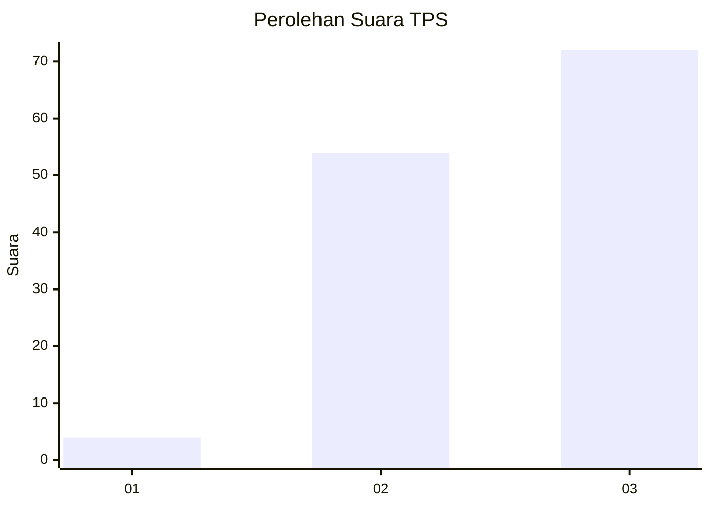
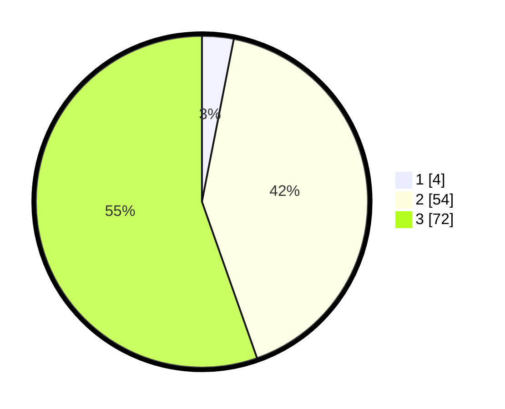

# Hasil

## Grafik

## Tabel

| No. | Nama Paslon    | Suara | Suara (raw) | Persentase |
|:--- |:-------------- | -----:| -----------:| ----------:|
| 1   | ANIES MUHAIMIN | 4     | [4][p-1]    | 3,08       |
| 2   | PRABOWO GIBRAN | 54    | [54][p-2]   | 41,54      |
| 3   | GANJAR MAHFUD  | 72    | [72][p-3]   | 55,38      |

[p-1]: https://github.com/gigit-pemilu/pemilu-2024-33-jawa-tengah/blob/main/pilpres/hitung-suara/sub/33-jawa-tengah/sub/73-kota-salatiga/sub/02-tingkir/sub/1001-kutowinangun-kidul/sub/002-tps/sub/paslon-1.txt
[p-2]: https://github.com/gigit-pemilu/pemilu-2024-33-jawa-tengah/blob/main/pilpres/hitung-suara/sub/33-jawa-tengah/sub/73-kota-salatiga/sub/02-tingkir/sub/1001-kutowinangun-kidul/sub/002-tps/sub/paslon-2.txt
[p-3]: https://github.com/gigit-pemilu/pemilu-2024-33-jawa-tengah/blob/main/pilpres/hitung-suara/sub/33-jawa-tengah/sub/73-kota-salatiga/sub/02-tingkir/sub/1001-kutowinangun-kidul/sub/002-tps/sub/paslon-3.txt

## Foto C Plano

https://sirekap-obj-formc.kpu.go.id/0d6e/pemilu/ppwp/33/73/02/10/01/3373021001002-20240215-022551--3f2a0a00-04e0-4454-aec4-8abb785fe4ee.jpg

https://sirekap-obj-formc.kpu.go.id/0d6e/pemilu/ppwp/33/73/02/10/01/3373021001002-20240215-022746--06d3b11a-1fa3-41ad-96ef-474c4eb2df93.jpg

https://sirekap-obj-formc.kpu.go.id/0d6e/pemilu/ppwp/33/73/02/10/01/3373021001002-20240215-022643--25377088-fd62-4ee9-aa5f-57afad91b2d0.jpg

## Metadata

| Key        | Value               |
| ---------- | ------------------- |
| Time Stamp | 2024-02-15 17:00:25 |

