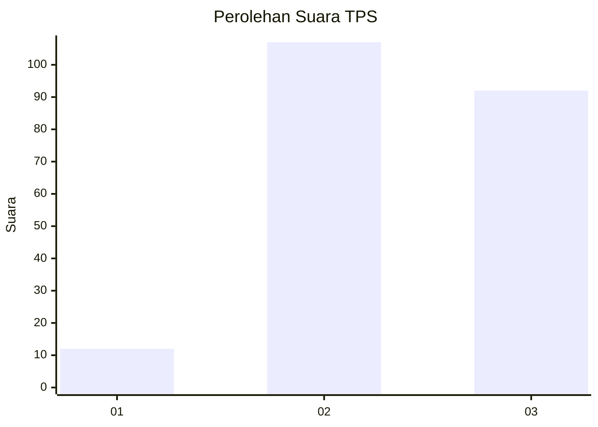
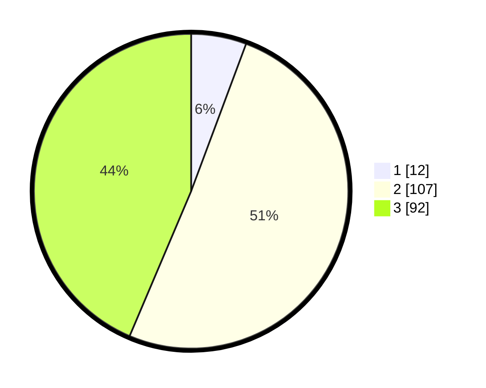

# Hasil

## Grafik

## Tabel

| No. | Nama Paslon    | Suara | Suara (raw) | Persentase |
|:--- |:-------------- | -----:| -----------:| ----------:|
| 1   | ANIES MUHAIMIN | 12    | [12][p-1]   | 5,69       |
| 2   | PRABOWO GIBRAN | 107   | [107][p-2]  | 50,71      |
| 3   | GANJAR MAHFUD  | 92    | [92][p-3]   | 43,60      |

[p-1]: https://github.com/gigit-pemilu/pemilu-2024-33-jawa-tengah/blob/main/pilpres/hitung-suara/sub/33-jawa-tengah/sub/73-kota-salatiga/sub/02-tingkir/sub/1001-kutowinangun-kidul/sub/006-tps/sub/paslon-1.txt
[p-2]: https://github.com/gigit-pemilu/pemilu-2024-33-jawa-tengah/blob/main/pilpres/hitung-suara/sub/33-jawa-tengah/sub/73-kota-salatiga/sub/02-tingkir/sub/1001-kutowinangun-kidul/sub/006-tps/sub/paslon-2.txt
[p-3]: https://github.com/gigit-pemilu/pemilu-2024-33-jawa-tengah/blob/main/pilpres/hitung-suara/sub/33-jawa-tengah/sub/73-kota-salatiga/sub/02-tingkir/sub/1001-kutowinangun-kidul/sub/006-tps/sub/paslon-3.txt

## Foto C Plano

https://sirekap-obj-formc.kpu.go.id/8adc/pemilu/ppwp/33/73/02/10/01/3373021001006-20240214-234942--5c371c03-500f-4f00-97df-a36c5602c0c6.jpg

https://sirekap-obj-formc.kpu.go.id/8adc/pemilu/ppwp/33/73/02/10/01/3373021001006-20240214-234832--39301b5b-7b0a-418f-9395-05245bd0b0a4.jpg

https://sirekap-obj-formc.kpu.go.id/8adc/pemilu/ppwp/33/73/02/10/01/3373021001006-20240214-234707--0c53ea0e-5af5-4407-993c-84160d7f46d1.jpg

## Metadata

| Key        | Value               |
| ---------- | ------------------- |
| Time Stamp | 2024-02-15 12:00:28 |

