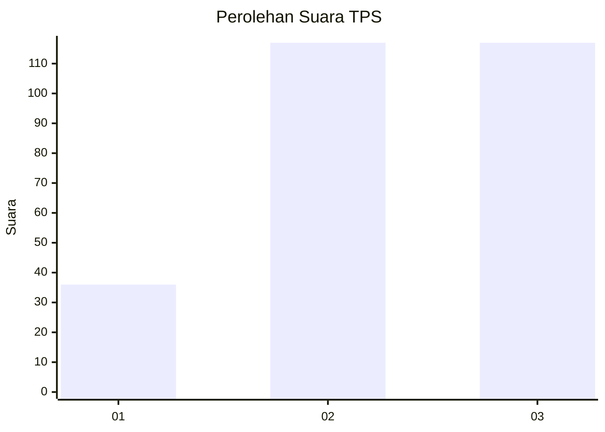
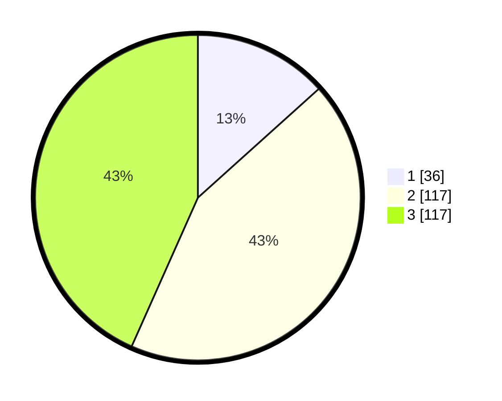

# Hasil

## Grafik

## Tabel

| No. | Nama Paslon    | Suara | Suara (raw) | Persentase |
|:--- |:-------------- | -----:| -----------:| ----------:|
| 1   | ANIES MUHAIMIN | 36    | [36][p-1]   | 13,33      |
| 2   | PRABOWO GIBRAN | 117   | [117][p-2]  | 43,33      |
| 3   | GANJAR MAHFUD  | 117   | [117][p-3]  | 43,33      |

[p-1]: https://github.com/gigit-pemilu/pemilu-2024/blob/main/pilpres/hitung-suara/sub/33-jawa-tengah/sub/73-kota-salatiga/sub/03-argomulyo/sub/1005-randuacir/sub/003-tps/sub/paslon-1.txt
[p-2]: https://github.com/gigit-pemilu/pemilu-2024/blob/main/pilpres/hitung-suara/sub/33-jawa-tengah/sub/73-kota-salatiga/sub/03-argomulyo/sub/1005-randuacir/sub/003-tps/sub/paslon-2.txt
[p-3]: https://github.com/gigit-pemilu/pemilu-2024/blob/main/pilpres/hitung-suara/sub/33-jawa-tengah/sub/73-kota-salatiga/sub/03-argomulyo/sub/1005-randuacir/sub/003-tps/sub/paslon-3.txt

## Foto C Plano

https://sirekap-obj-formc.kpu.go.id/7ddf/pemilu/ppwp/33/73/03/10/05/3373031005003-20240216-132827--fe0a93a6-6ebb-4772-8175-02ca7b2a5b5e.jpg

https://sirekap-obj-formc.kpu.go.id/7ddf/pemilu/ppwp/33/73/03/10/05/3373031005003-20240214-155442--7d3e303b-7e23-4a75-903a-848190f531be.jpg

## Metadata

| Key        | Value               |
| ---------- | ------------------- |
| Time Stamp | 2024-02-24 22:31:28 |

